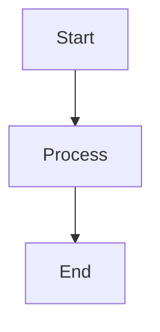

# Custom Components Integration Instructions

This guide explains how to integrate and use custom components in your VitePress documentation.

## YouTube Player Component

The YouTube player component allows you to embed YouTube videos directly in your markdown files.

### Basic Usage

To embed a YouTube video, use the `<YouTubePlayer>` component with the video ID:

```md
<YouTubePlayer videoId="VIDEO_ID_HERE" />
```

The video ID is the part of the YouTube URL after `v=`. For example, in the URL `https://www.youtube.com/watch?v=446E-r0rXHI`, the video ID is `446E-r0rXHI`.

### Examples

```md
## Introduction to Go

Go (or Golang) is an open-source programming language developed by Google.

<YouTubePlayer videoId="446E-r0rXHI" />
```

```md
## Concurrency in Go

Go's concurrency model is one of its strongest features.

<YouTubePlayer videoId="f6kdp27TYZs" />
```

### Best Practices for Video Integration

- Place videos after introducing a concept to provide visual explanation
- Choose videos that are concise and focused on the topic
- Ensure the video content is relevant to the surrounding text
- Use videos for complex topics that benefit from visual explanation
- Avoid placing multiple videos in succession

## Component Registration

The YouTube player component is globally registered in the VitePress theme and can be used in any markdown file without additional imports.

### Component Structure

The component is located at:
```
/opt/docs-cn/.vitepress/customComponents/youtube-player.vue
```

It's registered in the theme configuration at:
```
/opt/docs-cn/.vitepress/theme/index.ts
```

## Other Custom Components

### Mermaid Diagrams

For creating diagrams:

```md

```

### Code Groups

For showing code examples for different platforms:

```md
::: code-group
```bash [Linux]
sudo apt install golang
```

```bash [macOS]
brew install go
```

```powershell [Windows]
choco install golang
```
:::
```

### Callout Blocks

For highlighting important information:

```md
::: tip
This is a helpful tip.
:::

::: warning
This is a warning.
:::

::: danger
This is important information about a dangerous situation.
:::
```

## Implementation Difficulty Indicator

The Difficulty Indicator component visually represents how complex a security measure or tool is to implement.

### Basic Usage

```md
<DifficultyIndicator 
  :difficulty="3" 
  time="2-3 hours"
  :prerequisites="['Docker knowledge', 'Linux basics']"
>
  Additional notes about the implementation complexity.
</DifficultyIndicator>
```

### Examples

```md
<DifficultyIndicator :difficulty="2" label="Docker Installation" time="30 minutes">
  Docker installation is straightforward on most platforms with good documentation available.
</DifficultyIndicator>
```

```md
<DifficultyIndicator :difficulty="5" label="Zero Trust Architecture" time="3-6 months" :prerequisites="['Network security', 'Identity management', 'Micro-segmentation']">
  Implementing a complete Zero Trust Architecture requires significant planning, changes to infrastructure, and security expertise.
</DifficultyIndicator>
```

## Tool Comparison Matrix

The Tool Comparison Matrix component allows comparing different tools across multiple dimensions.

### Basic Usage

```md
<script setup>
const tools = [
  // Tool definitions here
];

const columns = [
  // Column definitions here
];
</script>

<ToolComparisonMatrix :tools="tools" :columns="columns" />
```

### Example

```md
<script setup>
const cicdTools = [
  {
    name: "GitHub Actions",
    category: "CI/CD",
    description: "GitHub's built-in CI/CD solution",
    pricing: "Free tier + paid",
    features: ["Built-in to GitHub", "Marketplace", "Matrix builds"],
    rating: 4,
    openSource: false,
    selfHosted: true
  },
  {
    name: "GitLab CI",
    category: "CI/CD",
    description: "GitLab's integrated CI/CD",
    pricing: "Free tier + paid",
    features: ["Integrated with GitLab", "Docker support", "Auto DevOps"],
    rating: 4,
    openSource: true,
    selfHosted: true
  }
];

const columns = [
  { key: "name", name: "Tool" },
  { key: "description", name: "Description" },
  { key: "pricing", name: "Pricing" },
  { key: "features", name: "Features" },
  { key: "rating", name: "Rating" },
  { key: "openSource", name: "Open Source", type: "boolean" },
  { key: "selfHosted", name: "Self-hosted Option", type: "boolean" }
];
</script>

<ToolComparisonMatrix :tools="cicdTools" :columns="columns" />
```
