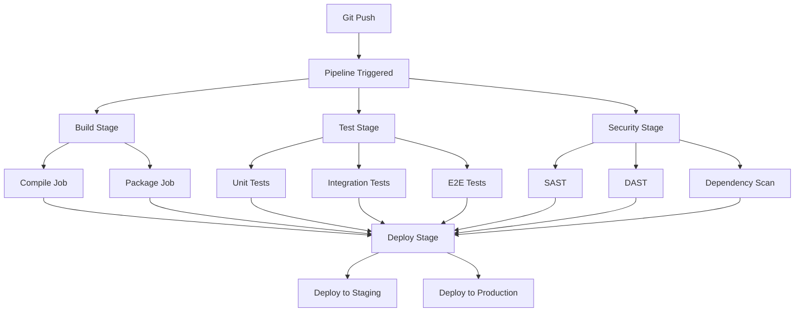

# GitLab CI/CD

## Introduction

GitLab CI/CD is a powerful, integrated continuous integration and continuous deployment platform built into GitLab. It allows you to automate your software development lifecycle with pipelines defined as code, providing seamless integration with your GitLab repositories.

With GitLab CI/CD, you can:

- Define pipelines as code using YAML configuration files
- Run jobs in parallel or sequentially across multiple environments
- Use GitLab's shared runners or configure your own runners
- Integrate security scanning, testing, and deployment automation
- Leverage built-in container registry and package management

## Key Concepts

- **Pipeline**: A collection of jobs that are executed in stages
- **Job**: Individual tasks that make up a pipeline (e.g., compile, test, deploy)
- **Stage**: A logical grouping of jobs that run in parallel
- **Runner**: An agent that executes CI/CD jobs
- **Artifact**: Files created by jobs that can be passed between stages
- **Environment**: A target deployment destination (staging, production, etc.)

### MermaidJS: GitLab CI/CD Pipeline Structure

Below is a diagram showing the structure of a typical GitLab CI/CD pipeline:



Educational note:
- Stages run sequentially, but jobs within a stage run in parallel
- Each job runs in an isolated environment (container or VM)
- Artifacts allow data sharing between jobs and stages

## Getting Started

### 1. Create a .gitlab-ci.yml File

All CI/CD configuration is defined in a `.gitlab-ci.yml` file in your repository root.

### 2. Basic Pipeline Structure

**Example: Simple Node.js pipeline**

```yaml
# Define pipeline stages
stages:
  - build
  - test
  - deploy

# Global variables
variables:
  NODE_VERSION: "18"
  DOCKER_IMAGE: "node:18-alpine"

# Cache configuration for dependencies
cache:
  paths:
    - node_modules/
  key:
    files:
      - package-lock.json

# Build job
build:
  stage: build
  image: $DOCKER_IMAGE
  script:
    - npm ci
    - npm run build
  artifacts:
    paths:
      - dist/
    expire_in: 1 hour

# Test jobs
test:unit:
  stage: test
  image: $DOCKER_IMAGE
  script:
    - npm ci
    - npm run test:unit
  coverage: '/Lines\s*:\s*(\d+\.\d+)%/'
  artifacts:
    reports:
      coverage_report:
        coverage_format: cobertura
        path: coverage/cobertura-coverage.xml

test:integration:
  stage: test
  image: $DOCKER_IMAGE
  services:
    - postgres:13
  variables:
    POSTGRES_DB: test_db
    POSTGRES_USER: test_user
    POSTGRES_PASSWORD: test_pass
  script:
    - npm ci
    - npm run test:integration

# Deployment job
deploy:staging:
  stage: deploy
  image: alpine:latest
  environment:
    name: staging
    url: https://staging.example.com
  script:
    - echo "Deploying to staging environment"
    - ./deploy.sh staging
  only:
    - develop

deploy:production:
  stage: deploy
  image: alpine:latest
  environment:
    name: production
    url: https://production.example.com
  script:
    - echo "Deploying to production environment"
    - ./deploy.sh production
  only:
    - main
  when: manual
```

Educational note:
- `stages` defines the execution order
- `cache` improves performance by preserving dependencies
- `artifacts` share files between jobs
- `environment` creates deployment tracking in GitLab

## Advanced Pipeline Configuration

### Using Templates and Includes

```yaml
# Include external templates
include:
  - template: Security/SAST.gitlab-ci.yml
  - template: Security/Dependency-Scanning.gitlab-ci.yml
  - template: Security/Container-Scanning.gitlab-ci.yml
  - local: '.gitlab/ci/build.yml'
  - remote: 'https://raw.githubusercontent.com/company/ci-templates/main/deploy.yml'

variables:
  # Security scanning configuration
  SAST_EXCLUDED_PATHS: "spec, test, tests, tmp"
  DS_EXCLUDED_PATHS: "spec, test, tests, tmp"
```

### Matrix Jobs and Parallel Execution

```yaml
test:
  stage: test
  image: node:${NODE_VERSION}
  parallel:
    matrix:
      - NODE_VERSION: ["16", "18", "20"]
        ENVIRONMENT: ["development", "staging"]
  script:
    - npm ci
    - npm run test
    - echo "Testing Node.js $NODE_VERSION in $ENVIRONMENT"

# Parallel execution by number
test:parallel:
  stage: test
  parallel: 5
  script:
    - npm ci
    - npm run test -- --parallel-index $CI_NODE_INDEX --parallel-total $CI_NODE_TOTAL
```

### Conditional Job Execution

```yaml
deploy:review:
  stage: deploy
  script:
    - echo "Deploying review app"
  environment:
    name: review/$CI_COMMIT_REF_SLUG
    url: https://review-$CI_COMMIT_REF_SLUG.example.com
    on_stop: stop:review
  rules:
    - if: '$CI_PIPELINE_SOURCE == "merge_request_event"'
    - if: '$CI_COMMIT_BRANCH != "main" && $CI_COMMIT_BRANCH != "develop"'

stop:review:
  stage: deploy
  script:
    - echo "Stopping review app"
  environment:
    name: review/$CI_COMMIT_REF_SLUG
    action: stop
  rules:
    - if: '$CI_PIPELINE_SOURCE == "merge_request_event"'
      when: manual
```

## DevSecOps Integration

### Complete Security Pipeline

```yaml
stages:
  - build
  - test
  - security
  - deploy

# Include GitLab security templates
include:
  - template: Security/SAST.gitlab-ci.yml
  - template: Security/Dependency-Scanning.gitlab-ci.yml
  - template: Security/Container-Scanning.gitlab-ci.yml
  - template: Security/DAST.gitlab-ci.yml
  - template: Security/Secret-Detection.gitlab-ci.yml

variables:
  # Security scanning configuration
  SAST_EXCLUDED_ANALYZERS: "bandit, brakeman, eslint, flawfinder, gosec, kubesec, phpcs-security-audit, pmd-apex, security-code-scan, semgrep, sobelow, spotbugs"
  DS_EXCLUDED_PATHS: "spec, test, tests, tmp, node_modules"
  CONTAINER_SCANNING_DISABLED: "false"
  DAST_WEBSITE: "https://staging.example.com"

# Custom security job
security:custom:
  stage: security
  image: alpine:latest
  before_script:
    - apk add --no-cache curl jq
  script:
    - echo "Running custom security checks"
    - ./scripts/security-audit.sh
  artifacts:
    reports:
      junit: security-report.xml
    paths:
      - security-report.html
    expire_in: 1 week

# License compliance
license_scanning:
  stage: security
  image: 
    name: registry.gitlab.com/gitlab-org/security-products/analyzers/license-finder:latest
    entrypoint: [""]
  script:
    - /analyzer run
  artifacts:
    reports:
      license_scanning: gl-license-scanning-report.json
  rules:
    - if: '$CI_COMMIT_BRANCH == "main"'

# Infrastructure as Code scanning
iac:scan:
  stage: security
  image: bridgecrew/checkov:latest
  script:
    - checkov -d . --framework terraform --output cli --output junitxml --output-file-path console,checkov-report.xml
  artifacts:
    reports:
      junit: checkov-report.xml
    paths:
      - checkov-report.xml
    expire_in: 1 week
  rules:
    - exists:
        - "**/*.tf"
```

### Docker Build and Security

```yaml
docker:build:
  stage: build
  image: docker:latest
  services:
    - docker:dind
  variables:
    DOCKER_TLS_CERTDIR: "/certs"
    IMAGE_TAG: $CI_REGISTRY_IMAGE:$CI_COMMIT_SHA
  before_script:
    - docker login -u $CI_REGISTRY_USER -p $CI_REGISTRY_PASSWORD $CI_REGISTRY
  script:
    - docker build -t $IMAGE_TAG .
    - docker push $IMAGE_TAG
  artifacts:
    reports:
      dotenv: docker.env
  dependencies: []

# Container vulnerability scanning
container:scan:
  stage: security
  image: 
    name: aquasec/trivy:latest
    entrypoint: [""]
  services:
    - docker:dind
  variables:
    DOCKER_TLS_CERTDIR: "/certs"
    IMAGE_TAG: $CI_REGISTRY_IMAGE:$CI_COMMIT_SHA
  script:
    - trivy image --format template --template "@contrib/gitlab.tpl" --output gl-container-scanning-report.json $IMAGE_TAG
  artifacts:
    reports:
      container_scanning: gl-container-scanning-report.json
  dependencies:
    - docker:build
```

## Deployment Strategies

### Blue-Green Deployment

```yaml
deploy:blue:
  stage: deploy
  environment:
    name: production-blue
    url: https://blue.example.com
  script:
    - echo "Deploying to blue environment"
    - ./deploy.sh blue
    - ./health-check.sh blue
  rules:
    - if: '$CI_COMMIT_BRANCH == "main"'

deploy:green:
  stage: deploy
  environment:
    name: production-green
    url: https://green.example.com
  script:
    - echo "Deploying to green environment"
    - ./deploy.sh green
    - ./health-check.sh green
  rules:
    - if: '$CI_COMMIT_BRANCH == "main"'
  when: manual

switch:traffic:
  stage: deploy
  script:
    - echo "Switching traffic to new deployment"
    - ./switch-traffic.sh
  environment:
    name: production
    url: https://example.com
  rules:
    - if: '$CI_COMMIT_BRANCH == "main"'
  when: manual
  dependencies:
    - deploy:green
```

### Canary Deployment

```yaml
deploy:canary:
  stage: deploy
  environment:
    name: production-canary
    url: https://canary.example.com
  script:
    - ./deploy.sh canary 10  # 10% traffic
    - ./monitor.sh canary 300  # Monitor for 5 minutes
  rules:
    - if: '$CI_COMMIT_BRANCH == "main"'

deploy:production:
  stage: deploy
  environment:
    name: production
    url: https://example.com
  script:
    - ./deploy.sh production 100  # 100% traffic
  rules:
    - if: '$CI_COMMIT_BRANCH == "main"'
  when: manual
  dependencies:
    - deploy:canary
```

## GitLab Runner Configuration

### Using Different Runner Types

```yaml
# Shared GitLab.com runners
test:shared:
  stage: test
  tags:
    - linux
    - docker
  script:
    - echo "Running on shared runners"

# Specific runner tags
build:gpu:
  stage: build
  tags:
    - gpu
    - linux
    - docker
  script:
    - echo "Running on GPU-enabled runner"

# Self-hosted runner
deploy:onpremise:
  stage: deploy
  tags:
    - production
    - shell
  script:
    - echo "Running on self-hosted runner"
  rules:
    - if: '$CI_COMMIT_BRANCH == "main"'
```

### Resource Management

```yaml
variables:
  # Resource limits
  KUBERNETES_CPU_REQUEST: "100m"
  KUBERNETES_CPU_LIMIT: "1"
  KUBERNETES_MEMORY_REQUEST: "128Mi"
  KUBERNETES_MEMORY_LIMIT: "1Gi"

test:performance:
  stage: test
  image: alpine:latest
  resource_group: performance-testing
  script:
    - echo "Running performance tests"
    - ./performance-test.sh
  timeout: 30m
```

## Monitoring and Notifications

### Slack Integration

```yaml
notify:slack:
  stage: .post
  image: alpine:latest
  before_script:
    - apk add --no-cache curl
  script:
    - |
      if [ "$CI_JOB_STATUS" == "success" ]; then
        EMOJI=":white_check_mark:"
        COLOR="good"
      else
        EMOJI=":x:"
        COLOR="danger"
      fi
      
      curl -X POST -H 'Content-type: application/json' \
        --data "{
          \"text\":\"$EMOJI Pipeline $CI_PIPELINE_STATUS\",
          \"attachments\":[{
            \"color\":\"$COLOR\",
            \"fields\":[{
              \"title\":\"Project\",
              \"value\":\"$CI_PROJECT_NAME\",
              \"short\":true
            },{
              \"title\":\"Branch\",
              \"value\":\"$CI_COMMIT_REF_NAME\",
              \"short\":true
            },{
              \"title\":\"Commit\",
              \"value\":\"$CI_COMMIT_SHA\",
              \"short\":true
            }]
          }]
        }" \
        $SLACK_WEBHOOK_URL
  rules:
    - when: always
```

### Email Notifications

```yaml
notify:email:
  stage: .post
  image: alpine:latest
  before_script:
    - apk add --no-cache ssmtp
  script:
    - |
      cat << EOF > /tmp/email.txt
      Subject: Pipeline $CI_PIPELINE_STATUS - $CI_PROJECT_NAME
      
      Pipeline: $CI_PIPELINE_URL
      Project: $CI_PROJECT_NAME
      Branch: $CI_COMMIT_REF_NAME
      Commit: $CI_COMMIT_SHA
      Status: $CI_PIPELINE_STATUS
      EOF
    - ssmtp team@example.com < /tmp/email.txt
  rules:
    - if: '$CI_PIPELINE_STATUS == "failed"'
    - if: '$CI_COMMIT_BRANCH == "main" && $CI_PIPELINE_STATUS == "success"'
```

## Best Practices

### Optimizing Pipeline Performance

```yaml
# Use pipeline caching effectively
cache:
  key: "$CI_COMMIT_REF_SLUG"
  paths:
    - node_modules/
    - .npm/
    - vendor/
  policy: pull-push

# Use artifacts strategically
build:
  stage: build
  script:
    - npm run build
  artifacts:
    paths:
      - dist/
    expire_in: 1 hour
    when: on_success

# Fail fast with dependencies
test:unit:
  stage: test
  script:
    - npm run test:unit
  needs: ["build"]  # Don't wait for entire stage

# Use interruptible jobs for cost optimization
test:long-running:
  stage: test
  interruptible: true
  script:
    - npm run test:e2e
```

### Security Best Practices

```yaml
variables:
  # Use protected variables for sensitive data
  DATABASE_URL: $PROTECTED_DATABASE_URL
  API_KEY: $PROTECTED_API_KEY

deploy:production:
  stage: deploy
  # Only run on protected branches
  rules:
    - if: '$CI_COMMIT_BRANCH == "main" && $CI_COMMIT_REF_PROTECTED == "true"'
  # Use deployment tokens
  before_script:
    - echo "Using deployment token for authentication"
  script:
    - ./deploy.sh
  # Require manual approval
  when: manual
  allow_failure: false
```

### Error Handling and Debugging

```yaml
debug:pipeline:
  stage: .pre
  script:
    - echo "CI_COMMIT_SHA=$CI_COMMIT_SHA"
    - echo "CI_COMMIT_REF_NAME=$CI_COMMIT_REF_NAME"
    - echo "CI_PIPELINE_SOURCE=$CI_PIPELINE_SOURCE"
    - echo "CI_JOB_TOKEN=$CI_JOB_TOKEN"
    - env | grep CI_ | sort
  rules:
    - if: '$DEBUG_MODE == "true"'

test:with-retry:
  stage: test
  script:
    - npm run test:flaky
  retry:
    max: 2
    when:
      - runner_system_failure
      - stuck_or_timeout_failure
      - script_failure
```

## GitLab Features Integration

### Merge Request Pipelines

```yaml
test:mr:
  stage: test
  script:
    - npm run test
    - npm run lint
  rules:
    - if: '$CI_PIPELINE_SOURCE == "merge_request_event"'
```

### Pages Deployment

GitLab Pages allows you to deploy static websites directly from your repository. Below is an example of a pipeline configuration for deploying documentation to GitLab Pages.

```yaml
pages:
  stage: deploy
  script:
    - npm run build:docs
    - mkdir public
    - cp -r docs/* public/
  artifacts:
    paths:
      - public
  rules:
    - if: '$CI_COMMIT_BRANCH == "main"'
```

**Educational note:**  
- The `public` directory is required for GitLab Pages to serve your static files.
- Use `rules` to ensure the deployment only occurs on the `main` branch.

### Running Expensive Tests

Expensive tests, such as end-to-end (E2E) tests, can be configured to run only on specific branches or schedules to optimize pipeline performance.

```yaml
test:expensive:
  stage: test
  script:
    - npm run test:e2e
  rules:
    - if: '$CI_COMMIT_BRANCH == "main"'
    - if: '$CI_PIPELINE_SOURCE == "schedule"'
```

**Educational note:**  
- Use `rules` to conditionally execute jobs based on branch or pipeline source.
- Scheduled pipelines can be configured in GitLab to trigger these tests periodically.

## Additional Resources

- [GitLab CI/CD Documentation](https://docs.gitlab.com/ee/ci/)
- [GitLab CI/CD YAML Reference](https://docs.gitlab.com/ee/ci/yaml/)
- [GitLab Security Templates](https://docs.gitlab.com/ee/ci/yaml/includes.html#security-templates)
- [GitLab Runner Documentation](https://docs.gitlab.com/runner/)