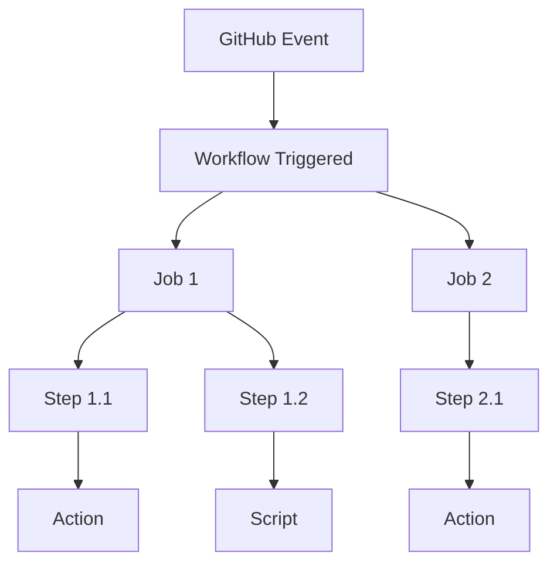
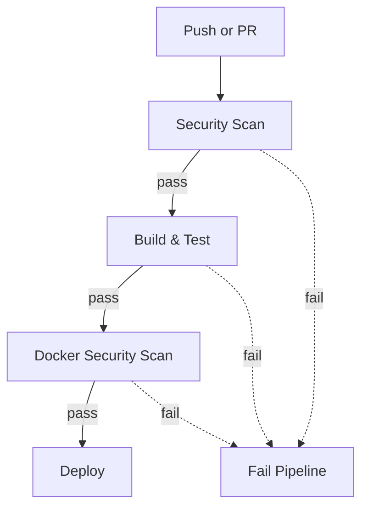

--- 
title: GitHub Actions CI/CD
mermaidTheme: forest
description: Complete guide for using GitHub Actions in a DevSecOps environment
layout: doc
---

# GitHub Actions CI/CD

## Introduction

GitHub Actions is a powerful automation platform integrated into GitHub that enables you to build, test, and deploy your code directly from your repository. It supports event-driven workflows, allowing you to automate tasks such as CI/CD, code linting, security scanning, and more.

With GitHub Actions, you can:

- Automate your software workflows with YAML-based configuration files.
- Run jobs in parallel or sequentially, and across different operating systems.
- Use a vast marketplace of pre-built actions or create your own custom actions.
- Securely manage secrets and environment variables for your workflows.
- Integrate with other tools and services for notifications, deployments, and monitoring.

## Key Concepts

- **Workflow**: A configurable automated process made up of one or more jobs, defined in a YAML file in `.github/workflows/`.
- **Job**: A set of steps that execute on the same runner.
- **Step**: An individual task, such as running a script or an action.
- **Action**: A reusable extension that can be included as a step in a workflow.
- **Runner**: A server that runs your jobs (GitHub-hosted or self-hosted).
- **Event**: A specific activity in your repository (e.g., push, pull request) that triggers a workflow.

### MermaidJS: Workflow Structure

Below is a MermaidJS diagram showing the structure of a typical GitHub Actions workflow:



> **Educational note:**  
> - A workflow is triggered by an event (like a push).
> - Each workflow can have multiple jobs, which can run in parallel or sequentially.
> - Each job consists of steps, which can be actions or scripts.

## Example Use Cases

- **Continuous Integration**: Automatically build and test your code on every push or pull request.
- **Continuous Deployment**: Deploy your application to production or staging environments after successful tests.
- **Security Automation**: Run static analysis, dependency scanning, or secret detection on your codebase.
- **Notifications**: Send alerts to Slack, email, or other services when workflows succeed or fail.
- **Release Automation**: Tag releases, generate changelogs, and publish packages.

## Getting Started

Let's walk through the basics of setting up a workflow.

### 1. Create a Workflow File

All workflows are defined in YAML files inside the `.github/workflows/` directory of your repository. For example, create `.github/workflows/ci.yml`.

### 2. Define Triggers

Specify which events will trigger your workflow. Common triggers include `push`, `pull_request`, or a manual trigger with `workflow_dispatch`.

**Example: Triggering on push and pull requests**

```yaml
on:
  push:
    branches: 
      - main
      - develop
      - 'feature/**'
    paths-ignore:
      - 'docs/**'
      - '*.md'
  
  pull_request:
    branches: [ main ]
    types: [opened, synchronize, reopened]
  
  release:
    types: [published]
  
  schedule:
    - cron: '0 2 * * 1'  # Every Monday at 2 AM
  
  workflow_dispatch:  # Manual trigger
    inputs:
      environment:
        description: 'Deployment environment'
        required: true
        default: 'staging'
        type: choice
        options:
        - staging
        - production
```

> **Educational note:**  
> - `push` and `pull_request` are the most common triggers for CI/CD.  
> - `schedule` allows you to run workflows on a cron schedule (e.g., nightly builds).  
> - `workflow_dispatch` enables manual runs with custom inputs, useful for deployments or hotfixes.

### 3. Configure Jobs and Steps

A workflow consists of one or more jobs. Each job runs on a runner and contains a sequence of steps.

**Example: Basic Node.js CI workflow**

```yaml
name: CI/CD Pipeline
on:
  push:
    branches: [ main, develop ]
  pull_request:
    branches: [ main ]

env:
  NODE_VERSION: '18'
  DOCKER_REGISTRY: 'ghcr.io'

jobs:
  test:
    runs-on: ubuntu-latest
    steps:
      - name: Checkout code
        uses: actions/checkout@v4
      
      - name: Setup Node.js
        uses: actions/setup-node@v4
        with:
          node-version: ${{ env.NODE_VERSION }}
          cache: 'npm'
      
      - name: Install dependencies
        run: npm ci
      
      - name: Run tests
        run: npm test
```

> **Educational note:**  
> - Each `job` runs independently by default, but you can define dependencies using `needs`.
> - `runs-on` specifies the runner OS (e.g., `ubuntu-latest`).
> - Steps can use actions (like `actions/checkout`) or run shell commands.

### 4. Manage Secrets and Environment Variables

Sensitive data (API keys, tokens) should never be hardcoded. Use GitHub Secrets and reference them in your workflow.

**Example: Using secrets in a deployment job**

```yaml
jobs:
  deploy:
    runs-on: ubuntu-latest
    environment: production
    steps:
      - name: Deploy to production
        env:
          API_KEY: ${{ secrets.API_KEY }}
          DATABASE_URL: ${{ secrets.DATABASE_URL }}
        run: |
          echo "Deploying with API key: ${API_KEY:0:4}..."
          ./deploy.sh
```

**Educational note:**  
- Add secrets in your repository settings under "Settings > Secrets and variables".
- Make sure all referenced secrets are properly defined in your repository settings.

### 5. Use Marketplace Actions and Custom Actions

You can use thousands of pre-built actions from the [GitHub Marketplace](https://github.com/marketplace?type=actions), or write your own.

**Example: Using a marketplace action for Slack notifications**

```yaml
- name: Slack Notification
  uses: 8398a7/action-slack@v3
  with:
    status: ${{ job.status }}
    channel: '#deployments'
  env:
    SLACK_WEBHOOK_URL: ${{ secrets.SLACK_WEBHOOK_URL }}
```

> **Educational note:**  
> - Actions are reusable units of code.  
> - Always pin actions to a specific version for security and stability.

### 6. Monitor Workflow Runs

After pushing your workflow file, go to the "Actions" tab in your GitHub repository to see the status, logs, and details of each run.

---

## Best Practices

- **Use [secrets](https://docs.github.com/en/actions/security-guides/encrypted-secrets) for sensitive data.**
- **Pin action versions** to avoid unexpected changes.
- **Use matrix builds** to test across multiple environments.
- **Keep workflows modular and reusable.**
- **Regularly review and update your workflows for security and efficiency.**

---

## Resources

- [GitHub Actions Documentation](https://docs.github.com/en/actions)
- [Actions Marketplace](https://github.com/marketplace?type=actions)
- [Workflow syntax reference](https://docs.github.com/en/actions/using-workflows/workflow-syntax-for-github-actions)

---

# Advanced Example: DevSecOps Pipeline

Below is a more advanced workflow that demonstrates security scanning, testing, and deployment.

```yaml
on:
  push:
    branches: [ main, develop ]
  pull_request:
    branches: [ main ]

jobs:
  security-scan:
    name: Security Analysis
    runs-on: ubuntu-latest
    steps:
      - uses: actions/checkout@v4
        with:
          fetch-depth: 0
      
      # Secret analysis
      - name: TruffleHog OSS
        uses: trufflesecurity/trufflehog@main
        with:
          path: ./
          base: main
          head: HEAD
      
      # SAST analysis
      - name: Run CodeQL Analysis
        uses: github/codeql-action/init@v3
        with:
          languages: javascript
      
      - name: Autobuild
        uses: github/codeql-action/autobuild@v3
      
      - name: Perform CodeQL Analysis
        uses: github/codeql-action/analyze@v3
      
      # Dependency analysis
      - name: Dependency Check
        uses: dependency-check/Dependency-Check_Action@main
        with:
          project: 'my-project'
          path: '.'
          format: 'ALL'
      
      - name: Upload Test results
        uses: actions/upload-artifact@v4
        with:
          name: Dependency Check Report
          path: reports/

  build-and-test:
    name: Build and Test
    needs: security-scan
    runs-on: ubuntu-latest
    steps:
      - uses: actions/checkout@v4
      
      - name: Setup Node.js
        uses: actions/setup-node@v4
        with:
          node-version: '18'
          cache: 'npm'
      
      - name: Install dependencies
        run: npm ci
      
      - name: Run linting
        run: npm run lint
      
      - name: Run tests with coverage
        run: npm run test:coverage
      
      - name: Upload coverage to Codecov
        uses: codecov/codecov-action@v3
        with:
          file: ./coverage/lcov.info
          fail_ci_if_error: true

  docker-security:
    name: Docker Security
    needs: build-and-test
    runs-on: ubuntu-latest
    steps:
      - uses: actions/checkout@v4
      
      - name: Build Docker image
        run: docker build -t app:${{ github.sha }} .
      
      - name: Run Trivy vulnerability scanner
        uses: aquasecurity/trivy-action@master
        with:
          image-ref: 'app:${{ github.sha }}'
          format: 'sarif'
          output: 'trivy-results.sarif'
      
      - name: Upload Trivy scan results
        uses: github/codeql-action/upload-sarif@v3
        with:
          sarif_file: 'trivy-results.sarif'
```

### DevSecOps Pipeline Flow

To visualize the advanced pipeline, here's a MermaidJS diagram showing the flow from code push to deployment, including security checks:



> **Educational note:**  
> - Each stage must pass for the next to run (`needs` keyword).
> - Security is integrated at every step, not just at the end.
> - This approach helps catch issues early and ensures only secure, tested code is deployed.

---

Continue exploring the documentation for more advanced patterns, reusable workflows, and DevSecOps best practices!