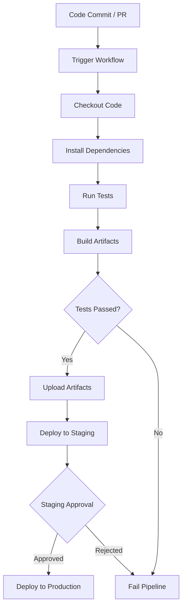

# GitHub Actions Templates

## CI/CD Pipeline Overview

Below is a visual representation of a typical CI/CD pipeline using GitHub Actions:



::: tip
This diagram shows the main stages: code commit, workflow trigger, testing, building, artifact handling, and deployment with approval gates.
:::

## Introduction

This collection provides ready-to-use GitHub Actions workflow templates for various development scenarios in a DevSecOps environment. These templates incorporate security scanning, testing, and deployment best practices.

## Node.js Application Template

### Complete DevSecOps Pipeline

```yaml
name: Node.js DevSecOps Pipeline

on:
  push:
    branches: [ main, develop ]
  pull_request:
    branches: [ main ]

env:
  NODE_VERSION: '18'
  REGISTRY: ghcr.io
  IMAGE_NAME: ${{ github.repository }}

jobs:
  security-scan:
    name: Security Scanning
    runs-on: ubuntu-latest
    steps:
      - name: Checkout code
        uses: actions/checkout@v4
        with:
          fetch-depth: 0

      - name: Run Trivy vulnerability scanner in repo mode
        uses: aquasecurity/trivy-action@master
        with:
          scan-type: 'fs'
          scan-ref: '.'
          format: 'sarif'
          output: 'trivy-results.sarif'

      - name: Upload Trivy scan results to GitHub Security tab
        uses: github/codeql-action/upload-sarif@v3
        with:
          sarif_file: 'trivy-results.sarif'

      - name: Run Secret Scan
        uses: trufflesecurity/trufflehog@main
        with:
          path: ./
          base: main
          head: HEAD

  test:
    name: Test & Build
    needs: security-scan
    runs-on: ubuntu-latest
    strategy:
      matrix:
        node-version: [16, 18, 20]
    steps:
      - name: Checkout code
        uses: actions/checkout@v4

      - name: Setup Node.js ${{ matrix.node-version }}
        uses: actions/setup-node@v4
        with:
          node-version: ${{ matrix.node-version }}
          cache: 'npm'

      - name: Install dependencies
        run: npm ci

      - name: Run ESLint
        run: npm run lint

      - name: Run tests
        run: npm run test:coverage

      - name: Upload coverage to Codecov
        uses: codecov/codecov-action@v3
        with:
          file: ./coverage/lcov.info

  build-and-push:
    name: Build & Push Docker Image
    needs: test
    runs-on: ubuntu-latest
    if: github.event_name == 'push'
    outputs:
      image: ${{ steps.image.outputs.image }}
      digest: ${{ steps.build.outputs.digest }}
    steps:
      - name: Checkout code
        uses: actions/checkout@v4

      - name: Setup Docker Buildx
        uses: docker/setup-buildx-action@v3

      - name: Login to Container Registry
        uses: docker/login-action@v3
        with:
          registry: ${{ env.REGISTRY }}
          username: ${{ github.actor }}
          password: ${{ secrets.GITHUB_TOKEN }}

      - name: Extract metadata
        id: meta
        uses: docker/metadata-action@v5
        with:
          images: ${{ env.REGISTRY }}/${{ env.IMAGE_NAME }}
          tags: |
            type=ref,event=branch
            type=sha,prefix={{branch}}-
            type=raw,value=latest,enable={{is_default_branch}}

      - name: Build and push Docker image
        id: build
        uses: docker/build-push-action@v5
        with:
          context: .
          push: true
          tags: ${{ steps.meta.outputs.tags }}
          labels: ${{ steps.meta.outputs.labels }}
          cache-from: type=gha
          cache-to: type=gha,mode=max

      - name: Output image
        id: image
        run: echo "image=${{ env.REGISTRY }}/${{ env.IMAGE_NAME }}:${{ github.sha }}" >> $GITHUB_OUTPUT

  container-security:
    name: Container Security Scan
    needs: build-and-push
    runs-on: ubuntu-latest
    steps:
      - name: Run Trivy vulnerability scanner on image
        uses: aquasecurity/trivy-action@master
        with:
          image-ref: ${{ needs.build-and-push.outputs.image }}
          format: 'sarif'
          output: 'trivy-image-results.sarif'

      - name: Upload Trivy scan results
        uses: github/codeql-action/upload-sarif@v3
        with:
          sarif_file: 'trivy-image-results.sarif'

  deploy-staging:
    name: Deploy to Staging
    needs: [build-and-push, container-security]
    runs-on: ubuntu-latest
    if: github.ref == 'refs/heads/develop'
    environment: staging
    steps:
      - name: Deploy to staging
        run: |
          echo "Deploying ${{ needs.build-and-push.outputs.image }} to staging"
          # Add your deployment scripts here

  deploy-production:
    name: Deploy to Production
    needs: [build-and-push, container-security]
    runs-on: ubuntu-latest
    if: github.ref == 'refs/heads/main'
    environment: production
    steps:
      - name: Deploy to production
        run: |
          echo "Deploying ${{ needs.build-and-push.outputs.image }} to production"
          # Add your deployment scripts here

  notify:
    name: Notify
    runs-on: ubuntu-latest
    needs: [deploy-staging, deploy-production]
    if: always()
    steps:
      - name: Slack Notification
        uses: 8398a7/action-slack@v3
        with:
          status: ${{ job.status }}
          channel: '#deployments'
          webhook_url: ${{ secrets.SLACK_WEBHOOK }}
```

## Python Application Template

### Django/Flask DevSecOps Pipeline

```yaml
name: Python DevSecOps Pipeline

on:
  push:
    branches: [ main, develop ]
  pull_request:
    branches: [ main ]

env:
  PYTHON_VERSION: '3.11'

jobs:
  security-scan:
    name: Security Analysis
    runs-on: ubuntu-latest
    steps:
      - name: Checkout code
        uses: actions/checkout@v4

      - name: Setup Python
        uses: actions/setup-python@v4
        with:
          python-version: ${{ env.PYTHON_VERSION }}

      - name: Install security tools
        run: |
          pip install bandit safety

      - name: Run Bandit security linter
        run: bandit -r . -f json -o bandit-report.json

      - name: Run Safety check
        run: safety check --json --output safety-report.json

      - name: Upload security reports
        uses: actions/upload-artifact@v4
        with:
          name: security-reports
          path: |
            bandit-report.json
            safety-report.json

  test:
    name: Test & Quality
    needs: security-scan
    runs-on: ubuntu-latest
    strategy:
      matrix:
        python-version: ['3.9', '3.10', '3.11']
    steps:
      - name: Checkout code
        uses: actions/checkout@v4

      - name: Setup Python ${{ matrix.python-version }}
        uses: actions/setup-python@v4
        with:
          python-version: ${{ matrix.python-version }}

      - name: Cache pip packages
        uses: actions/cache@v3
        with:
          path: ~/.cache/pip
          key: ${{ runner.os }}-pip-${{ hashFiles('**/requirements.txt') }}

      - name: Install dependencies
        run: |
          pip install -r requirements.txt
          pip install pytest pytest-cov flake8

      - name: Run linting
        run: flake8 . --count --select=E9,F63,F7,F82 --show-source --statistics

      - name: Run tests with coverage
        run: pytest --cov=. --cov-report=xml

      - name: Upload coverage to Codecov
        uses: codecov/codecov-action@v3
        with:
          file: ./coverage.xml

  docker-build:
    name: Build Docker Image
    needs: test
    runs-on: ubuntu-latest
    steps:
      - name: Checkout code
        uses: actions/checkout@v4

      - name: Build Docker image
        run: |
          docker build -t python-app:${{ github.sha }} .
          docker save python-app:${{ github.sha }} > python-app.tar

      - name: Upload Docker image
        uses: actions/upload-artifact@v4
        with:
          name: docker-image
          path: python-app.tar
```

## Go Application Template

### Microservice DevSecOps Pipeline

```yaml
name: Go DevSecOps Pipeline

on:
  push:
    branches: [ main, develop ]
  pull_request:
    branches: [ main ]

env:
  GO_VERSION: '1.21'

jobs:
  security-scan:
    name: Security Scanning
    runs-on: ubuntu-latest
    steps:
      - name: Checkout code
        uses: actions/checkout@v4

      - name: Setup Go
        uses: actions/setup-go@v4
        with:
          go-version: ${{ env.GO_VERSION }}

      - name: Run Gosec Security Scanner
        uses: securecodewarrior/github-action-gosec@master
        with:
          args: '-fmt sarif -out gosec.sarif ./...'

      - name: Upload SARIF file
        uses: github/codeql-action/upload-sarif@v3
        with:
          sarif_file: gosec.sarif

  test:
    name: Test & Build
    needs: security-scan
    runs-on: ubuntu-latest
    steps:
      - name: Checkout code
        uses: actions/checkout@v4

      - name: Setup Go
        uses: actions/setup-go@v4
        with:
          go-version: ${{ env.GO_VERSION }}

      - name: Cache Go modules
        uses: actions/cache@v3
        with:
          path: ~/go/pkg/mod
          key: ${{ runner.os }}-go-${{ hashFiles('**/go.sum') }}

      - name: Download dependencies
        run: go mod download

      - name: Run vet
        run: go vet ./...

      - name: Run tests
        run: go test -v -race -coverprofile=coverage.out ./...

      - name: Upload coverage
        uses: codecov/codecov-action@v3
        with:
          file: ./coverage.out

      - name: Build binary
        run: |
          CGO_ENABLED=0 GOOS=linux go build -a -installsuffix cgo -o main .

      - name: Upload binary
        uses: actions/upload-artifact@v4
        with:
          name: go-binary
          path: main
```

## Infrastructure as Code Template

### Terraform DevSecOps Pipeline

```yaml
name: Terraform DevSecOps Pipeline

on:
  push:
    branches: [ main ]
  pull_request:
    branches: [ main ]

env:
  TF_VERSION: '1.6.0'
  TF_IN_AUTOMATION: true

jobs:
  security-scan:
    name: Security Scanning
    runs-on: ubuntu-latest
    steps:
      - name: Checkout code
        uses: actions/checkout@v4

      - name: Run Checkov action
        uses: bridgecrewio/checkov-action@master
        with:
          directory: .
          framework: terraform
          output_format: sarif
          output_file_path: checkov.sarif

      - name: Upload Checkov scan results
        uses: github/codeql-action/upload-sarif@v3
        with:
          sarif_file: checkov.sarif

  terraform:
    name: Terraform
    needs: security-scan
    runs-on: ubuntu-latest
    defaults:
      run:
        shell: bash
        working-directory: ./terraform
    steps:
      - name: Checkout code
        uses: actions/checkout@v4

      - name: Setup Terraform
        uses: hashicorp/setup-terraform@v2
        with:
          terraform_version: ${{ env.TF_VERSION }}

      - name: Terraform Format Check
        run: terraform fmt -check -recursive

      - name: Terraform Init
        run: terraform init

      - name: Terraform Validate
        run: terraform validate

      - name: Terraform Plan
        if: github.event_name == 'pull_request'
        run: terraform plan -no-color
        env:
          TF_VAR_environment: staging

      - name: Terraform Apply
        if: github.ref == 'refs/heads/main' && github.event_name == 'push'
        run: terraform apply -auto-approve
        env:
          TF_VAR_environment: production
```

## Multi-Environment Template

### Blue-Green Deployment Strategy

```yaml
name: Blue-Green Deployment

on:
  push:
    branches: [ main ]

env:
  REGISTRY: ghcr.io
  IMAGE_NAME: ${{ github.repository }}

jobs:
  build:
    name: Build Application
    runs-on: ubuntu-latest
    outputs:
      image: ${{ steps.image.outputs.image }}
    steps:
      - name: Checkout code
        uses: actions/checkout@v4

      - name: Setup Docker Buildx
        uses: docker/setup-buildx-action@v3

      - name: Login to Container Registry
        uses: docker/login-action@v3
        with:
          registry: ${{ env.REGISTRY }}
          username: ${{ github.actor }}
          password: ${{ secrets.GITHUB_TOKEN }}

      - name: Build and push
        uses: docker/build-push-action@v5
        with:
          context: .
          push: true
          tags: ${{ env.REGISTRY }}/${{ env.IMAGE_NAME }}:${{ github.sha }}

      - name: Output image
        id: image
        run: echo "image=${{ env.REGISTRY }}/${{ env.IMAGE_NAME }}:${{ github.sha }}" >> $GITHUB_OUTPUT

  deploy-blue:
    name: Deploy to Blue Environment
    needs: build
    runs-on: ubuntu-latest
    environment: production-blue
    steps:
      - name: Deploy to blue environment
        run: |
          echo "Deploying ${{ needs.build.outputs.image }} to blue environment"
          # Blue deployment scripts

  health-check:
    name: Health Check
    needs: deploy-blue
    runs-on: ubuntu-latest
    steps:
      - name: Health check blue environment
        run: |
          echo "Running health checks on blue environment"
          # Health check scripts

  switch-traffic:
    name: Switch Traffic
    needs: health-check
    runs-on: ubuntu-latest
    environment: production
    steps:
      - name: Switch traffic to blue
        run: |
          echo "Switching traffic to blue environment"
          # Traffic switching scripts

  cleanup:
    name: Cleanup Green Environment
    needs: switch-traffic
    runs-on: ubuntu-latest
    steps:
      - name: Cleanup green environment
        run: |
          echo "Cleaning up green environment"
          # Cleanup scripts
```

Educational note:
- These templates provide comprehensive DevSecOps pipelines including security scanning, testing, and deployment
- Customize the templates based on your specific technology stack and requirements
- Always test templates in non-production environments first
- Consider using reusable workflows to avoid duplication across projects
