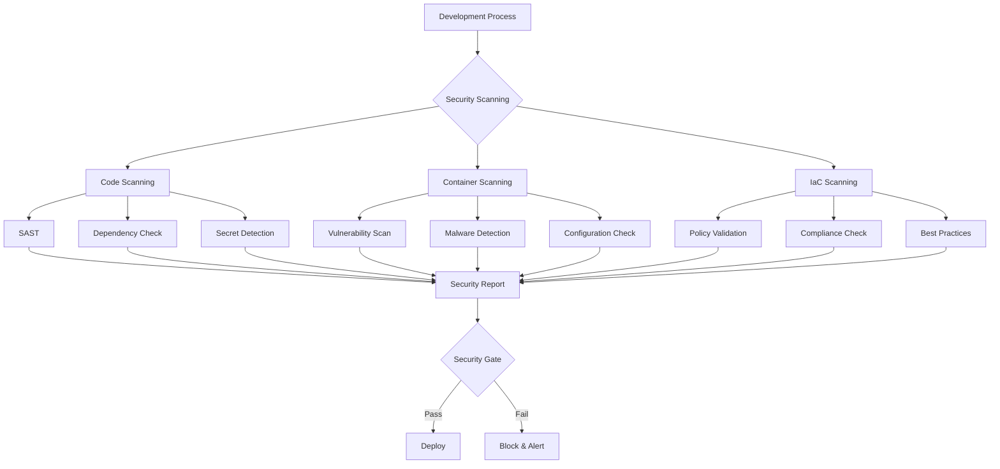

# Complete Security Scanning Tutorial

## Introduction

This comprehensive tutorial covers implementing security scanning across all layers of your DevSecOps pipeline. We'll explore scanning Docker images, source code, and Infrastructure as Code (IaC) using industry-standard tools integrated into CI/CD pipelines.

## Security Scanning Overview



## Part 1: Code Security Scanning

### 1.1 Static Application Security Testing (SAST)

SAST analyzes source code for security vulnerabilities without executing the program.

#### GitHub Actions Implementation

```yaml
name: Code Security Scanning

on:
  push:
    branches: [ main, develop ]
  pull_request:
    branches: [ main ]

jobs:
  sast-scan:
    name: Static Application Security Testing
    runs-on: ubuntu-latest
    steps:
      - name: Checkout code
        uses: actions/checkout@v4
        with:
          fetch-depth: 0

      # CodeQL for multiple languages
      - name: Initialize CodeQL
        uses: github/codeql-action/init@v3
        with:
          languages: javascript, python, java
          queries: security-extended

      - name: Autobuild
        uses: github/codeql-action/autobuild@v3

      - name: Perform CodeQL Analysis
        uses: github/codeql-action/analyze@v3

      # Semgrep for additional SAST
      - name: Run Semgrep
        uses: semgrep/semgrep-action@v1
        with:
          config: >-
            p/security-audit
            p/secrets
            p/owasp-top-ten
        env:
          SEMGREP_APP_TOKEN: ${{ secrets.SEMGREP_APP_TOKEN }}

      # SonarQube integration
      - name: SonarQube Scan
        uses: sonarqube-quality-gate-action@master
        env:
          SONAR_TOKEN: ${{ secrets.SONAR_TOKEN }}
        with:
          scanMetadataReportFile: target/sonar/report-task.txt
```

#### Language-Specific SAST Tools

**Python with Bandit:**
```yaml
      - name: Install Bandit
        run: pip install bandit[toml]

      - name: Run Bandit scan
        run: |
          bandit -r . -f json -o bandit-report.json
          bandit -r . -f sarif -o bandit-results.sarif

      - name: Upload Bandit results
        uses: github/codeql-action/upload-sarif@v3
        with:
          sarif_file: bandit-results.sarif
```

**JavaScript/TypeScript with ESLint Security:**
```yaml
      - name: Setup Node.js
        uses: actions/setup-node@v4
        with:
          node-version: '18'
          cache: 'npm'

      - name: Install security plugins
        run: |
          npm install eslint-plugin-security --save-dev
          npm install @typescript-eslint/eslint-plugin --save-dev

      - name: Run ESLint security scan
        run: |
          npx eslint . --ext .js,.jsx,.ts,.tsx \
            --config .eslintrc-security.js \
            --format @microsoft/eslint-formatter-sarif \
            --output-file eslint-results.sarif

      - name: Upload ESLint results
        uses: github/codeql-action/upload-sarif@v3
        with:
          sarif_file: eslint-results.sarif
```

### 1.2 Dependency Vulnerability Scanning

Scan third-party dependencies for known vulnerabilities.

```yaml
  dependency-scan:
    name: Dependency Vulnerability Scan
    runs-on: ubuntu-latest
    steps:
      - name: Checkout code
        uses: actions/checkout@v4

      # GitHub native dependency review
      - name: Dependency Review
        uses: actions/dependency-review-action@v3
        with:
          fail-on-severity: moderate

      # Snyk for comprehensive dependency scanning
      - name: Run Snyk to check for vulnerabilities
        uses: snyk/actions/node@master
        env:
          SNYK_TOKEN: ${{ secrets.SNYK_TOKEN }}
        with:
          args: --severity-threshold=high --sarif-file-output=snyk.sarif

      - name: Upload Snyk results
        uses: github/codeql-action/upload-sarif@v3
        with:
          sarif_file: snyk.sarif

      # OWASP Dependency Check
      - name: Run OWASP Dependency Check
        uses: dependency-check/Dependency-Check_Action@main
        with:
          project: 'my-project'
          path: '.'
          format: 'ALL'
          args: >
            --enableRetired
            --enableExperimental
            --nvdApiKey ${{ secrets.NVD_API_KEY }}

      - name: Upload OWASP results
        uses: actions/upload-artifact@v4
        with:
          name: dependency-check-reports
          path: reports/
```

### 1.3 Secret Detection

Prevent secrets from being committed to the repository.

```yaml
  secret-scan:
    name: Secret Detection
    runs-on: ubuntu-latest
    steps:
      - name: Checkout code
        uses: actions/checkout@v4
        with:
          fetch-depth: 0

      # TruffleHog for git history scanning
      - name: TruffleHog OSS
        uses: trufflesecurity/trufflehog@main
        with:
          path: ./
          base: main
          head: HEAD
          extra_args: --debug --only-verified

      # GitLeaks for additional secret detection
      - name: Run GitLeaks
        uses: gitleaks/gitleaks-action@v2
        env:
          GITHUB_TOKEN: ${{ secrets.GITHUB_TOKEN }}
          GITLEAKS_LICENSE: ${{ secrets.GITLEAKS_LICENSE }}

      # Custom secret patterns
      - name: Custom Secret Scan
        run: |
          # Create custom rules file
          cat > .secret-patterns << EOF
          (?i)(password|passwd|pwd)\s*[:=]\s*["']?[a-zA-Z0-9!@#$%^&*()_+\-=\[\]{};':"\\|,.<>\/?]{8,}
          (?i)(api[_\-]?key|apikey)\s*[:=]\s*["']?[a-zA-Z0-9]{16,}
          (?i)(secret[_\-]?key|secretkey)\s*[:=]\s*["']?[a-zA-Z0-9]{16,}
          EOF
          
          # Scan for custom patterns
          grep -r -E -f .secret-patterns . --exclude-dir=.git || true
```

## Part 2: Container Security Scanning

### 2.1 Comprehensive Container Scanning

Scan Docker images for vulnerabilities, malware, and misconfigurations.

```yaml
  container-security:
    name: Container Security Scanning
    runs-on: ubuntu-latest
    needs: build
    steps:
      - name: Checkout code
        uses: actions/checkout@v4

      # Trivy comprehensive scanning
      - name: Run Trivy vulnerability scanner
        uses: aquasecurity/trivy-action@master
        with:
          image-ref: '${{ needs.build.outputs.image }}'
          format: 'sarif'
          output: 'trivy-results.sarif'
          severity: 'CRITICAL,HIGH,MEDIUM'

      - name: Upload Trivy scan results
        uses: github/codeql-action/upload-sarif@v3
        with:
          sarif_file: 'trivy-results.sarif'

      # Grype for additional vulnerability scanning
      - name: Anchore Grype scan
        uses: anchore/scan-action@v3
        with:
          image: '${{ needs.build.outputs.image }}'
          fail-build: true
          severity-cutoff: high
          output-format: sarif

      # Syft for SBOM generation
      - name: Generate SBOM
        uses: anchore/sbom-action@v0
        with:
          image: '${{ needs.build.outputs.image }}'
          format: spdx-json
          output-file: sbom.spdx.json

      - name: Upload SBOM
        uses: actions/upload-artifact@v4
        with:
          name: sbom
          path: sbom.spdx.json

      # Custom security checks
      - name: Container Configuration Check
        run: |
          # Check for running as root
          docker run --rm '${{ needs.build.outputs.image }}' whoami | grep -v root || {
            echo "❌ Container running as root user"
            exit 1
          }
          
          # Check for exposed ports
          docker inspect '${{ needs.build.outputs.image }}' | \
            jq -r '.[0].Config.ExposedPorts // {} | keys[]' | \
            while read port; do
              echo "ℹ️ Exposed port: $port"
            done

      # Distroless/minimal base image check
      - name: Base Image Security Check
        run: |
          # Check if using distroless or minimal images
          docker history '${{ needs.build.outputs.image }}' --no-trunc | \
            grep -E "(distroless|scratch|alpine)" || {
            echo "⚠️ Consider using minimal base images (distroless, alpine, scratch)"
          }
```

### 2.2 Runtime Security Scanning

```yaml
  runtime-security:
    name: Runtime Security Testing
    runs-on: ubuntu-latest
    needs: container-security
    steps:
      - name: Container Runtime Security Test
        run: |
          # Start container with security monitoring
          docker run -d --name test-container \
            --read-only \
            --tmpfs /tmp \
            --cap-drop ALL \
            --cap-add NET_BIND_SERVICE \
            --no-new-privileges \
            '${{ needs.build.outputs.image }}'
          
          # Wait for container to start
          sleep 10
          
          # Check container security settings
          docker inspect test-container | jq '.[0].HostConfig | {
            ReadonlyRootfs: .ReadonlyRootfs,
            CapDrop: .CapDrop,
            CapAdd: .CapAdd,
            SecurityOpt: .SecurityOpt
          }'
          
          # Test application functionality
          docker exec test-container curl -f http://localhost:8080/health || {
            echo "❌ Application health check failed"
            exit 1
          }
          
          # Cleanup
          docker stop test-container
          docker rm test-container
```

## Part 3: Infrastructure as Code Security Scanning

### 3.1 Multi-Tool IaC Scanning

Scan Terraform, Kubernetes, Docker Compose, and other IaC files.

```yaml
  iac-security:
    name: Infrastructure as Code Security
    runs-on: ubuntu-latest
    steps:
      - name: Checkout code
        uses: actions/checkout@v4

      # Checkov for comprehensive IaC scanning
      - name: Run Checkov
        uses: bridgecrewio/checkov-action@master
        with:
          directory: .
          framework: terraform,kubernetes,dockerfile,docker_compose
          output_format: sarif
          output_file_path: checkov-results.sarif
          download_external_modules: true

      - name: Upload Checkov results
        uses: github/codeql-action/upload-sarif@v3
        with:
          sarif_file: checkov-results.sarif

      # TFSec for Terraform security
      - name: tfsec
        uses: aquasecurity/tfsec-sarif-action@v0.1.4
        with:
          sarif_file: tfsec.sarif

      - name: Upload TFSec results
        uses: github/codeql-action/upload-sarif@v3
        with:
          sarif_file: tfsec.sarif

      # Terrascan for additional IaC scanning
      - name: Run Terrascan
        uses: tenable/terrascan-action@main
        with:
          iac_type: 'terraform'
          iac_version: 'v14'
          policy_type: 'aws'
          only_warn: true
          sarif_upload: true

      # Kubernetes-specific security scanning
      - name: Kubesec scan
        run: |
          if find . -name "*.yaml" -o -name "*.yml" | grep -E "(k8s|kubernetes)" > /dev/null; then
            docker run --rm -v $(pwd):/workspace \
              kubesec/kubesec:latest scan /workspace/k8s/*.yaml
          fi

      # Custom policy validation
      - name: Custom IaC Policy Check
        run: |
          # Check for common security issues
          echo "🔍 Checking for common IaC security issues..."
          
          # Check for hardcoded secrets in Terraform
          if find . -name "*.tf" -exec grep -l "password\|secret\|key" {} \; | head -1; then
            echo "⚠️ Potential hardcoded secrets found in Terraform files"
          fi
          
          # Check for public S3 buckets
          if grep -r "acl.*public-read" . --include="*.tf"; then
            echo "❌ Public S3 bucket ACL detected"
            exit 1
          fi
          
          # Check for unrestricted security groups
          if grep -r "0.0.0.0/0" . --include="*.tf" | grep -v "egress"; then
            echo "⚠️ Unrestricted ingress rules detected"
          fi
```

### 3.2 Policy as Code Implementation

```yaml
  policy-as-code:
    name: Policy as Code Validation
    runs-on: ubuntu-latest
    steps:
      - name: Checkout code
        uses: actions/checkout@v4

      # Open Policy Agent (OPA) validation
      - name: Setup OPA
        run: |
          curl -L -o opa https://openpolicyagent.org/downloads/latest/opa_linux_amd64
          chmod +x opa
          sudo mv opa /usr/local/bin

      - name: Run OPA Policy Tests
        run: |
          # Create security policies
          mkdir -p policies
          cat > policies/security.rego << 'EOF'
          package security

          # Deny containers running as root
          deny[msg] {
            input.kind == "Deployment"
            input.spec.template.spec.containers[_].securityContext.runAsUser == 0
            msg := "Container running as root user"
          }

          # Require resource limits
          deny[msg] {
            input.kind == "Deployment"
            not input.spec.template.spec.containers[_].resources.limits
            msg := "Container missing resource limits"
          }

          # Require security context
          deny[msg] {
            input.kind == "Deployment"
            not input.spec.template.spec.containers[_].securityContext
            msg := "Container missing security context"
          }
          EOF

          # Test policies against Kubernetes manifests
          if find . -name "*.yaml" -path "*/k8s/*" | head -1 > /dev/null; then
            for file in $(find . -name "*.yaml" -path "*/k8s/*"); do
              echo "Testing $file"
              opa eval -d policies/ -I "$file" "data.security.deny[x]"
            done
          fi

      # Conftest for policy testing
      - name: Run Conftest
        run: |
          # Install conftest
          wget https://github.com/open-policy-agent/conftest/releases/latest/download/conftest_Linux_x86_64.tar.gz
          tar xzf conftest_Linux_x86_64.tar.gz
          sudo mv conftest /usr/local/bin

          # Test with built-in policies
          if find . -name "*.yaml" -o -name "*.yml" | head -1 > /dev/null; then
            conftest verify --policy policies/ $(find . -name "*.yaml" -o -name "*.yml")
          fi
```

## Part 4: Comprehensive Security Dashboard

### 4.1 Security Metrics Collection

```yaml
  security-metrics:
    name: Security Metrics Collection
    runs-on: ubuntu-latest
    needs: [sast-scan, dependency-scan, secret-scan, container-security, iac-security]
    if: always()
    steps:
      - name: Collect Security Metrics
        run: |
          # Create security summary
          cat > security-summary.json << EOF
          {
            "timestamp": "$(date -u +%Y-%m-%dT%H:%M:%SZ)",
            "repository": "${{ github.repository }}",
            "commit": "${{ github.sha }}",
            "branch": "${{ github.ref_name }}",
            "jobs": {
              "sast": "${{ needs.sast-scan.result }}",
              "dependency": "${{ needs.dependency-scan.result }}",
              "secrets": "${{ needs.secret-scan.result }}",
              "container": "${{ needs.container-security.result }}",
              "iac": "${{ needs.iac-security.result }}"
            }
          }
          EOF

      - name: Generate Security Report
        run: |
          # Create HTML security report
          cat > security-report.html << 'EOF'
          <!DOCTYPE html>
          <html>
          <head>
              <title>Security Scan Report</title>
              <style>
                  body { font-family: Arial, sans-serif; margin: 20px; }
                  .header { background-color: #f8f9fa; padding: 20px; border-radius: 5px; }
                  .section { margin: 20px 0; padding: 15px; border: 1px solid #ddd; border-radius: 5px; }
                  .pass { background-color: #d4edda; border-color: #c3e6cb; }
                  .fail { background-color: #f8d7da; border-color: #f5c6cb; }
                  .warning { background-color: #fff3cd; border-color: #ffeaa7; }
              </style>
          </head>
          <body>
              <div class="header">
                  <h1>🔒 Security Scan Report</h1>
                  <p><strong>Repository:</strong> ${{ github.repository }}</p>
                  <p><strong>Commit:</strong> ${{ github.sha }}</p>
                  <p><strong>Date:</strong> $(date)</p>
              </div>
              
              <div class="section ${{ needs.sast-scan.result == 'success' && 'pass' || 'fail' }}">
                  <h2>📋 Static Application Security Testing (SAST)</h2>
                  <p>Status: ${{ needs.sast-scan.result }}</p>
              </div>
              
              <div class="section ${{ needs.dependency-scan.result == 'success' && 'pass' || 'fail' }}">
                  <h2>📦 Dependency Vulnerability Scan</h2>
                  <p>Status: ${{ needs.dependency-scan.result }}</p>
              </div>
              
              <div class="section ${{ needs.secret-scan.result == 'success' && 'pass' || 'fail' }}">
                  <h2>🔑 Secret Detection</h2>
                  <p>Status: ${{ needs.secret-scan.result }}</p>
              </div>
              
              <div class="section ${{ needs.container-security.result == 'success' && 'pass' || 'fail' }}">
                  <h2>🐳 Container Security</h2>
                  <p>Status: ${{ needs.container-security.result }}</p>
              </div>
              
              <div class="section ${{ needs.iac-security.result == 'success' && 'pass' || 'fail' }}">
                  <h2>🏗️ Infrastructure as Code Security</h2>
                  <p>Status: ${{ needs.iac-security.result }}</p>
              </div>
          </body>
          </html>
          EOF

      - name: Upload Security Report
        uses: actions/upload-artifact@v4
        with:
          name: security-report
          path: |
            security-summary.json
            security-report.html

      - name: Comment PR with Security Summary
        if: github.event_name == 'pull_request'
        uses: actions/github-script@v7
        with:
          script: |
            const fs = require('fs');
            const summary = JSON.parse(fs.readFileSync('security-summary.json', 'utf8'));
            
            const statusEmoji = {
              'success': '✅',
              'failure': '❌',
              'cancelled': '⚠️',
              'skipped': '⏭️'
            };
            
            const comment = `
            ## 🔒 Security Scan Results
            
            | Scan Type | Status |
            |-----------|--------|
            | SAST | ${statusEmoji[summary.jobs.sast]} ${summary.jobs.sast} |
            | Dependencies | ${statusEmoji[summary.jobs.dependency]} ${summary.jobs.dependency} |
            | Secrets | ${statusEmoji[summary.jobs.secrets]} ${summary.jobs.secrets} |
            | Container | ${statusEmoji[summary.jobs.container]} ${summary.jobs.container} |
            | IaC | ${statusEmoji[summary.jobs.iac]} ${summary.jobs.iac} |
            
            **Commit:** \`${summary.commit}\`  
            **Branch:** \`${summary.branch}\`  
            **Timestamp:** ${summary.timestamp}
            `;
            
            github.rest.issues.createComment({
              issue_number: context.issue.number,
              owner: context.repo.owner,
              repo: context.repo.repo,
              body: comment
            });
```

## Part 5: Advanced Security Configuration

### 5.1 Security Thresholds and Gates

```yaml
  security-gate:
    name: Security Quality Gate
    runs-on: ubuntu-latest
    needs: [sast-scan, dependency-scan, secret-scan, container-security, iac-security]
    if: always()
    steps:
      - name: Evaluate Security Gate
        run: |
          echo "🚪 Evaluating Security Quality Gate..."
          
          # Define thresholds
          CRITICAL_THRESHOLD=0
          HIGH_THRESHOLD=5
          MEDIUM_THRESHOLD=20
          
          # Check each scan result
          CRITICAL_COUNT=0
          HIGH_COUNT=0
          MEDIUM_COUNT=0
          
          # Parse security reports (this would be customized based on actual report formats)
          if [ -f "trivy-results.sarif" ]; then
            CRITICAL_COUNT=$(jq '[.runs[].results[] | select(.level == "error")] | length' trivy-results.sarif || echo 0)
            HIGH_COUNT=$(jq '[.runs[].results[] | select(.level == "warning")] | length' trivy-results.sarif || echo 0)
          fi
          
          echo "Critical vulnerabilities: $CRITICAL_COUNT (threshold: $CRITICAL_THRESHOLD)"
          echo "High vulnerabilities: $HIGH_COUNT (threshold: $HIGH_THRESHOLD)"
          echo "Medium vulnerabilities: $MEDIUM_COUNT (threshold: $MEDIUM_THRESHOLD)"
          
          # Evaluate gate
          if [ "$CRITICAL_COUNT" -gt "$CRITICAL_THRESHOLD" ]; then
            echo "❌ Security gate FAILED: Critical vulnerabilities exceed threshold"
            exit 1
          elif [ "$HIGH_COUNT" -gt "$HIGH_THRESHOLD" ]; then
            echo "❌ Security gate FAILED: High vulnerabilities exceed threshold"
            exit 1
          elif [ "$MEDIUM_COUNT" -gt "$MEDIUM_THRESHOLD" ]; then
            echo "⚠️ Security gate WARNING: Medium vulnerabilities exceed threshold"
            # Don't fail, but warn
          else
            echo "✅ Security gate PASSED: All vulnerability counts within thresholds"
          fi

      - name: Security Gate Status
        if: failure()
        run: |
          echo "## ❌ Security Gate Failed" >> $GITHUB_STEP_SUMMARY
          echo "The security quality gate has failed due to security vulnerabilities exceeding defined thresholds." >> $GITHUB_STEP_SUMMARY
          echo "Please review the security scan results and remediate the identified issues." >> $GITHUB_STEP_SUMMARY
```

### 5.2 Automated Security Remediation

```yaml
  auto-remediation:
    name: Automated Security Remediation
    runs-on: ubuntu-latest
    needs: security-gate
    if: failure()
    steps:
      - name: Checkout code
        uses: actions/checkout@v4
        with:
          token: ${{ secrets.GITHUB_TOKEN }}

      - name: Auto-fix Dependencies
        run: |
          # Update vulnerable dependencies
          if [ -f "package.json" ]; then
            npm audit fix --force
          fi
          
          if [ -f "requirements.txt" ]; then
            # Update Python dependencies
            pip install --upgrade -r requirements.txt
            pip freeze > requirements.txt
          fi
          
          if [ -f "go.mod" ]; then
            go get -u ./...
            go mod tidy
          fi

      - name: Create Auto-fix PR
        uses: peter-evans/create-pull-request@v5
        with:
          token: ${{ secrets.GITHUB_TOKEN }}
          commit-message: "fix: auto-remediate security vulnerabilities"
          title: "🔒 Auto-fix Security Vulnerabilities"
          body: |
            This PR contains automated fixes for security vulnerabilities detected in the security scan.
            
            **Changes:**
            - Updated vulnerable dependencies
            - Applied security patches where available
            
            Please review the changes before merging.
          branch: security/auto-fix-${{ github.run_number }}
```

## Best Practices Summary

### ✅ Security Scanning Checklist

1. **Code Security:**
   - [ ] SAST scanning enabled
   - [ ] Dependency vulnerability scanning
   - [ ] Secret detection configured
   - [ ] License compliance checked

2. **Container Security:**
   - [ ] Image vulnerability scanning
   - [ ] SBOM generation
   - [ ] Runtime security testing
   - [ ] Base image security validation

3. **Infrastructure Security:**
   - [ ] IaC vulnerability scanning
   - [ ] Policy as Code implementation
   - [ ] Compliance validation
   - [ ] Configuration drift detection

4. **Process & Governance:**
   - [ ] Security gates implemented
   - [ ] Threshold-based quality gates
   - [ ] Automated reporting
   - [ ] Remediation workflows

### 🎯 Key Recommendations

1. **Start Simple:** Begin with basic scans and gradually add more comprehensive checks
2. **Set Realistic Thresholds:** Avoid alert fatigue by setting appropriate vulnerability thresholds
3. **Automate Everything:** Use CI/CD integration for consistent security scanning
4. **Monitor Continuously:** Implement ongoing monitoring, not just pre-deployment scanning
5. **Train Your Team:** Ensure developers understand security scan results and remediation

### 📊 Metrics to Track

- Vulnerability detection rate
- Mean time to remediation (MTTR)
- Security gate pass/fail rates
- Compliance score trends
- Security debt accumulation

This comprehensive security scanning approach ensures that security is integrated throughout your development lifecycle, providing multiple layers of protection and continuous visibility into your security posture.
