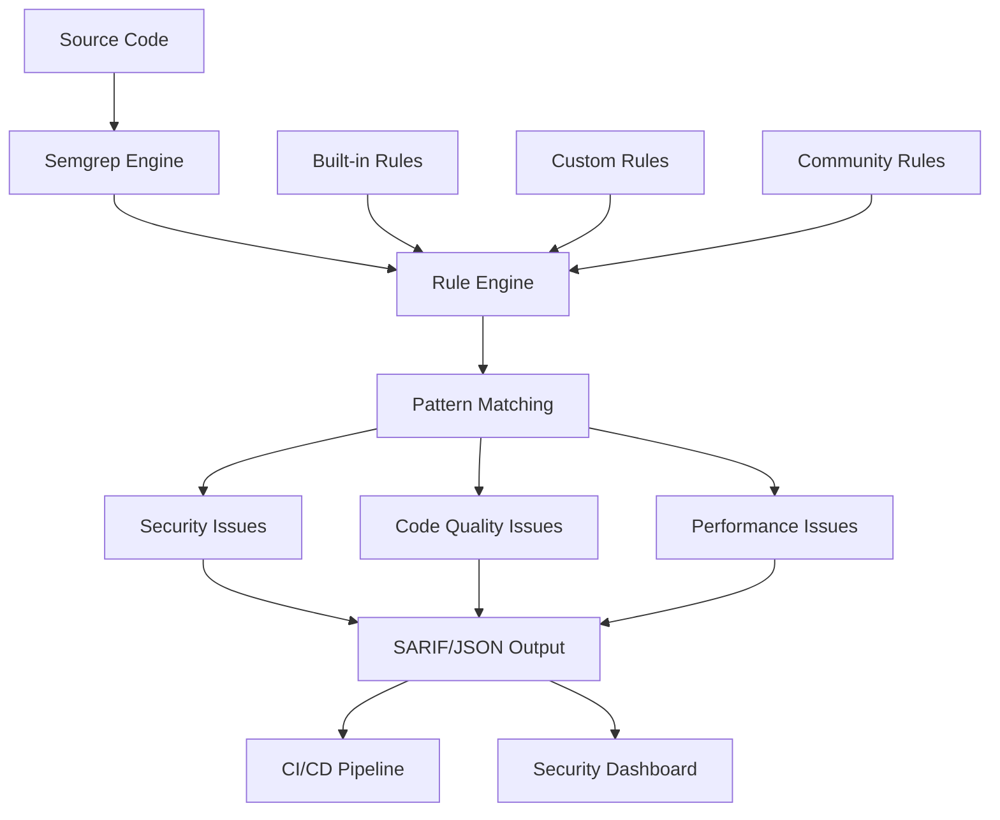

# Semgrep - Static Code Analysis

## Introduction

Semgrep is a fast, open-source static analysis tool that finds bugs, detects vulnerabilities, and enforces code standards. It uses pattern-based analysis with a simple syntax that allows you to write custom rules for your specific needs.

**Key Features:**
- **Multi-language support**: Python, JavaScript, Java, Go, C, C++, Ruby, PHP, and more
- **Custom rules**: Write your own patterns using a simple YAML syntax
- **Fast performance**: Analyzes large codebases quickly
- **CI/CD integration**: Easy integration with GitHub Actions, GitLab CI, and other platforms
- **Community rules**: Access to thousands of pre-built rules

## Architecture Overview



## Installation and Setup

### Local Installation

```bash
# Using pip
pip install semgrep

# Using homebrew (macOS)
brew install semgrep

# Using npm
npm install -g @semgrep/semgrep
```

### Verify Installation

```bash
semgrep --version
semgrep --help
```

## Basic Usage

### Running Semgrep

```bash
# Run with default rules
semgrep --config=auto .

# Run specific rule sets
semgrep --config=p/security .
semgrep --config=p/owasp-top-ten .
semgrep --config=p/django .

# Run custom rules
semgrep --config=my-rules.yml .
```

### Common Rule Sets

```bash
# Security-focused scans
semgrep --config=p/security
semgrep --config=p/secrets
semgrep --config=p/sql-injection
semgrep --config=p/xss

# Code quality scans
semgrep --config=p/code-quality
semgrep --config=p/performance
semgrep --config=p/best-practices
```

## Writing Custom Rules

### Basic Rule Structure

```yaml
rules:
  - id: hardcoded-password
    pattern: password = "..."
    message: Hardcoded password detected
    languages: [python, javascript]
    severity: ERROR
    metadata:
      category: security
      cwe: "CWE-798"
      confidence: HIGH
```

### Advanced Pattern Examples

**SQL Injection Detection:**
```yaml
rules:
  - id: sql-injection-risk
    patterns:
      - pattern-either:
          - pattern: cursor.execute($QUERY % $VAR)
          - pattern: cursor.execute($QUERY + $VAR)
          - pattern: cursor.execute(f"... {$VAR} ...")
    message: Potential SQL injection vulnerability
    languages: [python]
    severity: ERROR
    fix: Use parameterized queries instead
```

**Hardcoded Secrets:**
```yaml
rules:
  - id: hardcoded-api-key
    pattern-regex: |
      (api_key|apikey|api-key)\s*[:=]\s*["']([A-Za-z0-9]{20,})["']
    message: Hardcoded API key detected
    languages: [python, javascript, java]
    severity: ERROR
    metadata:
      category: security
      subcategory: secrets
```

**Unsafe Function Usage:**
```yaml
rules:
  - id: eval-usage
    pattern: eval($EXPR)
    message: Use of eval() is dangerous and should be avoided
    languages: [python, javascript]
    severity: WARNING
    metadata:
      cwe: "CWE-95"
      owasp: "A03:2021 - Injection"
```

## GitHub Actions Integration

### Basic Workflow

```yaml
name: Semgrep Security Scan

on:
  push:
    branches: [ main, develop ]
  pull_request:
    branches: [ main ]

jobs:
  semgrep:
    name: Semgrep Scan
    runs-on: ubuntu-latest
    steps:
      - name: Checkout code
        uses: actions/checkout@v4

      - name: Run Semgrep
        uses: semgrep/semgrep-action@v1
        with:
          config: >-
            p/security
            p/secrets
            p/owasp-top-ten
        env:
          SEMGREP_APP_TOKEN: ${{ secrets.SEMGREP_APP_TOKEN }}

      - name: Upload SARIF file
        uses: github/codeql-action/upload-sarif@v3
        with:
          sarif_file: semgrep.sarif
        if: always()
```

### Advanced GitHub Actions Workflow

```yaml
name: Advanced Semgrep Analysis

on:
  push:
    branches: [ main, develop ]
  pull_request:
    branches: [ main ]

jobs:
  semgrep-security:
    name: Security Analysis
    runs-on: ubuntu-latest
    steps:
      - name: Checkout code
        uses: actions/checkout@v4
        with:
          fetch-depth: 0

      - name: Run Semgrep Security Scan
        uses: semgrep/semgrep-action@v1
        with:
          config: >-
            p/security
            p/secrets
            p/sql-injection
            p/xss
          generateSarif: "1"
        env:
          SEMGREP_APP_TOKEN: ${{ secrets.SEMGREP_APP_TOKEN }}

      - name: Upload Security SARIF
        uses: github/codeql-action/upload-sarif@v3
        with:
          sarif_file: semgrep.sarif
          category: semgrep-security
        if: always()

  semgrep-quality:
    name: Code Quality Analysis
    runs-on: ubuntu-latest
    steps:
      - name: Checkout code
        uses: actions/checkout@v4

      - name: Run Semgrep Quality Scan
        uses: semgrep/semgrep-action@v1
        with:
          config: >-
            p/code-quality
            p/performance
            p/best-practices
          generateSarif: "1"
        env:
          SEMGREP_APP_TOKEN: ${{ secrets.SEMGREP_APP_TOKEN }}

      - name: Upload Quality SARIF
        uses: github/codeql-action/upload-sarif@v3
        with:
          sarif_file: semgrep.sarif
          category: semgrep-quality
        if: always()

  custom-rules:
    name: Custom Rules Analysis
    runs-on: ubuntu-latest
    steps:
      - name: Checkout code
        uses: actions/checkout@v4

      - name: Install Semgrep
        run: pip install semgrep

      - name: Run Custom Rules
        run: |
          semgrep --config=.semgrep/rules/ \
            --sarif \
            --output=custom-results.sarif \
            --severity=ERROR \
            .

      - name: Upload Custom Results
        uses: github/codeql-action/upload-sarif@v3
        with:
          sarif_file: custom-results.sarif
          category: semgrep-custom
        if: always()
```

## GitLab CI Integration

```yaml
stages:
  - security

semgrep-scan:
  stage: security
  image: semgrep/semgrep:latest
  script:
    - semgrep --config=auto --sarif --output=semgrep-results.sarif .
  artifacts:
    reports:
      sast: semgrep-results.sarif
    paths:
      - semgrep-results.sarif
    expire_in: 1 week
  rules:
    - if: '$CI_PIPELINE_SOURCE == "merge_request_event"'
    - if: '$CI_COMMIT_BRANCH == "main"'
```

## Configuration Files

### .semgrepignore

```plaintext
# Ignore test files
tests/
test/
*test*.py
*test*.js

# Ignore third-party code
node_modules/
vendor/
.venv/
venv/

# Ignore generated files
*.min.js
*.bundle.js
dist/
build/

# Ignore specific files
config/secrets.example.py
```

### Custom Rule File (.semgrep/rules/security.yml)

```yaml
rules:
  - id: django-sql-injection
    patterns:
      - pattern-either:
          - pattern: User.objects.extra(where=[$WHERE, ...], ...)
          - pattern: User.objects.raw($QUERY, ...)
      - pattern-not: User.objects.raw("...", [...])
    message: |
      Potential SQL injection in Django ORM. Use parameterized queries.
    languages: [python]
    severity: ERROR
    metadata:
      category: security
      cwe: "CWE-89"
      confidence: HIGH

  - id: insecure-random
    pattern-either:
      - pattern: random.random()
      - pattern: random.randint($X, $Y)
    message: |
      Using insecure random number generator. Use secrets module for 
      cryptographic purposes.
    languages: [python]
    severity: WARNING
    fix: |
      import secrets
      secrets.randbelow(max_value)

  - id: weak-crypto
    pattern-either:
      - pattern: hashlib.md5(...)
      - pattern: hashlib.sha1(...)
    message: Weak cryptographic hash function
    languages: [python]
    severity: WARNING
    metadata:
      cwe: "CWE-327"
```

## Advanced Features

### Autofix Rules

```yaml
rules:
  - id: use-https
    pattern: requests.get("http://...")
    message: Use HTTPS instead of HTTP
    languages: [python]
    severity: WARNING
    fix: requests.get("https://...")

  - id: remove-console-log
    pattern: console.log(...)
    message: Remove console.log in production
    languages: [javascript]
    severity: INFO
    fix: ""
```

### Metavariable Analysis

```yaml
rules:
  - id: path-traversal
    patterns:
      - pattern: open($FILE, ...)
      - metavariable-regex:
          metavariable: $FILE
          regex: .*\.\./.*
    message: Potential path traversal vulnerability
    languages: [python]
    severity: ERROR
```

## Best Practices

### 1. Gradual Implementation

```bash
# Start with security-focused rules
semgrep --config=p/security --severity=ERROR

# Add more rules gradually
semgrep --config=p/security,p/secrets --severity=WARNING

# Include custom rules
semgrep --config=auto,.semgrep/rules/
```

### 2. CI/CD Integration Strategy

```yaml
# Different rules for different branches
- name: Security scan for main branch
  if: github.ref == 'refs/heads/main'
  run: semgrep --config=p/security --severity=ERROR --error

- name: Full scan for PRs
  if: github.event_name == 'pull_request'
  run: semgrep --config=auto --severity=WARNING
```

### 3. Performance Optimization

```yaml
# Use baseline for incremental scanning
- name: Semgrep with baseline
  run: |
    semgrep --config=auto \
      --baseline=semgrep-baseline.json \
      --sarif \
      --output=results.sarif
```

## Troubleshooting

### Common Issues

**High False Positive Rate:**
```yaml
# Use more specific patterns
rules:
  - id: specific-rule
    patterns:
      - pattern: dangerous_function($ARG)
      - pattern-not: dangerous_function("safe_value")
    message: Potentially dangerous function call
```

**Performance Issues:**
```bash
# Exclude large directories
echo "node_modules/" >> .semgrepignore
echo "vendor/" >> .semgrepignore

# Use specific rule sets
semgrep --config=p/security # instead of --config=auto
```

**Integration Failures:**
```yaml
# Add error handling
- name: Run Semgrep
  run: semgrep --config=auto . || true
  continue-on-error: true
```

## Conclusion

Semgrep provides a powerful and flexible platform for static code analysis that can be easily integrated into any DevSecOps pipeline. Its pattern-based approach makes it simple to write custom rules while its extensive rule library covers common security and quality issues.

**Key advantages:**
- Fast and lightweight
- Easy custom rule creation
- Multi-language support
- Strong CI/CD integration
- Active community and rule sharing

For more information, visit the [Semgrep Documentation](https://semgrep.dev/docs/).
