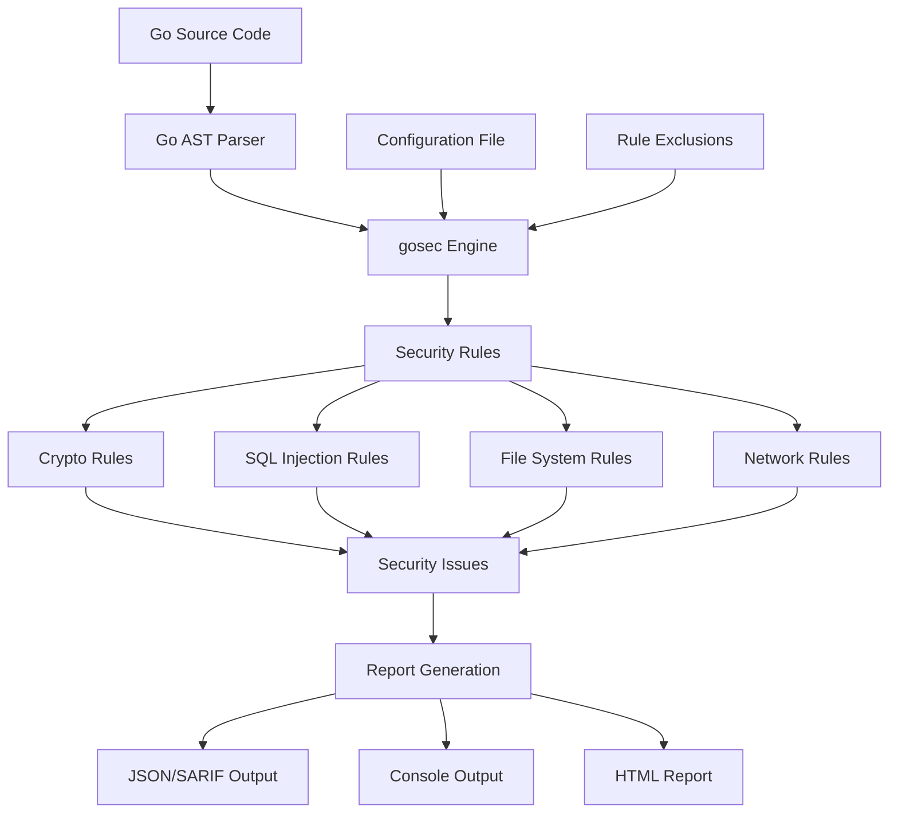

# gosec - Go Security Analysis

## Introduction

gosec is a security analyzer for Go that inspects source code for security problems by scanning the Go AST (Abstract Syntax Tree). It identifies common security issues specific to Go applications and provides detailed reports with remediation suggestions.

**Key Features:**
- **Go-specific security rules**: Tailored for Go language security patterns
- **AST-based analysis**: Deep understanding of Go code structure
- **Configurable rules**: Customizable rule sets and severity levels
- **Multiple output formats**: JSON, SARIF, XML, CSV, HTML, and more
- **CI/CD integration**: Easy integration with continuous integration pipelines

## Architecture Overview



## Installation and Setup

### Installation

```bash
# Install via go install
go install github.com/securecodewarrior/sast-scan/gosec@latest

# Install specific version
go install github.com/securecodewarrior/sast-scan/gosec@v2.18.2

# Download binary
curl -sfL https://raw.githubusercontent.com/securecodewarrior/sast-scan/master/install.sh | sh -s -- -b $(go env GOPATH)/bin gosec
```

### Verify Installation

```bash
gosec --version
gosec -help
```

## Basic Usage

### Command Line Analysis

```bash
# Scan current directory
gosec ./...

# Scan specific package
gosec ./pkg/...

# Scan with verbose output
gosec -verbose ./...

# Generate JSON report
gosec -fmt json -out gosec-report.json ./...

# Generate SARIF report
gosec -fmt sarif -out gosec-report.sarif ./...

# Scan with specific confidence level
gosec -confidence medium ./...

# Scan with specific severity level
gosec -severity medium ./...
```

### Common Options

```bash
# Exclude specific rules
gosec -exclude G101,G401 ./...

# Include only specific rules
gosec -include G201,G202 ./...

# Set confidence threshold (low, medium, high)
gosec -confidence high ./...

# Set severity threshold (low, medium, high)
gosec -severity high ./...

# Exclude test files
gosec -tests=false ./...

# Show only specific rule categories
gosec -tags crypto ./...
```

## Configuration

### Configuration File (.gosec.json)

```json
{
  "tests": false,
  "exclude": ["G101", "G401"],
  "include": ["G201", "G202"],
  "confidence": "medium",
  "severity": "medium",
  "format": "sarif",
  "output": "gosec-report.sarif",
  "stdout": false,
  "verbose": "text",
  "rules": {
    "G101": {
      "pattern": "(?i)(password|pwd|secret|token)",
      "ignore_entropy": false
    }
  },
  "global": {
    "nosec": false,
    "audit": true
  }
}
```

### Rule Categories

```json
{
  "crypto": ["G401", "G402", "G403", "G404", "G405"],
  "sql": ["G201", "G202"],
  "filesystem": ["G301", "G302", "G303", "G304", "G305", "G306", "G307"],
  "network": ["G401", "G402"],
  "subprocess": ["G204"],
  "bind": ["G102"],
  "hardcoded": ["G101", "G103"],
  "errors": ["G104"],
  "unsafe": ["G103", "G104"]
}
```

## GitHub Actions Integration

### Basic gosec Workflow

```yaml
name: Go Security Analysis with gosec

on:
  push:
    branches: [ main, develop ]
  pull_request:
    branches: [ main ]

jobs:
  gosec:
    name: gosec Security Scan
    runs-on: ubuntu-latest
    steps:
      - name: Checkout code
        uses: actions/checkout@v4

      - name: Setup Go
        uses: actions/setup-go@v4
        with:
          go-version: '1.21'

      - name: Install gosec
        run: go install github.com/securecodewarrior/sast-scan/gosec@latest

      - name: Run gosec
        run: |
          gosec -fmt sarif -out gosec-results.sarif ./...
        continue-on-error: true

      - name: Upload SARIF results
        uses: github/codeql-action/upload-sarif@v3
        with:
          sarif_file: gosec-results.sarif
        if: always()

      - name: Upload gosec report
        uses: actions/upload-artifact@v4
        with:
          name: gosec-report
          path: gosec-results.sarif
        if: always()
```

### Advanced gosec Workflow

```yaml
name: Advanced Go Security Analysis

on:
  push:
    branches: [ main ]
  pull_request:
    branches: [ main ]

jobs:
  gosec-analysis:
    name: gosec Security Analysis
    runs-on: ubuntu-latest
    strategy:
      matrix:
        go-version: ['1.20', '1.21']
    steps:
      - name: Checkout code
        uses: actions/checkout@v4

      - name: Setup Go ${{ matrix.go-version }}
        uses: actions/setup-go@v4
        with:
          go-version: ${{ matrix.go-version }}

      - name: Cache Go modules
        uses: actions/cache@v3
        with:
          path: ~/go/pkg/mod
          key: ${{ runner.os }}-go-${{ hashFiles('**/go.sum') }}

      - name: Install dependencies
        run: go mod download

      - name: Install gosec
        run: go install github.com/securecodewarrior/sast-scan/gosec@latest

      - name: Create gosec config
        run: |
          cat > .gosec.json << EOF
          {
            "tests": false,
            "exclude": ["G101"],
            "confidence": "medium",
            "severity": "medium",
            "format": "sarif",
            "output": "gosec-report.sarif"
          }
          EOF

      - name: Run gosec scan
        run: |
          # Run with different output formats
          gosec -fmt json -out gosec-report.json ./...
          gosec -fmt sarif -out gosec-report.sarif ./...
          gosec -fmt html -out gosec-report.html ./...
          
          # Run with different severity levels
          gosec -severity high -fmt json -out gosec-high.json ./... || true
        continue-on-error: true

      - name: Check for high severity issues
        run: |
          if [ -f gosec-high.json ]; then
            HIGH_COUNT=$(jq '.Issues | length' gosec-high.json 2>/dev/null || echo 0)
            echo "High severity issues: $HIGH_COUNT"
            
            if [ "$HIGH_COUNT" -gt 0 ]; then
              echo "❌ High severity security issues found!"
              jq -r '.Issues[] | "- \(.rule_id): \(.details) in \(.file):\(.line)"' gosec-high.json
              exit 1
            else
              echo "✅ No high severity issues found"
            fi
          fi

      - name: Upload SARIF results
        uses: github/codeql-action/upload-sarif@v3
        with:
          sarif_file: gosec-report.sarif
          category: gosec-go${{ matrix.go-version }}
        if: always()

      - name: Upload artifacts
        uses: actions/upload-artifact@v4
        with:
          name: gosec-reports-go${{ matrix.go-version }}
          path: |
            gosec-report.json
            gosec-report.html
            gosec-high.json
        if: always()

  security-summary:
    name: Security Summary
    needs: gosec-analysis
    runs-on: ubuntu-latest
    if: always()
    steps:
      - name: Download artifacts
        uses: actions/download-artifact@v4
        with:
          path: reports

      - name: Generate security summary
        run: |
          echo "# 🔒 Go Security Analysis Summary" >> $GITHUB_STEP_SUMMARY
          echo "" >> $GITHUB_STEP_SUMMARY
          
          for report in reports/*/gosec-report.json; do
            if [ -f "$report" ]; then
              TOTAL=$(jq '.Stats.files' "$report" 2>/dev/null || echo 0)
              ISSUES=$(jq '.Issues | length' "$report" 2>/dev/null || echo 0)
              HIGH=$(jq '[.Issues[] | select(.severity=="HIGH")] | length' "$report" 2>/dev/null || echo 0)
              MEDIUM=$(jq '[.Issues[] | select(.severity=="MEDIUM")] | length' "$report" 2>/dev/null || echo 0)
              LOW=$(jq '[.Issues[] | select(.severity=="LOW")] | length' "$report" 2>/dev/null || echo 0)
              
              echo "## Analysis Results" >> $GITHUB_STEP_SUMMARY
              echo "- **Files Scanned**: $TOTAL" >> $GITHUB_STEP_SUMMARY
              echo "- **Total Issues**: $ISSUES" >> $GITHUB_STEP_SUMMARY
              echo "- **High Severity**: $HIGH" >> $GITHUB_STEP_SUMMARY
              echo "- **Medium Severity**: $MEDIUM" >> $GITHUB_STEP_SUMMARY
              echo "- **Low Severity**: $LOW" >> $GITHUB_STEP_SUMMARY
              echo "" >> $GITHUB_STEP_SUMMARY
            fi
          done
```

## GitLab CI Integration

```yaml
stages:
  - security

gosec-security-scan:
  stage: security
  image: golang:1.21
  before_script:
    - go install github.com/securecodewarrior/sast-scan/gosec@latest
  script:
    - gosec -fmt json -out gosec-report.json ./...
    - gosec -fmt sarif -out gosec-report.sarif ./...
  artifacts:
    reports:
      sast: gosec-report.sarif
    paths:
      - gosec-report.json
      - gosec-report.sarif
    expire_in: 1 week
  allow_failure: true
  rules:
    - if: '$CI_PIPELINE_SOURCE == "merge_request_event"'
    - if: '$CI_COMMIT_BRANCH == "main"'
```

## Security Rules Coverage

### Built-in Security Checks

#### Hardcoded Credentials
```go
// G101: Hardcoded credentials
package main

const apiKey = "sk-1234567890abcdef"  // Flagged
var password = "secret123"            // Flagged

func main() {
    token := "bearer-token-12345"     // Flagged
}
```

#### SQL Injection
```go
// G201: SQL query construction with string concatenation
// G202: SQL query construction with string formatting
package main

import (
    "database/sql"
    "fmt"
)

func getUserData(db *sql.DB, userID string) {
    // G201: Flagged
    query := "SELECT * FROM users WHERE id = " + userID
    db.Query(query)
    
    // G202: Flagged
    query2 := fmt.Sprintf("SELECT * FROM users WHERE name = '%s'", userName)
    db.Query(query2)
}
```

#### Subprocess Execution
```go
// G204: Subprocess launched with potentially tainted input
package main

import (
    "os/exec"
)

func runCommand(userInput string) {
    // Flagged: command injection risk
    cmd := exec.Command("sh", "-c", userInput)
    cmd.Run()
}
```

#### File System Access
```go
// G301-G307: File system related security issues
package main

import (
    "os"
)

func createFile(filename string) {
    // G302: Poor file permissions
    file, _ := os.OpenFile(filename, os.O_CREATE, 0777)  // Flagged
    defer file.Close()
    
    // G304: File path traversal
    content, _ := os.ReadFile("../../../etc/passwd")     // Flagged
}
```

#### Cryptographic Issues
```go
// G401-G405: Weak cryptographic practices
package main

import (
    "crypto/md5"  // G401: Flagged
    "crypto/sha1" // G401: Flagged
    "crypto/des"  // G402: Flagged
)

func weakCrypto() {
    // G401: Weak hash function
    hasher := md5.New()
    
    // G402: Weak encryption
    block, _ := des.NewCipher(key)
}
```

### Custom Rule Development

```go
// Example: Custom rule for detecting unsafe operations
package rules

import (
    "go/ast"
    "github.com/securecodewarrior/sast-scan/gosec"
)

func NewUnsafePointerRule(id string, config gosec.Config) (gosec.Rule, []ast.Node) {
    return &unsafePointerRule{
        MetaData: gosec.MetaData{
            ID:         id,
            Severity:   gosec.High,
            Confidence: gosec.High,
            What:       "Use of unsafe.Pointer detected",
        },
    }, []ast.Node{(*ast.CallExpr)(nil)}
}

type unsafePointerRule struct {
    gosec.MetaData
}

func (r *unsafePointerRule) ID() string {
    return r.MetaData.ID
}

func (r *unsafePointerRule) Match(node ast.Node, ctx *gosec.Context) (*gosec.Issue, error) {
    if call, ok := node.(*ast.CallExpr); ok {
        if ident, ok := call.Fun.(*ast.Ident); ok {
            if ident.Name == "Pointer" && ctx.Pkg.Name() == "unsafe" {
                return gosec.NewIssue(ctx, node, r.ID(), r.What, r.Severity, r.Confidence), nil
            }
        }
    }
    return nil, nil
}
```

## Integration with Other Tools

### Pre-commit Hook

```yaml
# .pre-commit-config.yaml
repos:
  - repo: local
    hooks:
      - id: gosec
        name: gosec
        entry: gosec
        language: system
        args: ['./...']
        files: '\.go$'
```

### Combining with Other Go Tools

```yaml
name: Go Security & Quality

jobs:
  analysis:
    runs-on: ubuntu-latest
    steps:
      - uses: actions/checkout@v4

      - name: Setup Go
        uses: actions/setup-go@v4
        with:
          go-version: '1.21'

      - name: Install tools
        run: |
          go install github.com/securecodewarrior/sast-scan/gosec@latest
          go install honnef.co/go/tools/cmd/staticcheck@latest
          go install github.com/golangci/golangci-lint/cmd/golangci-lint@latest

      - name: Run gosec
        run: gosec -fmt sarif -out gosec.sarif ./...

      - name: Run staticcheck
        run: staticcheck ./...

      - name: Run golangci-lint
        run: golangci-lint run ./...

      - name: Upload gosec results
        uses: github/codeql-action/upload-sarif@v3
        with:
          sarif_file: gosec.sarif
```

## Best Practices

### 1. Configuration Strategy

```json
{
  "tests": false,
  "exclude": [],
  "confidence": "medium",
  "severity": "medium",
  "rules": {
    "G101": {
      "pattern": "(?i)(password|pwd|secret|token|key)",
      "ignore_entropy": false
    }
  }
}
```

### 2. Incremental Implementation

```bash
# Phase 1: High severity only
gosec -severity high ./...

# Phase 2: Add medium severity
gosec -severity medium ./...

# Phase 3: Include all severities
gosec ./...
```

### 3. False Positive Management

```go
// Use #nosec comment to suppress false positives
func example() {
    // #nosec G204 - command is safe here
    cmd := exec.Command("echo", "safe command")
    cmd.Run()
}

// Suppress specific rule
func anotherExample() {
    // #nosec G101 - this is not a real credential
    const example = "password_example"
}
```

## Troubleshooting

### Common Issues

**Module Resolution:**
```bash
# Ensure Go modules are initialized
go mod init your-module
go mod tidy

# Run gosec from module root
gosec ./...
```

**Performance Issues:**
```bash
# Exclude vendor directories
gosec -exclude-dir vendor ./...

# Scan specific packages only
gosec ./cmd/... ./pkg/...
```

**False Positives:**
```bash
# Use more specific rules
gosec -include G201,G202 ./...

# Adjust confidence level
gosec -confidence high ./...
```

## Conclusion

gosec provides essential security analysis for Go applications, helping identify common security vulnerabilities and unsafe practices. Its integration with CI/CD pipelines enables continuous security monitoring throughout the development lifecycle.

**Key advantages:**
- Go-specific security expertise
- Fast and lightweight analysis
- Comprehensive rule coverage
- Easy CI/CD integration
- Detailed remediation guidance

For more information, visit the [gosec GitHub Repository](https://github.com/securecodewarrior/sast-scan).
