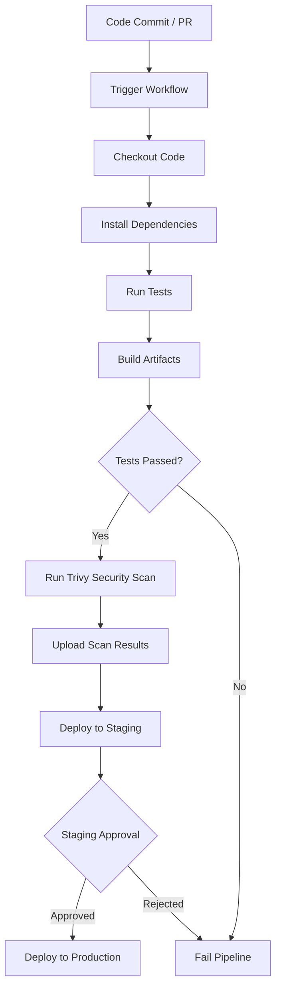

# Trivy Security Scanner

## CI/CD Pipeline Overview

Below is a visual representation of a typical CI/CD pipeline integrating Trivy:



::: tip
This diagram shows how Trivy fits into the CI/CD pipeline, scanning artifacts before deployment.
:::

## Introduction

Trivy is an open-source, all-in-one security scanner for containers, filesystems, and Infrastructure as Code (IaC). It is widely used in DevSecOps pipelines to detect vulnerabilities, misconfigurations, secrets, and license issues. Trivy supports multiple output formats, making it easy to integrate with CI/CD pipelines and security dashboards.

**Why use Trivy?**
- **Comprehensive Scanning**: Detects vulnerabilities in OS packages, application dependencies, IaC files, and container images.
- **Ease of Use**: Simple CLI interface with minimal configuration required.
- **Fast and Efficient**: Uses a local vulnerability database for quick scans.
- **Flexible Integration**: Works with GitHub Actions, GitLab CI, Jenkins, and other CI/CD tools.

## Key Features

1. **Vulnerability Scanning**: Identifies CVEs in OS packages and application dependencies.
2. **Secret Detection**: Detects hardcoded secrets like API keys, passwords, and tokens.
3. **IaC Misconfiguration Detection**: Scans Terraform, Kubernetes, and Docker Compose files for security issues.
4. **License Compliance**: Identifies software licenses in dependencies.
5. **SBOM Generation**: Creates Software Bill of Materials (SBOM) for better visibility into dependencies.

## Installation

### Using Docker
Run Trivy as a Docker container:
```bash
docker run --rm -v $(pwd):/workspace aquasec/trivy:latest fs /workspace
```

### Binary Installation
Install Trivy directly on your system:
```bash
# For Linux
wget https://github.com/aquasecurity/trivy/releases/latest/download/trivy_Linux-64bit.tar.gz
tar zxvf trivy_Linux-64bit.tar.gz
sudo mv trivy /usr/local/bin/
```

### GitHub Actions
Use the official Trivy GitHub Action:
```yaml
- name: Run Trivy vulnerability scanner
  uses: aquasecurity/trivy-action@master
  with:
    scan-type: 'fs'
    scan-ref: '.'
```

## Scanning Modes

### Filesystem Scanning
Scan local files and directories for vulnerabilities:
```bash
trivy fs .
```

### Container Image Scanning
Scan Docker images for vulnerabilities:
```bash
trivy image nginx:latest
```

### Infrastructure as Code Scanning
Scan IaC files for misconfigurations:
```bash
trivy config --severity HIGH,CRITICAL ./terraform
```

### Secret Detection
Detect hardcoded secrets in your codebase:
```bash
trivy fs --scanners secret .
```

## Integration with GitHub Actions

### Basic Workflow
```yaml
name: Security Scan with Trivy

on:
  push:
    branches: [ main, develop ]
  pull_request:
    branches: [ main ]

jobs:
  security-scan:
    name: Security Scan
    runs-on: ubuntu-latest
    steps:
      - name: Checkout code
        uses: actions/checkout@v4

      - name: Run Trivy vulnerability scanner
        uses: aquasecurity/trivy-action@master
        with:
          scan-type: 'fs'
          scan-ref: '.'
          format: 'sarif'
          output: 'trivy-results.sarif'

      - name: Upload Trivy scan results to GitHub Security tab
        uses: github/codeql-action/upload-sarif@v3
        with:
          sarif_file: 'trivy-results.sarif'
```

## Best Practices

1. **Fail Fast**: Configure Trivy to fail the pipeline if critical vulnerabilities are detected:
   ```bash
   trivy image --severity CRITICAL --exit-code 1 nginx:latest
   ```

2. **Use `.trivyignore`**: Exclude specific vulnerabilities or files from scans:
   ```plaintext
   # .trivyignore
   CVE-2021-12345
   node_modules/
   ```

3. **Automate Updates**: Regularly update the Trivy database to ensure accurate results:
   ```bash
   trivy --download-db-only
   ```

4. **Combine with Other Tools**: Use Trivy alongside tools like CodeQL and Dependabot for comprehensive security coverage.

5. **Generate Reports**: Use Trivy's output formats (e.g., JSON, SARIF) to integrate with dashboards and reporting tools.

## Troubleshooting

### Common Issues

**Database Update Failure**
- **Solution**: Use the `--skip-db-update` flag to run scans without updating the database:
  ```bash
  trivy fs --skip-db-update .
  ```

**False Positives**
- **Solution**: Add the CVE to `.trivyignore` after a risk assessment.

**Timeouts**
- **Solution**: Increase the timeout value:
  ```bash
  trivy image --timeout 10m nginx:latest
  ```

## Conclusion

Trivy is a versatile and powerful tool for integrating security into your DevSecOps pipelines. By automating vulnerability detection, secret scanning, and IaC checks, Trivy helps ensure that your applications and infrastructure remain secure throughout the development lifecycle.

For more information, visit the [Trivy GitHub Repository](https://github.com/aquasecurity/trivy).
