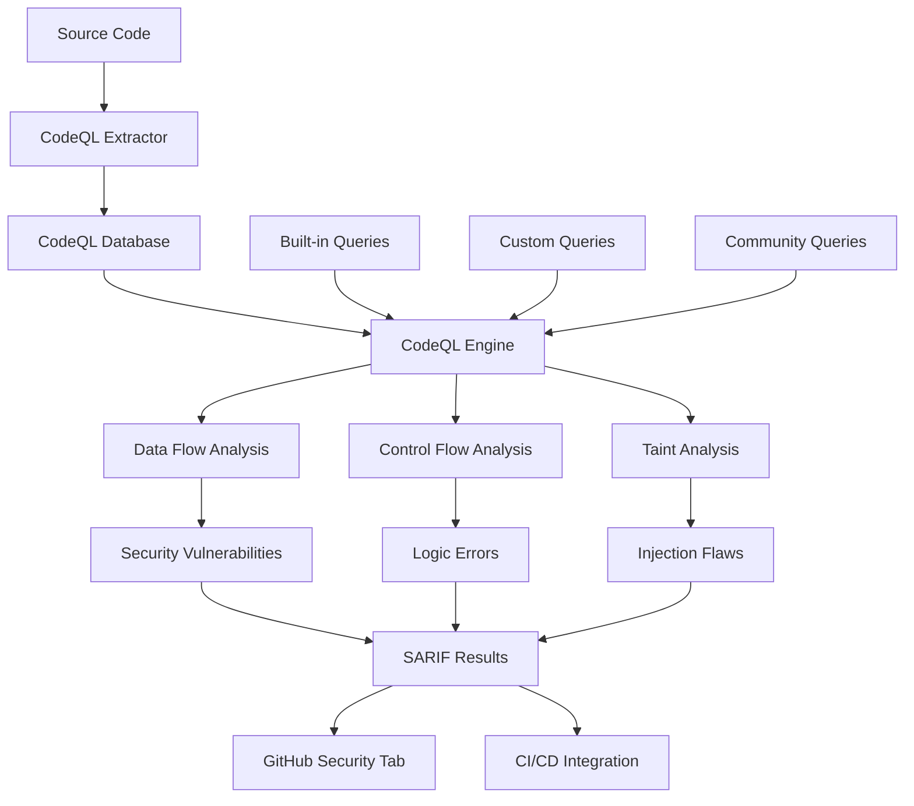

# CodeQL - GitHub's Code Analysis Engine

## Introduction

CodeQL is GitHub's semantic code analysis engine that treats code as data, allowing you to write queries to find security vulnerabilities, bugs, and other logical flaws. It uses a unique approach where source code is converted into a database that can be queried using a declarative language.

**Key Features:**
- **Semantic analysis**: Deep understanding of code structure and data flow
- **Multi-language support**: C/C++, C#, Go, Java, JavaScript/TypeScript, Python, Ruby
- **Powerful query language**: SQL-like syntax for complex code analysis
- **GitHub integration**: Native integration with GitHub Advanced Security
- **Community queries**: Extensive library of security and quality queries

## Architecture Overview



## Installation and Setup

### CodeQL CLI

```bash
# Download CodeQL CLI
wget https://github.com/github/codeql-cli-binaries/releases/latest/download/codeql-linux64.zip
unzip codeql-linux64.zip
export PATH="$PATH:/path/to/codeql"

# Verify installation
codeql version
```

### CodeQL Queries

```bash
# Clone CodeQL queries repository
git clone https://github.com/github/codeql.git
export CODEQL_HOME=/path/to/codeql
```

## Basic Usage

### Database Creation

```bash
# Create database for JavaScript/TypeScript
codeql database create my-app-db \
  --language=javascript \
  --source-root=/path/to/source

# Create database for Java with build command
codeql database create java-app-db \
  --language=java \
  --command="mvn clean compile" \
  --source-root=/path/to/java-source

# Create database for Python
codeql database create python-app-db \
  --language=python \
  --source-root=/path/to/python-source
```

### Running Queries

```bash
# Run security queries
codeql database analyze my-app-db \
  javascript-security-and-quality.qls \
  --format=sarif-latest \
  --output=results.sarif

# Run custom query
codeql query run \
  --database=my-app-db \
  my-custom-query.ql
```

## GitHub Actions Integration

### Basic CodeQL Workflow

```yaml
name: CodeQL Analysis

on:
  push:
    branches: [ main, develop ]
  pull_request:
    branches: [ main ]
  schedule:
    - cron: '0 2 * * 1'  # Weekly scan

jobs:
  analyze:
    name: CodeQL Analysis
    runs-on: ubuntu-latest
    permissions:
      actions: read
      contents: read
      security-events: write

    strategy:
      fail-fast: false
      matrix:
        language: [ 'javascript', 'python', 'java' ]

    steps:
      - name: Checkout repository
        uses: actions/checkout@v4

      - name: Initialize CodeQL
        uses: github/codeql-action/init@v3
        with:
          languages: ${{ matrix.language }}
          queries: security-extended,security-and-quality

      - name: Autobuild
        uses: github/codeql-action/autobuild@v3

      - name: Perform CodeQL Analysis
        uses: github/codeql-action/analyze@v3
        with:
          category: "/language:${{matrix.language}}"
```

### Advanced CodeQL Workflow

```yaml
name: Advanced CodeQL Analysis

on:
  push:
    branches: [ main ]
  pull_request:
    branches: [ main ]

jobs:
  codeql:
    name: CodeQL Security Analysis
    runs-on: ubuntu-latest
    permissions:
      actions: read
      contents: read
      security-events: write

    strategy:
      fail-fast: false
      matrix:
        include:
          - language: javascript
            build-mode: none
          - language: python
            build-mode: none
          - language: java
            build-mode: manual

    steps:
      - name: Checkout code
        uses: actions/checkout@v4

      - name: Setup Java (for Java analysis)
        if: matrix.language == 'java'
        uses: actions/setup-java@v3
        with:
          java-version: '11'
          distribution: 'temurin'

      - name: Initialize CodeQL
        uses: github/codeql-action/init@v3
        with:
          languages: ${{ matrix.language }}
          build-mode: ${{ matrix.build-mode }}
          queries: |
            security-extended
            security-and-quality
            +security-experimental

      - name: Manual build (Java)
        if: matrix.language == 'java'
        run: |
          mvn clean compile

      - name: Perform CodeQL Analysis
        uses: github/codeql-action/analyze@v3
        with:
          category: "/language:${{ matrix.language }}"
          upload: true

  custom-queries:
    name: Custom CodeQL Queries
    runs-on: ubuntu-latest
    permissions:
      actions: read
      contents: read
      security-events: write

    steps:
      - name: Checkout code
        uses: actions/checkout@v4

      - name: Checkout custom queries
        uses: actions/checkout@v4
        with:
          repository: myorg/codeql-custom-queries
          path: custom-queries

      - name: Initialize CodeQL
        uses: github/codeql-action/init@v3
        with:
          languages: javascript
          queries: ./custom-queries/security/

      - name: Autobuild
        uses: github/codeql-action/autobuild@v3

      - name: Perform Custom Analysis
        uses: github/codeql-action/analyze@v3
        with:
          category: "custom-security-queries"
```

## Writing Custom Queries

### Basic Query Structure

```ql
/**
 * @name Hardcoded credentials
 * @description Finds potential hardcoded credentials in source code
 * @kind path-problem
 * @problem.severity error
 * @security-severity 8.5
 * @precision high
 * @id js/hardcoded-credentials
 * @tags security
 *       external/cwe/cwe-798
 */

import javascript

from StringLiteral str
where str.getValue().regexpMatch("(?i).*(password|secret|key|token).*=.*['\"][a-zA-Z0-9]{8,}['\"].*")
select str, "Potential hardcoded credential found"
```

### Advanced Query Examples

**SQL Injection Detection:**
```ql
/**
 * @name SQL injection
 * @description User input flows to SQL query without sanitization
 * @kind path-problem
 * @problem.severity error
 * @security-severity 8.8
 * @precision high
 * @id js/sql-injection
 * @tags security
 *       external/cwe/cwe-89
 *       external/owasp/owasp-a03
 */

import javascript
import semmle.javascript.security.dataflow.SqlInjectionQuery
import DataFlow::PathGraph

from Configuration cfg, DataFlow::PathNode source, DataFlow::PathNode sink
where cfg.hasFlowPath(source, sink)
select sink.getNode(), source, sink, "SQL injection vulnerability from $@.", 
       source.getNode(), "user input"
```

**Cross-Site Scripting (XSS):**
```ql
/**
 * @name Reflected XSS
 * @description User input is reflected in HTML without encoding
 * @kind path-problem
 * @problem.severity error
 * @security-severity 6.1
 * @precision high
 * @id js/reflected-xss
 * @tags security
 *       external/cwe/cwe-79
 *       external/owasp/owasp-a07
 */

import javascript
import semmle.javascript.security.dataflow.ReflectedXssQuery
import DataFlow::PathGraph

from Configuration cfg, DataFlow::PathNode source, DataFlow::PathNode sink
where cfg.hasFlowPath(source, sink)
select sink.getNode(), source, sink, "Reflected XSS vulnerability from $@.", 
       source.getNode(), "user input"
```

**Path Traversal:**
```ql
/**
 * @name Path traversal
 * @description User input used in file path operations
 * @kind path-problem
 * @problem.severity error
 * @security-severity 7.5
 * @precision high
 * @id js/path-traversal
 * @tags security
 *       external/cwe/cwe-22
 */

import javascript

class PathTraversalConfiguration extends TaintTracking::Configuration {
  PathTraversalConfiguration() { this = "PathTraversal" }

  override predicate isSource(DataFlow::Node source) {
    source instanceof RemoteFlowSource
  }

  override predicate isSink(DataFlow::Node sink) {
    exists(FileSystemAccess fsa |
      sink = fsa.getAPathArgument()
    )
  }
}

from PathTraversalConfiguration cfg, DataFlow::PathNode source, DataFlow::PathNode sink
where cfg.hasFlowPath(source, sink)
select sink.getNode(), source, sink, "Path traversal vulnerability from $@.", 
       source.getNode(), "user input"
```

## Language-Specific Analysis

### JavaScript/TypeScript

```yaml
- name: JavaScript/TypeScript Analysis
  uses: github/codeql-action/init@v3
  with:
    languages: javascript
    queries: |
      security-extended
      +javascript-crypto-weak-random
      +javascript-unsafe-deserialization
```

### Python

```yaml
- name: Python Security Analysis
  uses: github/codeql-action/init@v3
  with:
    languages: python
    queries: |
      security-extended
      +python-sql-injection
      +python-weak-crypto
```

### Java

```yaml
- name: Java Analysis with Build
  uses: github/codeql-action/init@v3
  with:
    languages: java
    build-mode: manual
    queries: security-extended

- name: Build Java project
  run: |
    mvn clean compile -DskipTests
```

## Custom Query Suites

### Security-Focused Suite

```yaml
# security-suite.qls
- description: "Security-focused query suite"
- queries: .
- apply: security-extended
- include:
    kind:
      - problem
      - path-problem
    tags contain:
      - security
    severity:
      - error
      - warning
- exclude:
    precision: low
```

### Performance Analysis Suite

```yaml
# performance-suite.qls
- description: "Performance analysis suite"
- queries: .
- include:
    tags contain:
      - performance
      - efficiency
    kind: problem
```

## Advanced Configuration

### Database Configuration

```yaml
# .github/codeql/codeql-config.yml
name: "CodeQL Configuration"

disable-default-queries: false

queries:
  - name: security-extended
    uses: security-extended
  - name: custom-queries
    uses: ./custom-queries/

paths-ignore:
  - "**/*.min.js"
  - "**/node_modules/**"
  - "**/vendor/**"
  - "**/test/**"

paths:
  - "src/**"
  - "lib/**"
```

### Build Configuration

```yaml
# Custom build for CodeQL
- name: Custom Build Setup
  if: matrix.language == 'java'
  run: |
    # Install dependencies
    mvn dependency:resolve
    
    # Compile with debug information
    mvn clean compile -X -Dmaven.compiler.debug=true
    
    # Generate additional metadata
    mvn org.jacoco:jacoco-maven-plugin:prepare-agent
```

## Integration with Other Tools

### Combining with Other Scanners

```yaml
name: Comprehensive Security Analysis

jobs:
  multi-scanner:
    runs-on: ubuntu-latest
    steps:
      - uses: actions/checkout@v4

      # CodeQL Analysis
      - name: Initialize CodeQL
        uses: github/codeql-action/init@v3
        with:
          languages: javascript

      - name: Autobuild
        uses: github/codeql-action/autobuild@v3

      - name: Perform CodeQL Analysis
        uses: github/codeql-action/analyze@v3

      # Semgrep Analysis
      - name: Run Semgrep
        uses: semgrep/semgrep-action@v1
        with:
          config: p/security

      # Trivy Analysis
      - name: Run Trivy
        uses: aquasecurity/trivy-action@master
        with:
          scan-type: fs
          format: sarif
          output: trivy-results.sarif

      - name: Upload Trivy results
        uses: github/codeql-action/upload-sarif@v3
        with:
          sarif_file: trivy-results.sarif
```

## Best Practices

### 1. Query Performance

```ql
// Use specific predicates
from Method m
where m.getName() = "dangerousMethod"
select m

// Rather than broad searches
from Expr e
where e.toString().matches("%dangerous%")
select e
```

### 2. False Positive Reduction

```ql
// Add sanitization checks
predicate isSanitized(DataFlow::Node node) {
  exists(MethodCall sanitize |
    sanitize.getMethodName() = "sanitize" and
    node = sanitize.getArgument(0)
  )
}

// Exclude sanitized data
where cfg.hasFlowPath(source, sink) and
      not isSanitized(sink.getNode())
```

### 3. Query Organization

```
queries/
├── security/
│   ├── injection/
│   │   ├── sql-injection.ql
│   │   └── command-injection.ql
│   ├── xss/
│   │   ├── reflected-xss.ql
│   │   └── stored-xss.ql
│   └── crypto/
│       ├── weak-crypto.ql
│       └── hardcoded-keys.ql
└── quality/
    ├── performance/
    └── maintainability/
```

## Troubleshooting

### Common Issues

**Database Creation Failures:**
```bash
# Check language support
codeql resolve languages

# Verbose database creation
codeql database create mydb \
  --language=javascript \
  --source-root=. \
  --verbose
```

**Query Compilation Errors:**
```bash
# Check query syntax
codeql query compile my-query.ql

# Run query with debug info
codeql query run \
  --database=mydb \
  --verbose \
  my-query.ql
```

**Performance Issues:**
```bash
# Analyze database size
codeql database info mydb

# Use query performance profiling
codeql query run \
  --database=mydb \
  --tuple-counting \
  my-query.ql
```

## Conclusion

CodeQL provides powerful semantic analysis capabilities that go beyond traditional static analysis tools. Its unique approach of treating code as data enables sophisticated vulnerability detection and code quality analysis.

**Key advantages:**
- Deep semantic understanding of code
- Powerful query language for custom analysis
- Strong GitHub integration
- Comprehensive vulnerability detection
- Active community and query library

For more information, visit the [CodeQL Documentation](https://codeql.github.com/docs/).
