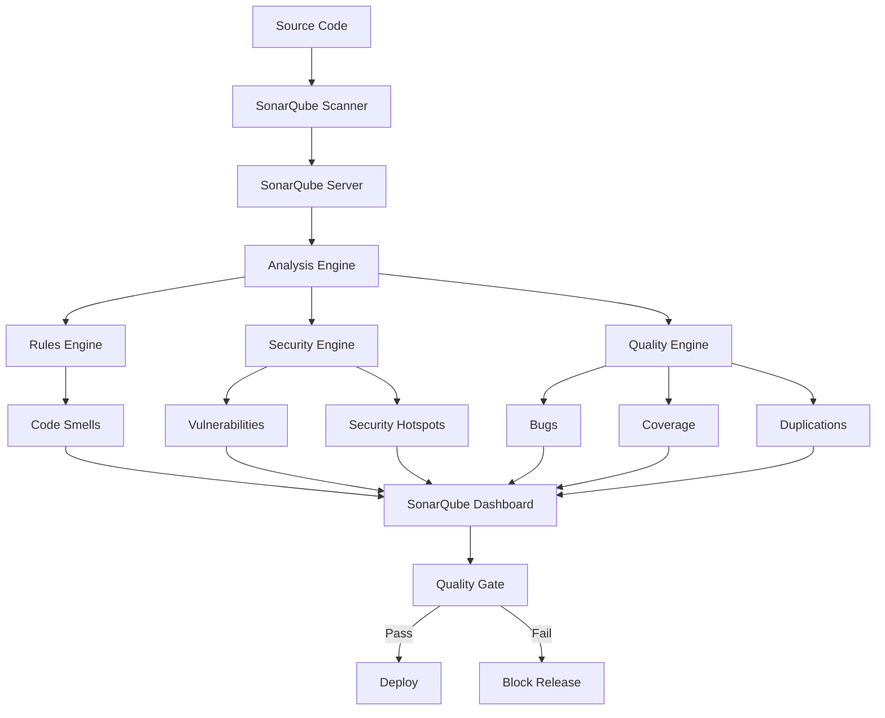

# SonarQube - Code Quality & Security Analysis

## Introduction

SonarQube is a comprehensive platform for continuous code quality and security analysis. It provides detailed insights into code quality, security vulnerabilities, code smells, bugs, and technical debt across multiple programming languages.

**Key Features:**
- **Multi-language support**: 25+ programming languages
- **Security analysis**: OWASP Top 10, CWE, SANS Top 25
- **Quality metrics**: Technical debt, code coverage, duplications
- **Pull request analysis**: Integration with GitHub, GitLab, Azure DevOps
- **Quality gates**: Automated pass/fail criteria for releases

## Architecture Overview



## Installation and Setup

### Docker Installation

```bash
# Pull SonarQube image
docker pull sonarqube:community

# Run SonarQube container
docker run -d --name sonarqube \
  -p 9000:9000 \
  -e SONAR_ES_BOOTSTRAP_CHECKS_DISABLE=true \
  sonarqube:community
```

### Docker Compose Setup

```yaml
version: '3.8'
services:
  sonarqube:
    image: sonarqube:community
    depends_on:
      - db
    environment:
      SONAR_JDBC_URL: jdbc:postgresql://db:5432/sonar
      SONAR_JDBC_USERNAME: sonar
      SONAR_JDBC_PASSWORD: sonar
    ports:
      - "9000:9000"
    volumes:
      - sonarqube_data:/opt/sonarqube/data
      - sonarqube_extensions:/opt/sonarqube/extensions
      - sonarqube_logs:/opt/sonarqube/logs

  db:
    image: postgres:13
    environment:
      POSTGRES_USER: sonar
      SONAR_JDBC_PASSWORD: sonar
      POSTGRES_DB: sonar
    volumes:
      - postgresql:/var/lib/postgresql
      - postgresql_data:/var/lib/postgresql/data

volumes:
  sonarqube_data:
  sonarqube_extensions:
  sonarqube_logs:
  postgresql:
  postgresql_data:
```

### Initial Configuration

```bash
# Access SonarQube
http://localhost:9000

# Default credentials
Username: admin
Password: admin
```

## Project Configuration

### sonar-project.properties

```properties
# Project identification
sonar.projectKey=my-project
sonar.projectName=My Project
sonar.projectVersion=1.0

# Source code location
sonar.sources=src
sonar.tests=tests

# Language-specific settings
sonar.java.source=11
sonar.java.binaries=target/classes
sonar.java.test.binaries=target/test-classes

# Exclusions
sonar.exclusions=**/node_modules/**,**/vendor/**,**/*.min.js
sonar.test.exclusions=**/test/**,**/tests/**

# Coverage reports
sonar.javascript.lcov.reportPaths=coverage/lcov.info
sonar.python.coverage.reportPaths=coverage.xml
sonar.java.coveragePlugin=jacoco
sonar.jacoco.reportPaths=target/jacoco.exec
```

## GitHub Actions Integration

### Basic SonarQube Analysis

```yaml
name: SonarQube Analysis

on:
  push:
    branches: [ main, develop ]
  pull_request:
    branches: [ main ]

jobs:
  sonarqube:
    name: SonarQube Scan
    runs-on: ubuntu-latest
    steps:
      - name: Checkout code
        uses: actions/checkout@v4
        with:
          fetch-depth: 0

      - name: Setup Java
        uses: actions/setup-java@v3
        with:
          java-version: '11'
          distribution: 'temurin'

      - name: Cache SonarQube packages
        uses: actions/cache@v3
        with:
          path: ~/.sonar/cache
          key: ${{ runner.os }}-sonar

      - name: Cache Maven packages
        uses: actions/cache@v3
        with:
          path: ~/.m2
          key: ${{ runner.os }}-m2-${{ hashFiles('**/pom.xml') }}

      - name: Build and analyze
        env:
          GITHUB_TOKEN: ${{ secrets.GITHUB_TOKEN }}
          SONAR_TOKEN: ${{ secrets.SONAR_TOKEN }}
        run: |
          mvn clean verify sonar:sonar \
            -Dsonar.projectKey=my-project \
            -Dsonar.host.url=https://sonarcloud.io \
            -Dsonar.organization=my-org
```

### Node.js Project Analysis

```yaml
name: SonarQube Node.js Analysis

on:
  push:
    branches: [ main ]
  pull_request:
    branches: [ main ]

jobs:
  sonarqube:
    name: SonarQube Analysis
    runs-on: ubuntu-latest
    steps:
      - name: Checkout code
        uses: actions/checkout@v4
        with:
          fetch-depth: 0

      - name: Setup Node.js
        uses: actions/setup-node@v4
        with:
          node-version: '18'
          cache: 'npm'

      - name: Install dependencies
        run: npm ci

      - name: Run tests with coverage
        run: npm run test:coverage

      - name: SonarQube Scan
        uses: sonarqube-quality-gate-action@master
        env:
          SONAR_TOKEN: ${{ secrets.SONAR_TOKEN }}
        with:
          scanMetadataReportFile: target/sonar/report-task.txt

      - name: SonarQube Quality Gate check
        id: sonarqube-quality-gate-check
        uses: sonarqube-quality-gate-action@master
        timeout-minutes: 5
        env:
          SONAR_TOKEN: ${{ secrets.SONAR_TOKEN }}
```

### Python Project Analysis

```yaml
name: SonarQube Python Analysis

on:
  push:
    branches: [ main ]
  pull_request:
    branches: [ main ]

jobs:
  sonarqube:
    name: SonarQube Python Scan
    runs-on: ubuntu-latest
    steps:
      - name: Checkout code
        uses: actions/checkout@v4
        with:
          fetch-depth: 0

      - name: Setup Python
        uses: actions/setup-python@v4
        with:
          python-version: '3.11'

      - name: Install dependencies
        run: |
          pip install -r requirements.txt
          pip install pytest pytest-cov

      - name: Run tests with coverage
        run: |
          pytest --cov=. --cov-report=xml

      - name: SonarQube Scan
        uses: sonarsource/sonarqube-scan-action@master
        env:
          SONAR_TOKEN: ${{ secrets.SONAR_TOKEN }}
          SONAR_HOST_URL: ${{ vars.SONAR_HOST_URL }}
        with:
          args: >
            -Dsonar.projectKey=python-project
            -Dsonar.sources=src
            -Dsonar.tests=tests
            -Dsonar.python.coverage.reportPaths=coverage.xml
            -Dsonar.python.xunit.reportPath=test-results.xml
```

## GitLab CI Integration

```yaml
stages:
  - test
  - sonarqube-check
  - sonarqube-vulnerability-report

sonarqube-check:
  stage: sonarqube-check
  image: 
    name: sonarsource/sonar-scanner-cli:latest
    entrypoint: [""]
  variables:
    SONAR_USER_HOME: "${CI_PROJECT_DIR}/.sonar"
    GIT_DEPTH: "0"
  cache:
    key: "${CI_JOB_NAME}"
    paths:
      - .sonar/cache
  script: 
    - sonar-scanner
  allow_failure: true
  rules:
    - if: $CI_COMMIT_BRANCH == "main"
    - if: $CI_PIPELINE_SOURCE == 'merge_request_event'

sonarqube-vulnerability-report:
  stage: sonarqube-vulnerability-report
  script:
    - 'curl -u "${SONAR_TOKEN}:" "${SONAR_HOST_URL}/api/issues/gitlab_sast_export?projectKey=${SONAR_PROJECT_KEY}&branch=${CI_COMMIT_BRANCH}&pullRequest=${CI_MERGE_REQUEST_IID}" -o gl-sast-sonar-report.json'
  allow_failure: true
  rules:
    - if: $CI_COMMIT_BRANCH == "main"
    - if: $CI_PIPELINE_SOURCE == 'merge_request_event'
  artifacts:
    expire_in: 1 day
    reports:
      sast: gl-sast-sonar-report.json
```

## Quality Gates Configuration

### Default Quality Gate

```json
{
  "conditions": [
    {
      "metric": "new_reliability_rating",
      "op": "GT",
      "errorThreshold": "1"
    },
    {
      "metric": "new_security_rating", 
      "op": "GT",
      "errorThreshold": "1"
    },
    {
      "metric": "new_maintainability_rating",
      "op": "GT", 
      "errorThreshold": "1"
    },
    {
      "metric": "new_coverage",
      "op": "LT",
      "errorThreshold": "80"
    },
    {
      "metric": "new_duplicated_lines_density",
      "op": "GT",
      "errorThreshold": "3"
    }
  ]
}
```

### Custom Quality Gate

```bash
# Create custom quality gate via API
curl -X POST \
  -H "Authorization: Bearer $SONAR_TOKEN" \
  -d "name=Strict Quality Gate" \
  "$SONAR_HOST_URL/api/qualitygates/create"

# Add conditions
curl -X POST \
  -H "Authorization: Bearer $SONAR_TOKEN" \
  -d "gateId=1&metric=coverage&op=LT&error=85" \
  "$SONAR_HOST_URL/api/qualitygates/create_condition"
```

## Advanced Configuration

### Custom Rules

```xml
<!-- Custom rule template -->
<rule>
  <key>CustomSecurityRule</key>
  <name>Custom Security Check</name>
  <description>Detects custom security patterns</description>
  <severity>MAJOR</severity>
  <cardinality>SINGLE</cardinality>
  <status>READY</status>
  <type>VULNERABILITY</type>
  <params>
    <param>
      <key>pattern</key>
      <description>Pattern to match</description>
      <type>STRING</type>
    </param>
  </params>
</rule>
```

### Branch Analysis

```bash
# Analyze specific branch
sonar-scanner \
  -Dsonar.projectKey=my-project \
  -Dsonar.sources=src \
  -Dsonar.branch.name=feature/new-feature \
  -Dsonar.branch.target=main
```

### Pull Request Analysis

```bash
# Analyze pull request
sonar-scanner \
  -Dsonar.projectKey=my-project \
  -Dsonar.sources=src \
  -Dsonar.pullrequest.key=123 \
  -Dsonar.pullrequest.branch=feature/pr-branch \
  -Dsonar.pullrequest.base=main
```

## Security Analysis Features

### Security Hotspots

```yaml
# Enable security hotspot detection
sonar.security.hotspots.enabled=true

# Security hotspot categories
- SQL Injection
- Cross-Site Scripting (XSS)
- Code Injection
- Path Traversal
- LDAP Injection
- Weak Cryptography
```

### OWASP Top 10 Coverage

```bash
# Generate OWASP report
curl -u "$SONAR_TOKEN:" \
  "$SONAR_HOST_URL/api/measures/component?component=$PROJECT_KEY&metricKeys=security_rating,vulnerabilities,security_hotspots"
```

## Reporting and Dashboards

### Custom Dashboard

```json
{
  "name": "Security Dashboard",
  "widgets": [
    {
      "key": "security_rating",
      "name": "Security Rating",
      "description": "Overall security rating"
    },
    {
      "key": "vulnerabilities",
      "name": "Vulnerabilities",
      "description": "Number of vulnerabilities"
    },
    {
      "key": "security_hotspots_reviewed",
      "name": "Security Hotspots Reviewed",
      "description": "Percentage of reviewed security hotspots"
    }
  ]
}
```

### Export Reports

```bash
# Export project report
curl -u "$SONAR_TOKEN:" \
  "$SONAR_HOST_URL/api/project_dump/export?projectKey=$PROJECT_KEY" \
  -o project-report.zip

# Export security issues
curl -u "$SONAR_TOKEN:" \
  "$SONAR_HOST_URL/api/issues/search?componentKeys=$PROJECT_KEY&types=VULNERABILITY" \
  -o security-issues.json
```

## Best Practices

### 1. Quality Gate Strategy

```yaml
# Progressive quality gates
Development:
  - new_coverage > 70%
  - new_duplicated_lines_density < 5%

Staging:
  - new_coverage > 80%
  - new_duplicated_lines_density < 3%
  - new_reliability_rating = A

Production:
  - new_coverage > 90%
  - new_duplicated_lines_density < 1%
  - new_reliability_rating = A
  - new_security_rating = A
```

### 2. Performance Optimization

```properties
# Optimize analysis performance
sonar.scm.disabled=true
sonar.sourceEncoding=UTF-8
sonar.analysis.mode=incremental

# Exclude unnecessary files
sonar.exclusions=**/node_modules/**,**/dist/**,**/*.min.js
sonar.coverage.exclusions=**/test/**,**/spec/**
```

### 3. Security Configuration

```bash
# Secure SonarQube installation
- Use HTTPS
- Configure authentication (LDAP, SAML)
- Set up proper user permissions
- Regular security updates
- Database encryption
```

## Troubleshooting

### Common Issues

**Analysis Timeout:**
```properties
# Increase timeout
sonar.ws.timeout=300
sonar.scm.provider=git
```

**Memory Issues:**
```bash
# Increase JVM memory
export SONAR_SCANNER_OPTS="-Xmx2048m"
```

**Quality Gate Failures:**
```bash
# Debug quality gate
curl -u "$SONAR_TOKEN:" \
  "$SONAR_HOST_URL/api/qualitygates/project_status?projectKey=$PROJECT_KEY"
```

## Conclusion

SonarQube provides comprehensive code quality and security analysis capabilities that integrate seamlessly into DevSecOps pipelines. Its rich feature set, detailed reporting, and quality gate functionality make it an essential tool for maintaining high code standards and security.

**Key benefits:**
- Comprehensive analysis across multiple dimensions
- Strong CI/CD integration
- Detailed security vulnerability detection
- Technical debt management
- Team collaboration features

For more information, visit the [SonarQube Documentation](https://docs.sonarqube.org/).
