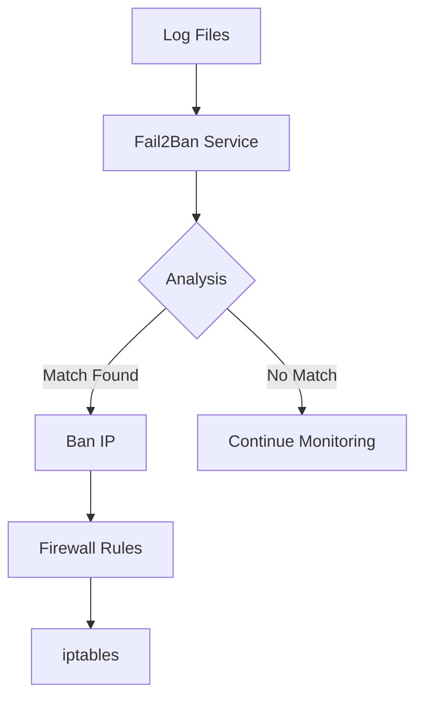

# Fail2Ban Integration Guide

## Overview

Fail2Ban is an intrusion prevention software framework that protects systems from brute-force attacks. This guide covers its Docker deployment and configuration in a DevSecOps context.

:::tip Key Benefits
- Automated protection against brute-force attacks
- Customizable rules and actions
- Real-time log monitoring
- Easy integration with existing systems
:::

## Architecture Overview



## Prerequisites

::: code-group
```sh [apt]
sudo apt update
sudo apt install docker docker-compose
```
```sh [yum]
sudo yum update
sudo yum install docker docker-compose
```
```sh [dnf]
sudo dnf update
sudo dnf install docker docker-compose
```
:::

## Docker Implementation

### Directory Structure
```
fail2ban/
├── .env
├── docker-compose.yml
├── volumes/
│   ├── jail.d/
│   ├── filter.d/
│   └── action.d/
└── config/
    └── fail2ban.local
```

### Environment Variables File (.env)
```env
# Fail2Ban Configuration
F2B_LOG_LEVEL=INFO
F2B_DB_PURGE_AGE=1d
F2B_FIND_TIME=10m
F2B_BAN_TIME=1h
F2B_MAX_RETRY=5

# Docker volumes base path
VOLUME_PATH=./volumes

# Log paths
HOST_LOG_PATH=/var/log
```

### Docker Compose Configuration

```yaml
version: '3.8'

services:
  fail2ban:
    image: crazymax/fail2ban:latest
    container_name: fail2ban
    restart: unless-stopped
    environment:
      - TZ=${TZ:-UTC}
      - F2B_LOG_LEVEL=${F2B_LOG_LEVEL:-INFO}
      - F2B_DB_PURGE_AGE=${F2B_DB_PURGE_AGE:-1d}
      - F2B_FIND_TIME=${F2B_FIND_TIME:-10m}
      - F2B_BAN_TIME=${F2B_BAN_TIME:-1h}
      - F2B_MAX_RETRY=${F2B_MAX_RETRY:-5}
    volumes:
      - ${VOLUME_PATH}/jail.d:/etc/fail2ban/jail.d:ro
      - ${VOLUME_PATH}/filter.d:/etc/fail2ban/filter.d:ro
      - ${VOLUME_PATH}/action.d:/etc/fail2ban/action.d:ro
      - ${HOST_LOG_PATH}:/var/log:ro
      - ${VOLUME_PATH}/db:/var/lib/fail2ban
    network_mode: "host"
    cap_add:
      - NET_ADMIN
      - NET_RAW
```

### Basic Jail Configuration (./volumes/jail.d/custom.conf)

```ini
[DEFAULT]
bantime = 1h
findtime = 10m
maxretry = 5

[sshd]
enabled = true
port = ssh,22
filter = sshd
logpath = /var/log/auth.log
maxretry = 3
```

## Custom Filter Configuration

### SSH Filter (./volumes/filter.d/sshd.conf)
```ini
[Definition]
failregex = ^%(__prefix_line)s(?:error: PAM: )?Authentication failure for .* from <HOST>( via \S+)?\s*$
            ^%(__prefix_line)s(?:error: PAM: )?User not known to the underlying authentication module for .* from <HOST>\s*$
            ^%(__prefix_line)sFailed \S+ for invalid user .* from <HOST>(?: port \d+)?(?: ssh\d*)?(: (ruser .*|(\S+ ID \S+ \(serial \d+\) CA )?\S+ %(__md5hex)s(, client user ".*", client host ".*")?))?\s*$
            ^%(__prefix_line)sFailed \S+ for .* from <HOST>(?: port \d+)?(?: ssh\d*)?(: (ruser .*|(\S+ ID \S+ \(serial \d+\) CA )?\S+ %(__md5hex)s(, client user ".*", client host ".*")?))?\s*$
            ^%(__prefix_line)sROOT LOGIN REFUSED.* FROM <HOST>\s*$
            ^%(__prefix_line)s[iI](?:llegal|nvalid) user .* from <HOST>\s*$
            ^%(__prefix_line)sUser .+ from <HOST> not allowed because not listed in AllowUsers\s*$
            ^%(__prefix_line)sUser .+ from <HOST> not allowed because listed in DenyUsers\s*$
            ^%(__prefix_line)sUser .+ from <HOST> not allowed because not in any group\s*$
            ^%(__prefix_line)srefused connect from \S+ \(<HOST>\)\s*$
            ^%(__prefix_line)sReceived disconnect from <HOST>: 3: .*: Auth fail$
            ^%(__prefix_line)sUser .+ from <HOST> not allowed because a group is listed in DenyGroups\s*$
            ^%(__prefix_line)sUser .+ from <HOST> not allowed because none of user's groups are listed in AllowGroups\s*$
            ^%(__prefix_line)sauthentication failure; logname=\S* uid=\S* euid=\S* tty=\S* ruser=\S* rhost=<HOST>(?:\s+user=.*)?\s*$

ignoreregex =
```

## Deployment Instructions

1. Create the necessary directories:
```bash
mkdir -p volumes/{jail.d,filter.d,action.d,db}
```

2. Copy configuration files:
```bash
cp custom.conf volumes/jail.d/
cp sshd.conf volumes/filter.d/
```

3. Start the service:
```bash
docker-compose up -d
```

## Monitoring and Management

### View Banned IPs
```bash
docker exec fail2ban fail2ban-client status
```

### Unban an IP
```bash
docker exec fail2ban fail2ban-client set sshd unbanip <IP_ADDRESS>
```

### View Logs
```bash
docker logs fail2ban
```

## Best Practices

:::tip Security Recommendations
1. Always use custom configurations instead of defaults
2. Regularly backup your Fail2Ban database
3. Monitor Fail2Ban logs for false positives
4. Use appropriate ban times based on your security requirements
5. Keep your Docker image updated
:::

## Troubleshooting

### Common Issues

1. **Permission Denied**
```bash
# Solution
chmod 644 volumes/jail.d/*
chmod 644 volumes/filter.d/*
```

2. **Logs Not Being Read**
```bash
# Verify log paths
docker exec fail2ban fail2ban-client get sshd logpath
```

### Health Check

```bash
# Check Fail2Ban status
docker exec fail2ban fail2ban-client status

# Check specific jail
docker exec fail2ban fail2ban-client status sshd
```

## Maintenance

### Regular Tasks

1. **Database Cleanup**
```bash
docker exec fail2ban fail2ban-client set all cleanjail
```

2. **Configuration Reload**
```bash
docker exec fail2ban fail2ban-client reload
```

3. **Log Rotation**
```bash
# Add to crontab
0 0 * * * docker exec fail2ban fail2ban-client reload
```