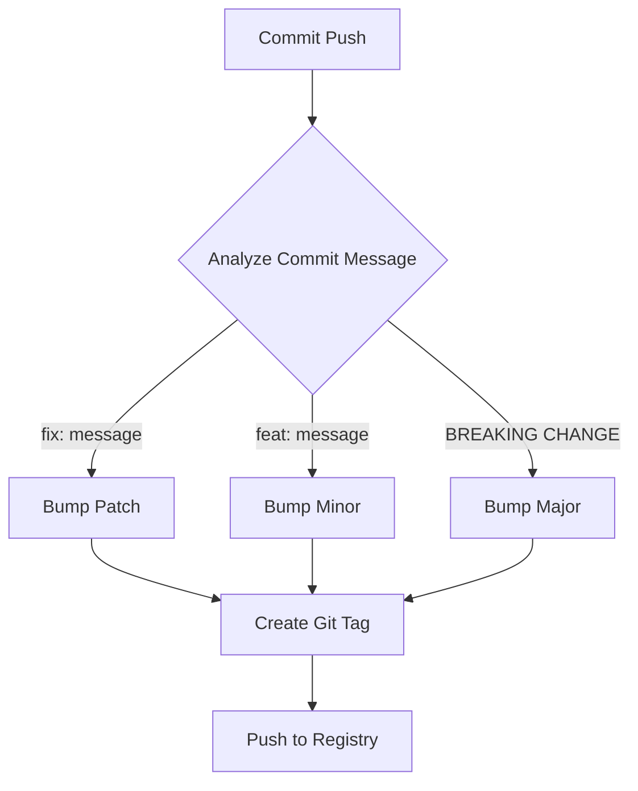
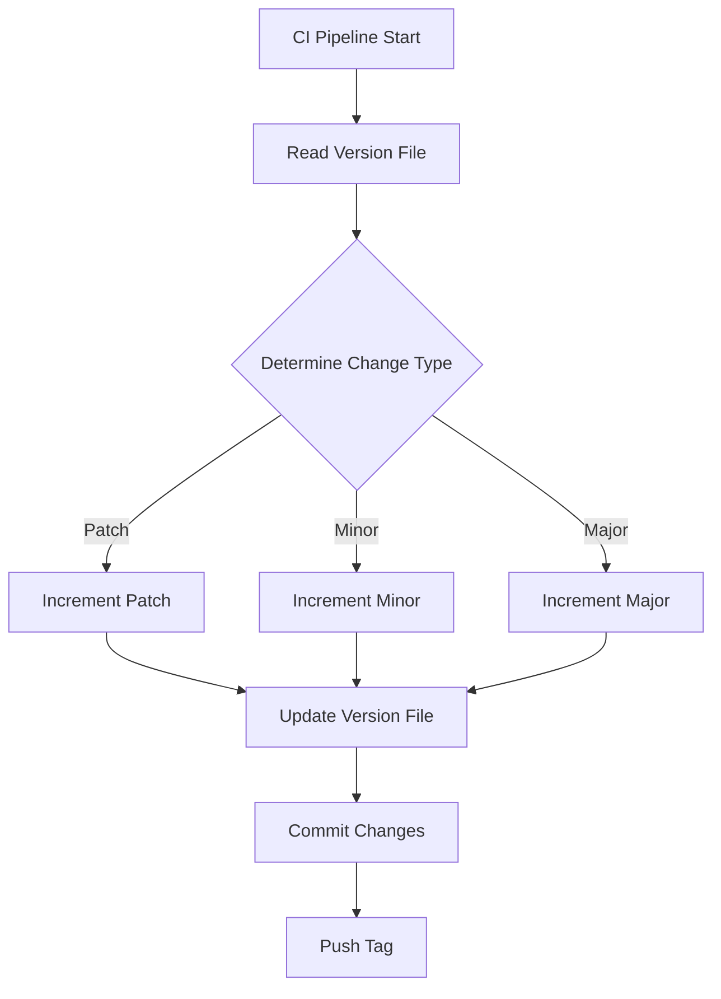

# Automated Version Management in CI/CD

## Introduction

Version management is a crucial aspect of software development that helps track changes, maintain compatibility, and manage dependencies. This guide explains how to implement automated version bumping in your CI/CD pipeline using semantic versioning (SemVer).

::: tip Semantic Versioning
SemVer follows the format MAJOR.MINOR.PATCH (e.g., 2.1.3) where:
- MAJOR: Breaking changes
- MINOR: New features, backwards-compatible
- PATCH: Bug fixes, backwards-compatible
:::

## Implementation Approaches

### 1. Git-based Versioning

Using git tags and commit messages to determine version changes:



### 2. File-based Versioning

Maintaining version in a file (e.g., package.json or VERSION):



## Implementation Examples

### GitLab CI Implementation

::: code-group
```yaml [.gitlab-ci.yml]
variables:
  VERSION_FILE: "VERSION"

version:
  stage: version
  script:
    - |
      # Get current version
      CURRENT_VERSION=$(cat $VERSION_FILE)
      
      # Parse commit messages since last tag
      COMMIT_MSG=$(git log $(git describe --tags --abbrev=0)..HEAD --pretty=format:"%s")
      
      # Determine version bump type
      if echo "$COMMIT_MSG" | grep -q "BREAKING CHANGE"; then
        NEW_VERSION=$(semver bump major $CURRENT_VERSION)
      elif echo "$COMMIT_MSG" | grep -q "^feat:"; then
        NEW_VERSION=$(semver bump minor $CURRENT_VERSION)
      else
        NEW_VERSION=$(semver bump patch $CURRENT_VERSION)
      fi
      
      # Update version file
      echo $NEW_VERSION > $VERSION_FILE
      
      # Create git tag
      git tag "v$NEW_VERSION"
      git push origin "v$NEW_VERSION"
```

```yaml [version-script.sh]
#!/bin/bash

# Function to bump version
bump_version() {
    local version=$1
    local bump_type=$2
    
    IFS='.' read -r major minor patch <<< "$version"
    
    case $bump_type in
        "major")
            echo "$((major + 1)).0.0"
            ;;
        "minor")
            echo "$major.$((minor + 1)).0"
            ;;
        "patch")
            echo "$major.$minor.$((patch + 1))"
            ;;
    esac
}

# Main script
current_version=$(cat VERSION)
commit_msg=$(git log -1 --pretty=%B)

if echo "$commit_msg" | grep -q "BREAKING CHANGE"; then
    new_version=$(bump_version "$current_version" "major")
elif echo "$commit_msg" | grep -q "^feat:"; then
    new_version=$(bump_version "$current_version" "minor")
else
    new_version=$(bump_version "$current_version" "patch")
fi

echo "$new_version" > VERSION
```
:::

### GitHub Actions Implementation

```yaml
name: Version Bump

on:
  push:
    branches: [ main ]

jobs:
  version:
    runs-on: ubuntu-latest
    steps:
      - uses: actions/checkout@v3
        with:
          fetch-depth: 0
      
      - name: Get Previous Version
        id: get_version
        run: echo "VERSION=$(cat VERSION)" >> $GITHUB_ENV
      
      - name: Determine Version Bump
        id: bump_version
        run: |
          COMMIT_MSG=$(git log -1 --pretty=%B)
          if echo "$COMMIT_MSG" | grep -q "BREAKING CHANGE"; then
            echo "BUMP_TYPE=major" >> $GITHUB_ENV
          elif echo "$COMMIT_MSG" | grep -q "^feat:"; then
            echo "BUMP_TYPE=minor" >> $GITHUB_ENV
          else
            echo "BUMP_TYPE=patch" >> $GITHUB_ENV
          fi
      
      - name: Bump Version
        uses: actions/github-script@v6
        with:
          script: |
            const version = process.env.VERSION
            const bumpType = process.env.BUMP_TYPE
            
            const [major, minor, patch] = version.split('.')
            let newVersion
            
            switch(bumpType) {
              case 'major':
                newVersion = `${parseInt(major) + 1}.0.0`
                break
              case 'minor':
                newVersion = `${major}.${parseInt(minor) + 1}.0`
                break
              case 'patch':
                newVersion = `${major}.${minor}.${parseInt(patch) + 1}`
                break
            }
            
            require('fs').writeFileSync('VERSION', newVersion)
            
            await github.rest.git.createRef({
              owner: context.repo.owner,
              repo: context.repo.repo,
              ref: `refs/tags/v${newVersion}`,
              sha: context.sha
            })
```

## Docker Integration

For Docker-based applications, integrate version management with your Docker builds:

```yaml
version: '3.8'

services:
  app:
    build:
      context: .
      args:
        - VERSION=${VERSION}
    image: ${REGISTRY_URL}/${IMAGE_NAME}:${VERSION}
    volumes:
      - ./volumes/app:/app/data
```

Corresponding Dockerfile:

```dockerfile
FROM node:16-alpine

ARG VERSION
ENV APP_VERSION=$VERSION

COPY package.json .
COPY VERSION .

RUN npm install
COPY . .

LABEL version=$VERSION
```

## Commit Message Convention

To make this system work effectively, establish a commit message convention:

::: tip Commit Message Format
```
<type>[optional scope]: <description>

[optional body]

[optional footer(s)]
```

Types:
- `feat`: New feature (minor version bump)
- `fix`: Bug fix (patch version bump)
- `BREAKING CHANGE`: Breaking change (major version bump)
- `chore`: Maintenance
- `docs`: Documentation
- `style`: Formatting
- `refactor`: Code restructuring
- `test`: Adding tests
- `ci`: CI/CD changes
:::

## Version File Management

Create a VERSION file in your project root:

```bash
echo "0.1.0" > VERSION
```

## Automation Script

Here's a comprehensive script for version management:

```bash
#!/bin/bash

# version-manager.sh
set -e

VERSION_FILE="VERSION"
CHANGELOG_FILE="CHANGELOG.md"

# Read current version
if [ -f "$VERSION_FILE" ]; then
    CURRENT_VERSION=$(cat "$VERSION_FILE")
else
    CURRENT_VERSION="0.1.0"
fi

# Function to bump version
bump_version() {
    local version=$1
    local bump_type=$2
    
    IFS='.' read -r major minor patch <<< "$version"
    
    case $bump_type in
        "major")
            echo "$((major + 1)).0.0"
            ;;
        "minor")
            echo "$major.$((minor + 1)).0"
            ;;
        "patch")
            echo "$major.$minor.$((patch + 1))"
            ;;
    esac
}

# Determine bump type from commit messages
determine_bump_type() {
    local commits=$1
    
    if echo "$commits" | grep -q "BREAKING CHANGE"; then
        echo "major"
    elif echo "$commits" | grep -q "^feat:"; then
        echo "minor"
    else
        echo "patch"
    fi
}

# Update changelog
update_changelog() {
    local version=$1
    local date=$(date +%Y-%m-%d)
    
    # Get commits since last tag
    local commits=$(git log $(git describe --tags --abbrev=0 2>/dev/null || echo HEAD)..HEAD --pretty=format:"- %s")
    
    # Prepend new version to changelog
    echo -e "# $version ($date)\n\n$commits\n\n$(cat $CHANGELOG_FILE)" > $CHANGELOG_FILE
}

# Main execution
COMMITS=$(git log $(git describe --tags --abbrev=0 2>/dev/null || echo HEAD)..HEAD --pretty=format:"%s")
BUMP_TYPE=$(determine_bump_type "$COMMITS")
NEW_VERSION=$(bump_version "$CURRENT_VERSION" "$BUMP_TYPE")

# Update files
echo "$NEW_VERSION" > "$VERSION_FILE"
update_changelog "$NEW_VERSION"

# Git operations
git add "$VERSION_FILE" "$CHANGELOG_FILE"
git commit -m "chore: bump version to $NEW_VERSION"
git tag -a "v$NEW_VERSION" -m "Version $NEW_VERSION"

echo "Version bumped to $NEW_VERSION"
```

## Best Practices

1. **Consistency**: Use the same versioning scheme across all projects
2. **Automation**: Automate version bumping to avoid human error
3. **Documentation**: Maintain a changelog with version history
4. **Testing**: Include version bump verification in your CI pipeline
5. **Backups**: Keep backups of version history and tags

::: tip Version Management Tips
- Always use git tags for version tracking
- Keep a CHANGELOG.md file updated
- Use semantic versioning consistently
- Automate version bumping in CI/CD
- Include version information in build artifacts
:::

## Troubleshooting

Common issues and solutions:

1. **Version Conflict**:
```bash
# Reset to last valid tag
git fetch --tags
git checkout $(git describe --tags --abbrev=0)
```

2. **Tag Management**:
```bash
# List all tags
git tag -l

# Delete a tag
git tag -d v1.2.3
git push origin :refs/tags/v1.2.3
```

3. **CI Pipeline Failure**:
```bash
# Debug version file
cat VERSION

# Check git tags
git describe --tags --abbrev=0

# Verify commit messages
git log -1 --pretty=%B
```

This implementation provides a robust, automated version management system that can be integrated into any CI/CD pipeline while maintaining consistency and reliability in your software releases.