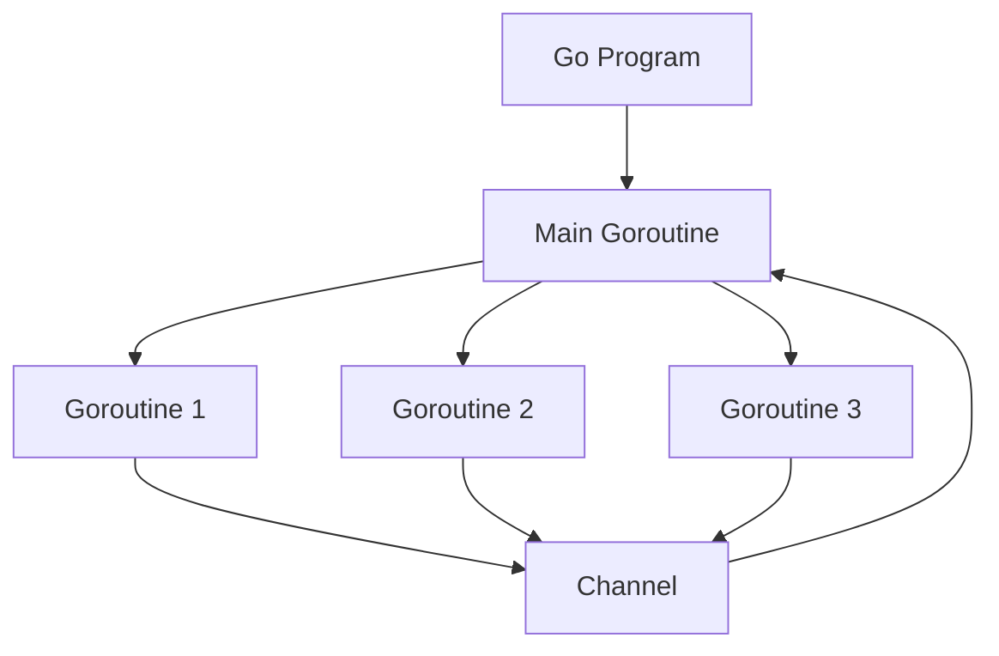

# Go Programming Basics {#go-programming-basics}

This guide covers the fundamental concepts of the Go programming language, designed to help developers quickly get started with writing effective Go code.

## Introduction to Go {#introduction}

Go (or Golang) is an open-source programming language developed by Google. It's known for:

- Static typing with simple syntax
- Compiled language with efficient execution
- Built-in concurrency support
- Strong standard library
- Garbage collection
- Cross-platform compatibility

<YouTubePlayer videoId="446E-r0rXHI" />

## Setting Up Your Development Environment {#development-environment}

Before diving into Go programming, ensure you have:

1. [Go installed](/Documentations/Development/Languages/Go/Go-Install) on your system
2. A code editor or IDE with Go support (VSCode with Go extension, GoLand, etc.)
3. Your GOPATH and workspace properly configured

::: tip Development Container
For a consistent development experience, consider using a Docker container:

```bash
docker run -it --name go-dev -v $(pwd):/app -w /app golang:latest bash
```
:::

## Your First Go Program {#first-program}

Let's create a simple "Hello, World!" program:

```go
package main

import "fmt"

func main() {
    fmt.Println("Hello, World!")
}
```

Save this as `hello.go` and run it:

::: code-group
```bash [Linux/macOS]
go run hello.go
```

```powershell [Windows]
go run hello.go
```
:::

### Program Structure Explained {#program-structure}

- `package main`: Declares the package name (main is required for executables)
- `import "fmt"`: Imports the formatting package for I/O functions
- `func main()`: The entry point of the program
- `fmt.Println()`: Prints text to the console with a newline

## Basic Syntax {#basic-syntax}

### Variables and Types {#variables-types}

Go has various ways to declare variables:

```go
// Variable declaration with explicit type
var name string = "John"

// Variable declaration with type inference
var age = 30

// Short variable declaration (inside functions only)
score := 95.5

// Multiple variable declaration
var (
    firstName string = "Jane"
    lastName  string = "Doe"
    isActive  bool   = true
)

// Constants
const Pi = 3.14159
```

### Basic Data Types {#data-types}

Go has several built-in data types:

```go
// Numeric types
var intValue int = 42         // Platform-dependent size (32 or 64 bit)
var int32Value int32 = 42     // 32-bit integer
var int64Value int64 = 42     // 64-bit integer
var uintValue uint = 42       // Unsigned integer
var floatValue float64 = 3.14 // 64-bit floating-point

// Boolean type
var isEnabled bool = true

// String type
var message string = "Hello, Go!"

// Complex types
var complex128Value complex128 = 1 + 2i
```

### Control Structures {#control-structures}

#### Conditional Statements {#conditionals}

```go
// If statement
if x > 10 {
    fmt.Println("x is greater than 10")
} else if x < 5 {
    fmt.Println("x is less than 5")
} else {
    fmt.Println("x is between 5 and 10")
}

// Switch statement
switch day {
case "Monday":
    fmt.Println("Start of work week")
case "Friday":
    fmt.Println("End of work week")
case "Saturday", "Sunday":
    fmt.Println("Weekend")
default:
    fmt.Println("Midweek")
}
```

#### Loops {#loops}

```go
// For loop (standard)
for i := 0; i < 5; i++ {
    fmt.Println(i)
}

// For loop as while
x := 0
for x < 5 {
    fmt.Println(x)
    x++
}

// Infinite loop
for {
    // Do something repeatedly
    break // Exit the loop
}

// For-range loop (for iterating over collections)
numbers := []int{1, 2, 3, 4, 5}
for index, value := range numbers {
    fmt.Printf("Index: %d, Value: %d\n", index, value)
}
```

## Functions {#functions}

Functions are a core component of Go:

```go
// Basic function
func add(a int, b int) int {
    return a + b
}

// Multiple return values
func divide(a, b float64) (float64, error) {
    if b == 0 {
        return 0, fmt.Errorf("cannot divide by zero")
    }
    return a / b, nil
}

// Named return values
func getCoordinates() (x, y int) {
    x = 10
    y = 20
    return // Returns named values
}

// Variadic function (variable number of arguments)
func sum(numbers ...int) int {
    total := 0
    for _, num := range numbers {
        total += num
    }
    return total
}
```

### Defer, Panic, and Recover {#defer-panic-recover}

Go provides mechanisms for handling exceptional situations:

```go
// Defer: executes a function call just before the surrounding function returns
func processFile(filename string) error {
    file, err := os.Open(filename)
    if err != nil {
        return err
    }
    defer file.Close() // Will be executed when function exits
    
    // Process file here
    return nil
}

// Panic and Recover
func safeOperation() {
    defer func() {
        if r := recover(); r != nil {
            fmt.Println("Recovered from panic:", r)
        }
    }()
    
    // This will cause a panic
    panic("something went wrong")
}
```

## Data Structures {#data-structures}

### Arrays and Slices {#arrays-slices}

```go
// Array (fixed size)
var colors [3]string
colors[0] = "Red"
colors[1] = "Green"
colors[2] = "Blue"

// Array initialization
numbers := [5]int{1, 2, 3, 4, 5}

// Slice (dynamic size)
fruits := []string{"Apple", "Banana", "Orange"}

// Create slice with make
scores := make([]int, 5)      // Length 5, capacity 5
moreScores := make([]int, 3, 10) // Length 3, capacity 10

// Append to slice
fruits = append(fruits, "Mango")

// Slice operations
subset := fruits[1:3] // elements 1 through 2
```

### Maps {#maps}

```go
// Map declaration
userRoles := map[string]string{
    "alice": "admin",
    "bob":   "user",
    "carol": "editor",
}

// Create map with make
scores := make(map[string]int)

// Add or update entries
scores["John"] = 89
scores["Alice"] = 95

// Check if key exists
role, exists := userRoles["dave"]
if !exists {
    fmt.Println("User not found")
}

// Delete key
delete(userRoles, "bob")
```

### Structs {#structs}

```go
// Define a struct
type Person struct {
    FirstName string
    LastName  string
    Age       int
    Address   Address
}

type Address struct {
    Street  string
    City    string
    Country string
}

// Create a struct instance
person := Person{
    FirstName: "John",
    LastName:  "Doe",
    Age:       30,
    Address: Address{
        Street:  "123 Main St",
        City:    "Anytown",
        Country: "USA",
    },
}

// Access fields
fmt.Println(person.FirstName)
fmt.Println(person.Address.City)
```

## Methods and Interfaces {#methods-interfaces}

### Methods {#methods}

Methods are functions associated with types:

```go
// Define a struct
type Rectangle struct {
    Width  float64
    Height float64
}

// Method with receiver
func (r Rectangle) Area() float64 {
    return r.Width * r.Height
}

// Method with pointer receiver (can modify the receiver)
func (r *Rectangle) Scale(factor float64) {
    r.Width *= factor
    r.Height *= factor
}

// Usage
rect := Rectangle{Width: 10, Height: 5}
area := rect.Area()
rect.Scale(2)
```

### Interfaces {#interfaces}

Interfaces define behavior:

```go
// Define an interface
type Shape interface {
    Area() float64
    Perimeter() float64
}

// Implement interface for Rectangle
func (r Rectangle) Perimeter() float64 {
    return 2 * (r.Width + r.Height)
}

// Implement interface for Circle
type Circle struct {
    Radius float64
}

func (c Circle) Area() float64 {
    return math.Pi * c.Radius * c.Radius
}

func (c Circle) Perimeter() float64 {
    return 2 * math.Pi * c.Radius
}

// Function using the interface
func PrintShapeInfo(s Shape) {
    fmt.Printf("Area: %f, Perimeter: %f\n", s.Area(), s.Perimeter())
}

// Usage
rect := Rectangle{Width: 10, Height: 5}
circ := Circle{Radius: 5}

PrintShapeInfo(rect)
PrintShapeInfo(circ)
```

## Concurrency {#concurrency}

Go's built-in concurrency is one of its strongest features.

<YouTubePlayer videoId="f6kdp27TYZs" />

### Goroutines {#goroutines}

Goroutines are lightweight threads:

```go
// Basic goroutine
func main() {
    go sayHello() // Function runs in background
    
    // Continue with other work
    time.Sleep(1 * time.Second) // Wait for goroutine to finish
}

func sayHello() {
    fmt.Println("Hello, concurrency!")
}
```

### Channels {#channels}

Channels allow communication between goroutines:

```go
// Create a channel
messages := make(chan string)

// Send to channel (in a goroutine)
go func() {
    messages <- "Hello from goroutine"
}()

// Receive from channel
msg := <-messages
fmt.Println(msg)

// Buffered channel
buffer := make(chan string, 2)
buffer <- "First"
buffer <- "Second"
fmt.Println(<-buffer)
fmt.Println(<-buffer)

// Channel directions (in function parameters)
func send(ch chan<- string, message string) {
    ch <- message
}

func receive(ch <-chan string) string {
    return <-ch
}
```

### Select Statement {#select}

The select statement lets you wait on multiple channel operations:

```go
func main() {
    c1 := make(chan string)
    c2 := make(chan string)

    go func() {
        time.Sleep(1 * time.Second)
        c1 <- "one"
    }()
    
    go func() {
        time.Sleep(2 * time.Second)
        c2 <- "two"
    }()

    for i := 0; i < 2; i++ {
        select {
        case msg1 := <-c1:
            fmt.Println("Received:", msg1)
        case msg2 := <-c2:
            fmt.Println("Received:", msg2)
        case <-time.After(3 * time.Second):
            fmt.Println("Timeout")
        }
    }
}
```

## Error Handling {#error-handling}

Go uses explicit error handling rather than exceptions:

```go
// Function returning an error
func divide(a, b float64) (float64, error) {
    if b == 0 {
        return 0, errors.New("cannot divide by zero")
    }
    return a / b, nil
}

// Error handling
result, err := divide(10, 0)
if err != nil {
    fmt.Println("Error:", err)
    return
}
fmt.Println("Result:", result)

// Custom error types
type CustomError struct {
    Code    int
    Message string
}

func (e *CustomError) Error() string {
    return fmt.Sprintf("Error %d: %s", e.Code, e.Message)
}
```

## Packages and Modules {#packages-modules}

### Creating Packages {#creating-packages}

```go
// File: math/calculator.go
package math

// Add is an exported function (capitalized)
func Add(a, b int) int {
    return a + b
}

// subtract is a non-exported function (lowercase)
func subtract(a, b int) int {
    return a - b
}
```

### Using Packages {#using-packages}

```go
// File: main.go
package main

import (
    "fmt"
    "yourmodule/math"
)

func main() {
    sum := math.Add(5, 3)
    fmt.Println("Sum:", sum)
}
```

### Go Modules {#go-modules}

Go modules provide dependency management:

::: code-group
```bash [Initialize]
# Initialize a new module
go mod init example.com/myproject
```

```bash [Add Dependencies]
# Add dependencies
go get github.com/some/package
```

```bash [Update]
# Update dependencies
go get -u
```

```bash [Clean Up]
# Clean up unused dependencies
go mod tidy
```
:::

## Testing {#testing}

Go has built-in testing capabilities:

```go
// File: calculator_test.go
package math

import "testing"

func TestAdd(t *testing.T) {
    result := Add(2, 3)
    expected := 5
    
    if result != expected {
        t.Errorf("Add(2, 3) = %d; expected %d", result, expected)
    }
}

// Table-driven tests
func TestMultiply(t *testing.T) {
    tests := []struct {
        a, b, expected int
    }{
        {1, 2, 2},
        {2, 3, 6},
        {5, 5, 25},
    }
    
    for _, test := range tests {
        result := Multiply(test.a, test.b)
        if result != test.expected {
            t.Errorf("Multiply(%d, %d) = %d; expected %d", 
                test.a, test.b, result, test.expected)
        }
    }
}
```

Run tests with:

::: code-group
```bash [Basic]
go test
```

```bash [Verbose]
go test -v
```

```bash [Coverage]
go test -cover
```
:::

## Best Practices {#best-practices}

::: tip
- Follow Go's official [Code Review Comments](https://github.com/golang/go/wiki/CodeReviewComments)
- Use `gofmt` to format your code
- Write clear documentation comments for public functions
- Handle errors explicitly
- Prefer composition over inheritance
- Use meaningful variable and function names
- Keep functions small and focused on a single task
- Use the standard library when possible
:::

## Go Development Environment with Docker {#dev-with-docker}

For a consistent development environment, you can use Docker:

```bash
# Run a Go development container
docker run -it --name go-dev -v $(pwd):/app -w /app golang:latest bash
```

## Next Steps {#next-steps}

After mastering the basics, consider exploring:

1. Web development with Go (net/http package, Gin, Echo)
2. Database integration (database/sql, GORM)
3. Advanced concurrency patterns
4. Microservices development
5. Cloud-native Go applications

::: warning
As Go evolves, some features may change. Always refer to the official documentation for the most up-to-date information.
:::

## Resources {#resources}

- [Go Documentation](https://golang.org/doc/)
- [Effective Go](https://golang.org/doc/effective_go)
- [Go by Example](https://gobyexample.com/)
- [The Go Playground](https://play.golang.org/)

## Go Project Structure {#project-structure}

Here's a typical Go project structure:

```
myproject/
├── cmd/                  # Command applications
│   └── myapp/
│       └── main.go
├── internal/             # Private application code
│   ├── app/
│   │   └── app.go
│   └── pkg/
│       └── utils.go
├── pkg/                  # Public libraries
│   └── mylib/
│       └── mylib.go
├── api/                  # API definitions
│   └── api.go
├── web/                  # Web assets
│   ├── template/
│   └── static/
├── configs/              # Configuration files
├── test/                 # Test files
├── go.mod               # Module definition
└── go.sum               # Module checksums
```

::: tip
This structure follows the standard Go project layout recommendations.
:::

## Go Concurrency Model {#concurrency-model}

Go's concurrency model is one of its most powerful features, allowing developers to write efficient concurrent code.



This diagram illustrates how goroutines can communicate through channels, which is Go's approach to safe concurrent data access.
