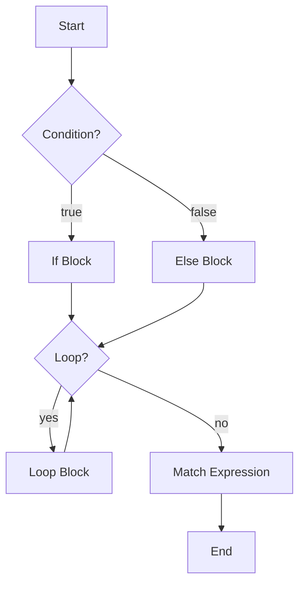

# Rust Flow Control

Control flow is how you control the execution path of your program. Rust provides several constructs for branching, looping, and pattern matching.



::: tip
This diagram summarizes how Rust uses conditional statements, loops, and match expressions to control program flow.
:::

## Conditional Statements

### If Expression

The `if` expression allows you to branch your code based on conditions:

```rust
let number = 6;

if number % 2 == 0 {
    println!("{} is even", number);
}
```

### If...Else Expression

You can provide an alternative with the `else` keyword:

```rust
let number = 5;

if number % 2 == 0 {
    println!("{} is even", number);
} else {
    println!("{} is odd", number);
}
```

### If...Else If...Else Expression

For multiple conditions, use `else if`:

```rust
let number = 0;

if number > 0 {
    println!("{} is positive", number);
} else if number < 0 {
    println!("{} is negative", number);
} else {
    println!("{} is zero", number);
}
```

### If Let Expression

The `if let` syntax combines `if` and `let` to handle values that match one pattern while ignoring the rest:

```rust
let some_value = Some(3);

if let Some(value) = some_value {
    println!("The value is: {}", value);
}

// Working with arrays
let array = [1, 2, 3];
if let [1, _, _] = array {
    println!("Array starts with 1");
}

// Working with tuples
let tuple = (1, "hello", true);
if let (1, message, _) = tuple {
    println!("Message: {}", message);
}
```

### Nested If Expressions

You can nest `if` expressions within other `if` expressions:

```rust
let number = 5;
let is_even = number % 2 == 0;

if is_even {
    if number > 5 {
        println!("{} is an even number greater than 5", number);
    } else {
        println!("{} is an even number less than or equal to 5", number);
    }
} else {
    println!("{} is odd", number);
}
```

## Match Expression

The `match` expression is a powerful control flow operator that allows you to compare a value against a series of patterns:

```rust
let number = 3;

match number {
    1 => println!("One"),
    2 => println!("Two"),
    3 => println!("Three"),
    4 => println!("Four"),
    5 => println!("Five"),
    _ => println!("Something else"), // Default case
}
```

### Match with Multiple Values

You can match multiple values for a single arm:

```rust
let x = 1;

match x {
    1 | 2 => println!("One or two"),
    3 => println!("Three"),
    _ => println!("Anything else"),
}
```

### Match with Ranges

You can match ranges of values:

```rust
let x = 5;

match x {
    1..=5 => println!("One through five"),
    6..=10 => println!("Six through ten"),
    _ => println!("Something else"),
}
```

## Loops

### Loop Keyword

The `loop` keyword creates an infinite loop:

```rust
loop {
    println!("This will print forever!");
    // Break out of the loop
    break;
}
```

### While Loop

The `while` loop executes while a condition is true:

```rust
let mut counter = 0;

while counter < 5 {
    println!("Counter: {}", counter);
    counter += 1;
}
```

### For Loop

The `for` loop iterates through a collection or a range:

```rust
// Iterating through a range
for i in 0..5 {
    println!("i: {}", i); // 0, 1, 2, 3, 4
}

// Iterating through a collection
let colors = ["red", "green", "blue"];
for color in colors.iter() {
    println!("Color: {}", color);
}
```

### Loop Control Flow

You can use `break` and `continue` to control the flow of loops:

```rust
// Breaking out of a loop
let mut count = 0;
loop {
    println!("Count: {}", count);
    count += 1;
    if count >= 5 {
        break;
    }
}

// Skipping iterations with continue
for i in 0..10 {
    if i % 2 == 0 {
        continue; // Skip even numbers
    }
    println!("Odd number: {}", i);
}
```

### Returning Values from Loops

You can return a value from a loop:

```rust
let mut counter = 0;
let result = loop {
    counter += 1;
    if counter == 10 {
        break counter * 2; // Return counter * 2
    }
};
println!("Result: {}", result); // 20
```

### Named Loops

You can label loops to break or continue outer loops:

```rust
'outer: for i in 0..5 {
    println!("i: {}", i);
    
    'inner: for j in 0..5 {
        println!("j: {}", j);
        
        if i == 2 && j == 2 {
            break 'outer; // Break the outer loop
        }
    }
}
```

## Next Steps

Continue your Rust journey with these topics:
- [Rust Functions](/Documentations/Development/Languages/Rust/Rust-Functions)
- [Rust Miscellaneous](/Documentations/Development/Languages/Rust/Rust-Misc)
