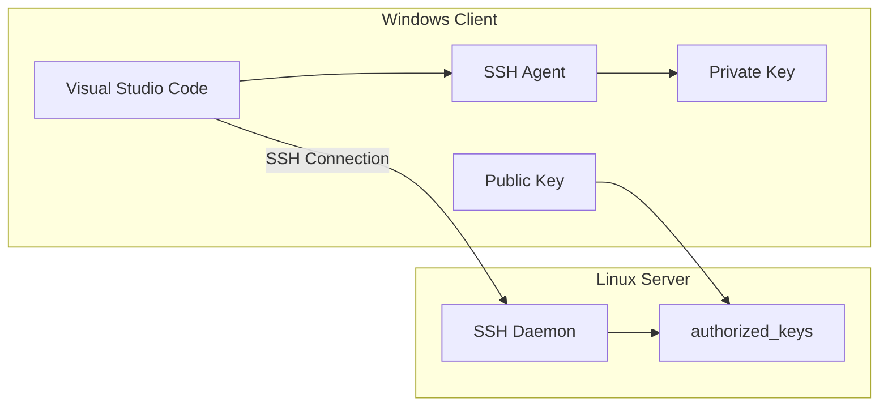

# VSCode SSH Key Authentication Setup

## Introduction

This guide explains how to configure SSH key authentication for Visual Studio Code, eliminating the need to enter passwords when connecting to Linux servers. We'll cover both Windows client and Linux server configurations.

::: tip Why Use SSH Keys?
- More secure than password authentication
- No need to enter passwords repeatedly
- Can be used with SSH agents for added security
- Supports key revocation if compromised
:::

## System Requirements

- Windows 10/11 with VSCode installed
- Linux server with SSH access
- OpenSSH client installed on Windows
- Administrator access on both systems

## Architecture Overview



## Windows Client Setup

### 1. Install OpenSSH Client

::: code-group
```powershell [PowerShell Admin]
# Check if OpenSSH Client is installed
Get-WindowsCapability -Online | Where-Object Name -like 'OpenSSH.Client*'

# Install OpenSSH Client if needed
Add-WindowsCapability -Online -Name OpenSSH.Client~~~~0.0.1.0
```

```cmd [Command Prompt Admin]
# Check installation
ssh -V
```
:::

### 2. Generate SSH Key Pair

Open PowerShell and run:

```powershell
# Create .ssh directory if it doesn't exist
mkdir ~\.ssh

# Generate SSH key pair
ssh-keygen -t ed25519 -C "your_email@example.com"
```

::: tip Key Options
- Use `ed25519` for better security (recommended)
- Alternatively, use `rsa` with 4096 bits: `ssh-keygen -t rsa -b 4096`
- Always set a strong passphrase for your private key
:::

### 3. Start SSH Agent

```powershell
# Start SSH Agent
Start-Service ssh-agent

# Add private key to agent
ssh-add ~\.ssh\id_ed25519
```

### 4. Configure SSH Config File

Create or edit `~\.ssh\config`:

```bash
# Global settings
Host *
    IdentityFile ~/.ssh/id_ed25519
    AddKeysToAgent yes
    ForwardAgent no

# Server-specific settings
Host dev-server
    HostName 192.168.1.100
    User username
    Port 22
    IdentityFile ~/.ssh/id_ed25519
```

### 5. VSCode Configuration

1. Install "Remote - SSH" extension in VSCode
2. Add configuration in VSCode settings.json:

```json
{
    "remote.SSH.showLoginTerminal": true,
    "remote.SSH.useLocalServer": false,
    "remote.SSH.remotePlatform": {
        "dev-server": "linux"
    }
}
```

## Linux Server Setup

### 1. Configure SSH Directory

```bash
# Create .ssh directory with correct permissions
mkdir -p ~/.ssh
chmod 700 ~/.ssh
```

### 2. Add Public Key

Copy the public key from Windows to the Linux server:

::: code-group
```powershell [Windows PowerShell]
# Copy public key content
Get-Content ~\.ssh\id_ed25519.pub | clip
```

```bash [Linux Server]
# Create/edit authorized_keys file
nano ~/.ssh/authorized_keys

# Set correct permissions
chmod 600 ~/.ssh/authorized_keys
```
:::

### 3. Configure SSH Daemon

Edit `/etc/ssh/sshd_config`:

```bash
# Security settings
PermitRootLogin no
PasswordAuthentication no
PubkeyAuthentication yes
AuthorizedKeysFile .ssh/authorized_keys
UsePAM yes

# Optional but recommended settings
Protocol 2
PermitEmptyPasswords no
X11Forwarding no
MaxAuthTries 3
```

### 4. Restart SSH Service

```bash
sudo systemctl restart sshd
```

## Testing the Connection

1. From VSCode:
   - Press `F1` or `Ctrl+Shift+P`
   - Type "Remote-SSH: Connect to Host"
   - Select your configured host

2. From PowerShell:
```powershell
# Test SSH connection
ssh dev-server
```

## Troubleshooting

### Common Issues and Solutions

1. **Permission Issues**
```bash
# Check file permissions on Linux
ls -la ~/.ssh/
```

2. **SSH Agent Issues**
```powershell
# Verify SSH agent is running
Get-Service ssh-agent
```

3. **Key Issues**
```bash
# Test SSH connection with verbose output
ssh -v dev-server
```

### Security Best Practices

::: tip Security Recommendations
1. Always use strong passphrases for SSH keys
2. Regularly rotate SSH keys
3. Use different keys for different servers/purposes
4. Keep private keys secure and never share them
5. Backup your SSH keys securely
:::

## Automated Setup Script

Create `setup-ssh.ps1` on Windows:

```powershell
# Setup SSH for VSCode
# Run as Administrator

# Check if OpenSSH is installed
$openssh = Get-WindowsCapability -Online | Where-Object Name -like 'OpenSSH.Client*'
if ($openssh.State -ne "Installed") {
    Write-Host "Installing OpenSSH Client..."
    Add-WindowsCapability -Online -Name OpenSSH.Client~~~~0.0.1.0
}

# Create .ssh directory
$sshPath = "$env:USERPROFILE\.ssh"
if (!(Test-Path $sshPath)) {
    New-Item -ItemType Directory -Path $sshPath
    icacls $sshPath /inheritance:r
    icacls $sshPath /grant:r "${env:USERNAME}:(OI)(CI)F"
}

# Generate SSH key if it doesn't exist
$keyPath = "$sshPath\id_ed25519"
if (!(Test-Path $keyPath)) {
    Write-Host "Generating SSH key..."
    ssh-keygen -t ed25519 -f $keyPath -N """" -C "$env:USERNAME@$env:COMPUTERNAME"
}

# Configure SSH agent
Set-Service ssh-agent -StartupType Automatic
Start-Service ssh-agent
ssh-add $keyPath

# Create SSH config
$configPath = "$sshPath\config"
if (!(Test-Path $configPath)) {
    @"
Host *
    IdentityFile ~/.ssh/id_ed25519
    AddKeysToAgent yes
    ForwardAgent no
"@ | Out-File -FilePath $configPath -Encoding ASCII
}

Write-Host "Setup complete! Don't forget to:"
Write-Host "1. Copy your public key to the Linux server"
Write-Host "2. Install the Remote-SSH extension in VSCode"
Write-Host "3. Configure your specific host in ~/.ssh/config"
```

## SSH Key Full Setup Script

Open a new PowerShell script file `setup-ssh-key.ps1` and paste the following code:

```powershell
# SSH Key Setup Script
# Usage: .\setup-ssh-key.ps1 -RemoteHost "hostname" -RemoteUser "username" -KeyName "key_name" -KeyType "ed25519"

param(
    [Parameter(Mandatory=$true)]
    [string]$RemoteHost,
    
    [Parameter(Mandatory=$true)]
    [string]$RemoteUser,
    
    [Parameter(Mandatory=$false)]
    [string]$KeyName = "id_ed25519",
    
    [Parameter(Mandatory=$false)]
    [ValidateSet("ed25519", "rsa")]
    [string]$KeyType = "ed25519",
    
    [Parameter(Mandatory=$false)]
    [string]$KeyComment = "",
    
    [Parameter(Mandatory=$false)]
    [int]$RemotePort = 22,
    
    [Parameter(Mandatory=$false)]
    [switch]$Force
)

# Function to write colored output
function Write-ColorOutput($ForegroundColor) {
    $fc = $host.UI.RawUI.ForegroundColor
    $host.UI.RawUI.ForegroundColor = $ForegroundColor
    if ($args) {
        Write-Output $args
    }
    $host.UI.RawUI.ForegroundColor = $fc
}

function Test-SshConnection {
    param (
        [string]$Host,
        [string]$User,
        [int]$Port = 22
    )
    
    try {
        $result = ssh -q -o BatchMode=yes -o ConnectTimeout=5 "${User}@${Host}" -p $Port "echo 2>&1"
        return $LASTEXITCODE -eq 0
    }
    catch {
        return $false
    }
}

# Ensure OpenSSH Client is installed
$openssh = Get-WindowsCapability -Online | Where-Object Name -like 'OpenSSH.Client*'
if ($openssh.State -ne "Installed") {
    Write-ColorOutput Yellow "Installing OpenSSH Client..."
    Add-WindowsCapability -Online -Name OpenSSH.Client~~~~0.0.1.0
    if ($LASTEXITCODE -ne 0) {
        Write-ColorOutput Red "Failed to install OpenSSH Client"
        exit 1
    }
}

# Create .ssh directory if it doesn't exist
$sshPath = "$env:USERPROFILE\.ssh"
if (!(Test-Path $sshPath)) {
    Write-ColorOutput Yellow "Creating .ssh directory..."
    New-Item -ItemType Directory -Path $sshPath | Out-Null
    # Secure the directory
    icacls $sshPath /inheritance:r
    icacls $sshPath /grant:r "${env:USERNAME}:(OI)(CI)F"
}

# Set key parameters based on type
$keyPath = "$sshPath\$KeyName"
$keyArgs = @()
if ($KeyType -eq "ed25519") {
    $keyArgs += "-t", "ed25519"
} else {
    $keyArgs += "-t", "rsa", "-b", "4096"
}

# Generate comment if not provided
if ([string]::IsNullOrWhiteSpace($KeyComment)) {
    $KeyComment = "$env:USERNAME@$env:COMPUTERNAME"
}

# Check if key already exists
if (Test-Path $keyPath) {
    if ($Force) {
        Write-ColorOutput Yellow "Removing existing key..."
        Remove-Item $keyPath -Force
        Remove-Item "$keyPath.pub" -Force
    } else {
        Write-ColorOutput Red "Key already exists. Use -Force to overwrite."
        exit 1
    }
}

# Generate SSH key
Write-ColorOutput Green "Generating SSH key..."
$keyArgs += "-f", $keyPath, "-N", '""', "-C", $KeyComment
Start-Process -FilePath "ssh-keygen" -ArgumentList $keyArgs -NoNewWindow -Wait

# Verify key generation
if (!(Test-Path $keyPath) -or !(Test-Path "$keyPath.pub")) {
    Write-ColorOutput Red "Failed to generate SSH key"
    exit 1
}

# Configure SSH agent
$sshAgent = Get-Service ssh-agent
if ($sshAgent.Status -ne "Running") {
    Write-ColorOutput Yellow "Starting SSH agent..."
    Set-Service ssh-agent -StartupType Automatic
    Start-Service ssh-agent
}

# Add key to SSH agent
Write-ColorOutput Yellow "Adding key to SSH agent..."
ssh-add $keyPath

# Create or update SSH config
$configPath = "$sshPath\config"
$configContent = @"
Host $RemoteHost
    HostName $RemoteHost
    User $RemoteUser
    Port $RemotePort
    IdentityFile $keyPath
    AddKeysToAgent yes
    ForwardAgent no
"@

if (!(Test-Path $configPath)) {
    $configContent | Out-File -FilePath $configPath -Encoding ASCII
} else {
    # Check if host entry exists
    $existingConfig = Get-Content $configPath -Raw
    if ($existingConfig -notmatch "Host\s+$RemoteHost") {
        $configContent | Add-Content -Path $configPath
    }
}

# Copy public key to remote server
Write-ColorOutput Green "Copying public key to remote server..."
$pubKey = Get-Content "$keyPath.pub"
$remoteCommand = @"
mkdir -p ~/.ssh && chmod 700 ~/.ssh && echo '$pubKey' >> ~/.ssh/authorized_keys && chmod 600 ~/.ssh/authorized_keys
"@

try {
    $pubKey | ssh "${RemoteUser}@${RemoteHost}" -p $RemotePort "mkdir -p ~/.ssh && chmod 700 ~/.ssh && cat >> ~/.ssh/authorized_keys && chmod 600 ~/.ssh/authorized_keys"
    if ($LASTEXITCODE -ne 0) {
        throw "Failed to copy key"
    }
} catch {
    Write-ColorOutput Red "Failed to copy public key to remote server: $_"
    exit 1
}

# Test connection with new key
Write-ColorOutput Yellow "Testing SSH connection..."
Start-Sleep -Seconds 2 # Wait for remote server to process the key
if (Test-SshConnection -Host $RemoteHost -User $RemoteUser -Port $RemotePort) {
    Write-ColorOutput Green "SSH key setup completed successfully!"
    Write-ColorOutput Green "You can now connect using: ssh ${RemoteHost}"
} else {
    Write-ColorOutput Red "SSH connection test failed. Please check your configuration."
    exit 1
}

# Display key information
Write-ColorOutput Cyan @"

SSH Key Setup Summary:
---------------------
Key Type: $KeyType
Key Path: $keyPath
Remote Host: $RemoteHost
Remote User: $RemoteUser
Remote Port: $RemotePort

To connect manually:
ssh ${RemoteHost}

To use with VSCode:
1. Install the 'Remote - SSH' extension
2. Press F1 and select 'Remote-SSH: Connect to Host...'
3. Select '$RemoteHost' from the list
"@
```

## Additional Resources

- [OpenSSH Documentation](https://www.openssh.com/manual.html)
- [VSCode Remote Development](https://code.visualstudio.com/docs/remote/remote-overview)
- [SSH Key Types Comparison](https://goteleport.com/blog/comparing-ssh-keys/)