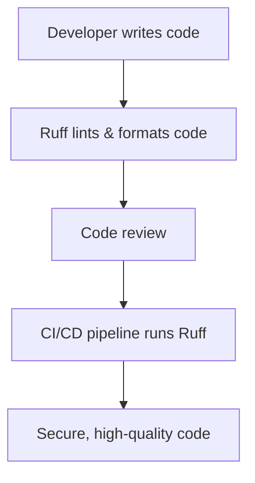

# Python Linting & Formatting with Ruff in VS Code

As a DevSecOps engineer, ensuring code quality and security is essential. Ruff is a fast, modern Python linter and formatter that helps enforce best practices, catch bugs early, and maintain a consistent code style across your projects.

## What is Ruff?

Ruff is an extremely fast Python linter and code formatter written in Rust. It supports most common linting rules (including Flake8, isort, pycodestyle, and more) and can automatically fix many issues.

**Key Benefits:**
- **Speed:** Processes large codebases quickly.
- **Comprehensive:** Supports a wide range of linting rules.
- **Formatter:** Can auto-format code to a consistent style.
- **Security:** Helps catch insecure code patterns early.

::: tip
Using Ruff in your workflow improves code quality, reduces technical debt, and helps prevent security vulnerabilities.
:::

## Installation

### 1. Install Ruff

You can install Ruff using `pipx`, `pip`, or download a prebuilt binary.

::: code-group
```sh [pip]
pip install ruff
```
```sh [pipx]
pipx install ruff
```
```sh [Docker]
docker run --rm -v $(pwd):/src chartboost/ruff check /src
```
:::

::: tip
For isolated development, use the official Ruff Docker image:
```sh
docker run --rm -v $(pwd):/src chartboost/ruff check /src
```
:::

### 2. Install the Ruff VS Code Extension

- Open VS Code.
- Go to the Extensions view (`Ctrl+Shift+X`).
- Search for **Ruff** and install the official extension.

## Basic Usage

### Linting Your Code

To lint your codebase, run:

```sh
ruff check .
```

### Automatically Fix Lint Issues

Ruff can automatically fix many linting issues for you. Use the `--fix` flag:

```sh
ruff check --fix .
```

- This command will attempt to automatically correct fixable lint errors in your codebase.
- Review changes after running to ensure correctness.

### Formatting Your Code

To automatically format your code:

```sh
ruff format .
```

- This command reformats your Python files to follow consistent style guidelines.

::: code-group
```sh [Lint only]
ruff check .
```
```sh [Lint & auto-fix]
ruff check --fix .
```
```sh [Format]
ruff format .
```
:::

### Example Output

```sh
$ ruff check .
src/app.py:1:1: F401 'os' imported but unused
src/app.py:2:5: E225 missing whitespace around operator
```

## Configuring Ruff

Ruff can be configured via a `pyproject.toml` file at the root of your project.

```toml
# pyproject.toml
[tool.ruff]
line-length = 88
select = ["E", "F", "I"]
ignore = ["E501"]
```

- `line-length`: Maximum line length.
- `select`: Linting rules to enable.
- `ignore`: Rules to ignore.

::: tip
Refer to the [Ruff documentation](https://docs.astral.sh/ruff/) for a full list of rules and configuration options.
:::

## Integrating Ruff with VS Code

1. Open VS Code settings (`Ctrl+,`).
2. Search for "Ruff".
3. Set **Ruff: Path** if not using the default.
4. Enable **Ruff: Enable** for linting and formatting.

### Example VS Code Settings

```json
// .vscode/settings.json
{
  "python.linting.enabled": false,
  "ruff.enable": true,
  "ruff.format.enable": true,
  "editor.formatOnSave": true
}
```

## Security & DevSecOps Considerations

- **Early Detection:** Ruff helps catch insecure code patterns (e.g., use of `eval`, insecure imports).
- **Consistency:** Enforces consistent code style, reducing the risk of overlooked vulnerabilities.
- **Automation:** Integrate Ruff in CI/CD pipelines for automated code quality checks.



## Running Ruff in CI/CD

Integrate Ruff into your pipeline for automated checks.

### GitHub Actions Example

```yaml
# .github/workflows/lint.yml
name: Lint

on: [push, pull_request]

jobs:
  lint:
    runs-on: ubuntu-latest
    steps:
      - uses: actions/checkout@v3
      - name: Set up Python
        uses: actions/setup-python@v4
        with:
          python-version: '3.11'
      - name: Install Ruff
        run: pip install ruff
      - name: Run Ruff
        run: ruff check .
```

## Troubleshooting

::: warning
If Ruff is not recognized in VS Code, ensure it is installed in your environment and the path is set correctly in VS Code settings.
:::

## Further Reading

- [Ruff Official Documentation](https://docs.astral.sh/ruff/)
- [Ruff VS Code Extension](https://marketplace.visualstudio.com/items?itemName=charliermarsh.ruff)
- [DevSecOps Best Practices](https://owasp.org/www-project-devsecops-maturity-model/)

