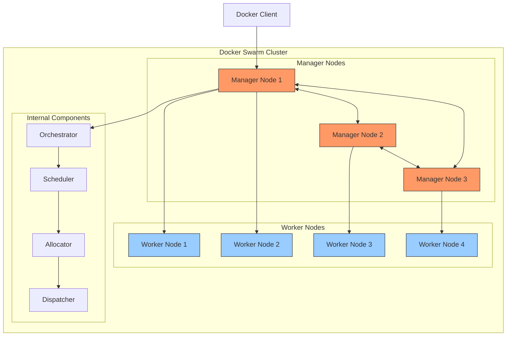
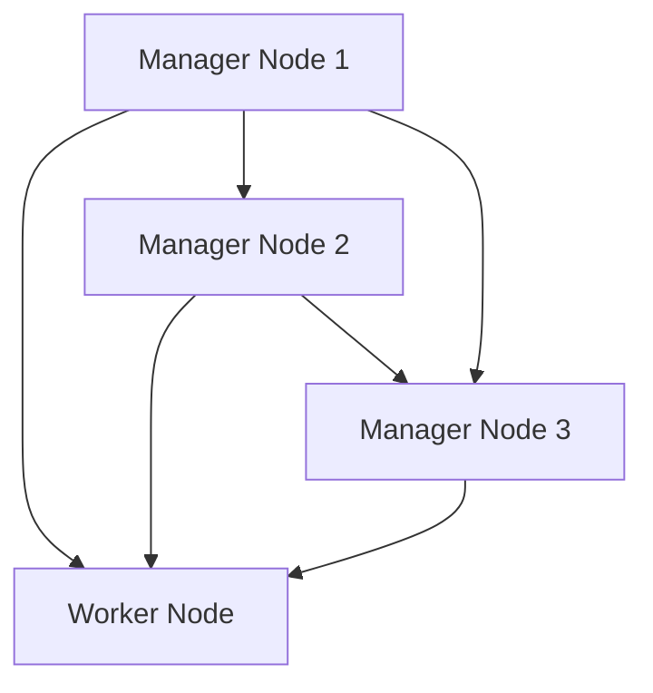
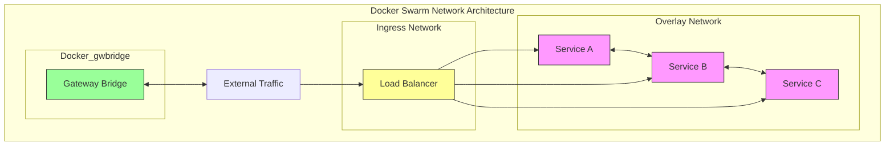

# Docker Swarm: Advanced Container Orchestration

## Docker Swarm Overview

Docker Swarm is a **container orchestration platform** built into Docker. It allows you to create a cluster of Docker nodes (machines running Docker) and manage them as a single, virtual server. By using Swarm, you can deploy, manage, and scale applications with ease while taking advantage of features like service discovery, load balancing, and scaling.

Swarm's integration with Docker is seamless, which allows it to be a compelling choice for users already using Docker for containerization. However, it is less complex compared to other orchestration tools like Kubernetes, making it easier to set up and manage for smaller clusters or teams that are new to container orchestration.


## Docker Swarm Architecture




---

## Swarm Mode and Cluster Configuration

### Initializing Swarm

Docker Swarm mode is activated by initializing a swarm cluster. This sets up the first **manager node**, which is responsible for managing the state of the cluster. After initializing the manager, you can join additional nodes as either **manager** or **worker** nodes.

```bash
# Initialize a Swarm
docker swarm init --advertise-addr <MANAGER-IP>

# To add worker nodes, use the following command on each worker node
docker swarm join --token <WORKER-TOKEN> <MANAGER-IP>:2377
```

Once the swarm is initialized, you can deploy services and manage your cluster using Docker commands.

### Manager Nodes and Raft Consensus

The **manager nodes** maintain the state of the cluster, distribute tasks, and manage the overall orchestration. They communicate with each other using the **Raft consensus** algorithm to ensure that the cluster remains consistent.

For high availability, it's recommended to have an **odd number of manager nodes**. The Raft consensus algorithm requires a majority of the manager nodes to agree on a change before it is applied. Therefore, with three manager nodes, two must be online for the swarm to function properly.

#### Key features of manager nodes:
- **State management**: Maintain the state of the cluster and services.
- **Service scheduling**: Schedule tasks on worker nodes.
- **Consensus**: Maintain consistency using Raft.



### Worker Nodes

**Worker nodes** are where your application containers are deployed and run. They **cannot** manage the cluster state but report their status back to the manager nodes, ensuring the cluster is operating as expected.

Worker nodes are primarily responsible for:
- **Executing containers**: Running the containerized applications.
- **Reporting status**: Sending updates on health and resource utilization back to the managers.

---

## Docker Swarm Services and Tasks

### Services

A **service** in Docker Swarm defines the desired state for a containerized application, including the number of replicas, the container image to use, and the network configuration.

**Key attributes of a service**:
- **Replicas**: The number of identical containers that should be running for the service.
- **Image**: The Docker image to use for the service.
- **Resource constraints**: Limits for CPU, memory, and other resources.
- **Update policies**: How to handle updates and rollbacks.

```bash
# Create a service with 3 replicas
docker service create --replicas 3 --name my-web-app nginx:latest
```

### Tasks

A **task** represents a **single container instance** in the swarm. Every service consists of one or more tasks, depending on the number of replicas specified.

Tasks are:
- Scheduled by manager nodes.
- Managed by the swarm scheduler.
- Automatically rescheduled in case of failure.

---

## Docker Swarm Networking

Docker Swarm has a **multi-tier networking model** that facilitates the communication between containers, services, and external traffic. Here are the key types of networks used in Docker Swarm:


## Network model in Docker Swarm



### Overlay Networks

**Overlay networks** span multiple Docker hosts. They enable containers running on different nodes to communicate securely and seamlessly.

- **Used for service-to-service communication**.
- **Can be encrypted** for secure data transfer.
- Provide **service discovery** via DNS.

```bash
docker network create --driver overlay --opt encrypted my-overlay-network
```

### Ingress Networks

The **Ingress network** is a special overlay network used by Docker Swarm for **load balancing** and routing external traffic to the appropriate service.

- **Built-in load balancing**: Automatically distributes external requests to available service replicas.
- **Routing mesh**: Ensures that traffic can be routed to any node in the cluster, regardless of where the service is running.

### Docker_gwbridge

The **docker_gwbridge** is the default network driver for **bridge networks** in Docker Swarm. It is primarily used for **connecting overlay networks** to the host network and external systems.

```bash
docker network create --driver bridge docker_gwbridge
```

---

## Advanced Configuration and Best Practices

### High Availability and Scalability

Docker Swarm is designed with **high availability** in mind. Here are key practices to ensure your swarm remains highly available and can scale effectively:

- **Use an odd number of manager nodes** to ensure quorum.
- **Set up service replicas** to ensure redundancy and fault tolerance.
- **Implement rolling updates** to minimize downtime during updates.
- Use **placement constraints** to distribute services across multiple availability zones.

#### Example of scaling a service:
```bash
# Scale the web service to 5 replicas
docker service scale my-web-app=5
```

### Secrets Management

Docker Swarm provides a secure way to store and manage **sensitive data** using **secrets**. Secrets are encrypted and can be easily injected into services without exposing them in environment variables or configuration files.

```bash
# Create a secret
docker secret create my_secret /path/to/secret/file

# Use secret in service
docker service create --secret my_secret myapp
```

### Health Checks and Monitoring

Docker Swarm supports **health checks** to ensure that services and containers are operating correctly. If a container fails a health check, it is automatically replaced.

#### Example of a health check in a service:
```yaml
healthcheck:
  test: ["CMD", "curl", "-f", "http://localhost"]
  interval: 30s
  retries: 3
```

### Security Considerations

#### Transport Layer Security (TLS)
Docker Swarm uses **TLS encryption** for secure communication between manager and worker nodes. This ensures that sensitive information is not exposed in transit.

- Enable automatic **TLS encryption** during initialization.

```bash
docker swarm init --autolock
```

#### Network Security
To enhance security, Docker Swarm allows you to **encrypt overlay networks**.

```bash
docker network create --driver overlay --opt encrypted my-secure-network
```

---

## Monitoring and Maintenance

### Service Logs and Metrics

To monitor services in Docker Swarm, you can view **logs** and **metrics**:

```bash
# View logs for a service
docker service logs <service-name>

# Follow logs for a service
docker service logs -f <service-name>
```

For advanced monitoring, integrate **Prometheus** and **Grafana** for container-level metrics and visualizations.

### Node Management and Maintenance

You can manage the nodes in your swarm using Docker commands. For example, you can promote a worker node to a manager or drain a node for maintenance.

```bash
# List all nodes
docker node ls

# Promote a worker node to manager
docker node promote <node-name>

# Drain a node for maintenance
docker node update --availability drain <node-name>
```

---

## Conclusion

Docker Swarm is a powerful container orchestration tool that allows developers to deploy, scale, and manage applications with ease. By understanding its architecture, services, networking, and best practices, you can leverage Swarm to build highly available, resilient applications.

While Docker Swarm is ideal for simpler use cases and teams looking for straightforward orchestration, it offers the flexibility and power needed to scale containerized applications while maintaining security and performance. Consider using Docker Swarm for your containerized applications, and implement the best practices outlined here to ensure your deployments are efficient, secure, and scalable.
