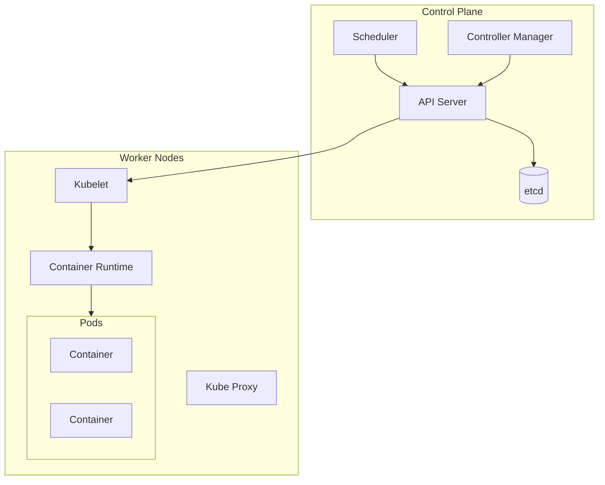

# Introduction to Kubernetes and Basic Deployment

## What is Kubernetes?

Kubernetes (K8s) is an open-source container orchestration platform that automates container deployment, scaling, and management.

:::tip Key Benefits
- Automated container orchestration
- Self-healing capabilities
- Horizontal scaling
- Load balancing
- Rolling updates and rollbacks
:::

## Architecture Overview

Kubernetes follows a master-worker architecture:

1. **Control Plane (Master)** components:
   - API Server: Central management point
   - etcd: Distributed key-value store
   - Scheduler: Places pods on nodes
   - Controller Manager: Maintains cluster state

2. **Worker Nodes** components:
   - Kubelet: Node agent
   - Container Runtime: Runs containers
   - Kube Proxy: Network proxy




## Basic Concepts

### Pods

The smallest deployable unit in Kubernetes.

```yaml
apiVersion: v1
kind: Pod
metadata:
  name: nginx-pod
spec:
  containers:
  - name: nginx
    image: nginx:latest
    ports:
    - containerPort: 80
```

### Deployments

Manages ReplicaSets and provides declarative updates.

```yaml
apiVersion: apps/v1
kind: Deployment
metadata:
  name: nginx-deployment
spec:
  replicas: 3
  selector:
    matchLabels:
      app: nginx
  template:
    metadata:
      labels:
        app: nginx
    spec:
      containers:
      - name: nginx
        image: nginx:latest
        ports:
        - containerPort: 80
```

### Services

Expose applications running on pods.

```yaml
apiVersion: v1
kind: Service
metadata:
  name: nginx-service
spec:
  selector:
    app: nginx
  ports:
  - port: 80
    targetPort: 80
  type: ClusterIP
```

## Practical Setup

### Local Development Environment

::: code-group

```sh [Docker Desktop]
# Enable Kubernetes in Docker Desktop settings
```

```sh [minikube]
# Install minikube
curl -LO https://storage.googleapis.com/minikube/releases/latest/minikube-linux-amd64
sudo install minikube-linux-amd64 /usr/local/bin/minikube

# Start cluster
minikube start
```

```sh [kind]
# Install kind
curl -Lo ./kind https://kind.sigs.k8s.io/dl/v0.20.0/kind-linux-amd64
chmod +x ./kind
sudo mv ./kind /usr/local/bin/kind

# Create cluster
kind create cluster
```

:::

### kubectl Installation

::: code-group

```sh [Linux]
curl -LO "https://dl.k8s.io/release/$(curl -L -s https://dl.k8s.io/release/stable.txt)/bin/linux/amd64/kubectl"
sudo install -o root -g root -m 0755 kubectl /usr/local/bin/kubectl
```

```sh [MacOS]
brew install kubectl
```

```sh [Windows]
choco install kubernetes-cli
```

:::

## Basic Operations

### Deployment Management

```sh
# Create deployment
kubectl create deployment nginx --image=nginx

# Scale deployment
kubectl scale deployment nginx --replicas=3

# Update image
kubectl set image deployment/nginx nginx=nginx:1.19

# View deployments
kubectl get deployments

# View pods
kubectl get pods

# View details
kubectl describe deployment nginx
```

### Service Management

```sh
# Create service
kubectl expose deployment nginx --port=80 --type=LoadBalancer

# List services
kubectl get services

# Delete service
kubectl delete service nginx
```

## Monitoring and Debugging

```sh
# View pod logs
kubectl logs <pod-name>

# Execute command in pod
kubectl exec -it <pod-name> -- /bin/bash

# View resource usage
kubectl top pods
kubectl top nodes
```

## Example Application Deployment

Let's create a complete application deployment:

```yaml
# app-deployment.yaml
apiVersion: apps/v1
kind: Deployment
metadata:
  name: example-app
spec:
  replicas: 3
  selector:
    matchLabels:
      app: example
  template:
    metadata:
      labels:
        app: example
    spec:
      containers:
      - name: example
        image: nginx:latest
        ports:
        - containerPort: 80
        resources:
          requests:
            memory: "64Mi"
            cpu: "250m"
          limits:
            memory: "128Mi"
            cpu: "500m"
---
apiVersion: v1
kind: Service
metadata:
  name: example-service
spec:
  selector:
    app: example
  ports:
  - port: 80
    targetPort: 80
  type: LoadBalancer
```

Deploy the application:

```sh
kubectl apply -f app-deployment.yaml
```

## Best Practices

1. **Resource Management**
   - Always set resource requests and limits
   - Use namespaces for isolation

2. **High Availability**
   - Use multiple replicas
   - Implement pod disruption budgets
   - Use pod anti-affinity rules

3. **Security**
   - Enable RBAC
   - Use network policies
   - Regularly update images

4. **Monitoring**
   - Implement health checks
   - Use readiness and liveness probes
   - Set up monitoring tools

## Exercises

1. Deploy a simple web application with 3 replicas
2. Create a service to expose the application
3. Scale the deployment up and down
4. Perform a rolling update
5. View application logs and metrics

:::tip Next Steps
- Learn about ConfigMaps and Secrets
- Explore Helm for package management
- Study Kubernetes networking
- Implement CI/CD pipelines
:::