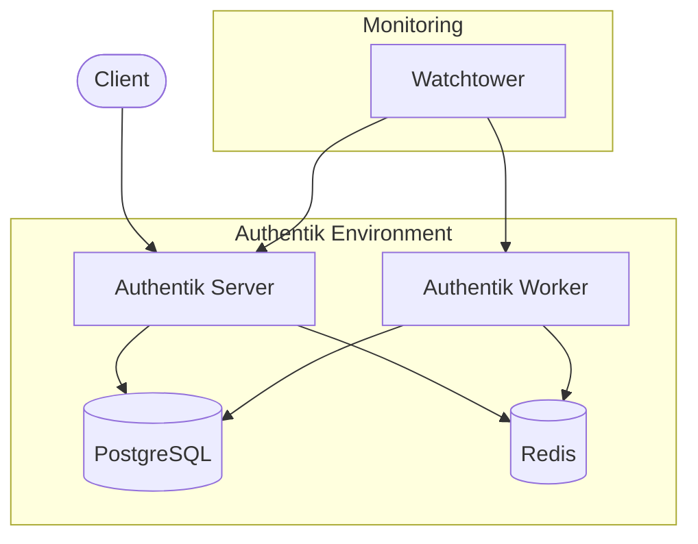
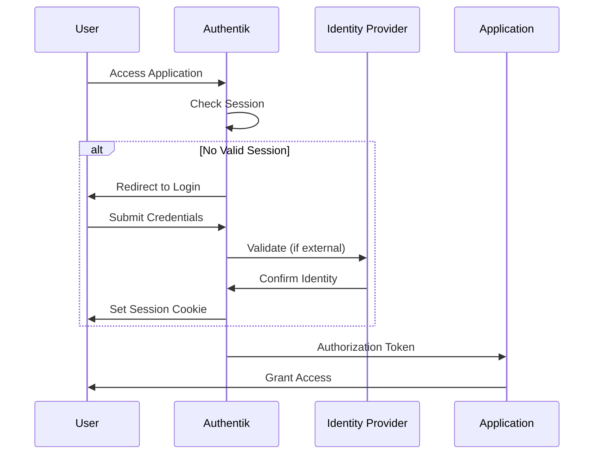

I'll help you create a comprehensive documentation for Authentik using VitePress format. I'll include the configuration details and explanations based on the provided docker-compose file.

```markdown
---
layout: doc
title: Authentik - Identity Provider Setup Guide
description: A comprehensive guide for setting up Authentik Identity Provider with Docker
mermaidTheme: forest
---

# Authentik Identity Provider Setup Guide

## Introduction

Authentik is a modern Identity Provider focused on flexibility and versatility. This guide covers setting up Authentik using Docker Compose with proper security configurations and monitoring.

## Architecture Overview



## Prerequisites

::: tip Requirements
- Docker and Docker Compose installed
- Basic understanding of identity management
- Access to ports:
  - 9000 (HTTP)
  - 9443 (HTTPS)
  - 5432 (PostgreSQL)
:::

## Initial Setup

### Directory Structure

Create the required directory structure:

```bash
mkdir -p ./data/{database,media,custom-templates,geoip,certs}
```

### Environment Configuration

Create a `.env` file with the following configurations:

```env
# PostgreSQL Configuration
PG_PASS=your_secure_password
PG_USER=authentik
PG_DB=authentik

# Authentik Configuration
AUTHENTIK_SECRET_KEY=your_long_random_secret_key
AUTHENTIK_ERROR_REPORTING__ENABLED=false
AUTHENTIK_PORT_HTTPS=9443
AUTHENTIK_VERSION=2024.2.1

# Email Configuration (Optional)
AUTHENTIK_EMAIL__HOST=smtp.gmail.com
AUTHENTIK_EMAIL__PORT=587
AUTHENTIK_EMAIL__USERNAME=your_email@gmail.com
AUTHENTIK_EMAIL__PASSWORD=your_app_password
AUTHENTIK_EMAIL__USE_TLS=true
AUTHENTIK_EMAIL__FROM=authentik@yourdomain.com

# Authentik Admin User (First Run)
AUTHENTIK_BOOTSTRAP_PASSWORD=your_admin_password
AUTHENTIK_BOOTSTRAP_TOKEN=your_admin_token

# GeoIP Configuration (Optional)
GEOIPUPDATE_ACCOUNT_ID=your_account_id
GEOIPUPDATE_LICENSE_KEY=your_license_key

# Docker Image Configuration
AUTHENTIK_IMAGE=ghcr.io/goauthentik/server
```

## Component Breakdown

### Core Components

1. **PostgreSQL Database**
```yaml
postgresql:
  image: postgres:12-alpine
  environment:
    POSTGRES_PASSWORD: ${PG_PASS}
    POSTGRES_USER: ${PG_USER:-authentik}
    POSTGRES_DB: ${PG_DB:-authentik}
  volumes:
    - ./data/database:/var/lib/postgresql/data
```

::: tip Database Security
PostgreSQL is configured with:
- Health checks for reliability
- Persistent volume for data retention
- Environment-based configuration for security
:::

2. **Redis Cache**
```yaml
redis:
  image: redis:alpine
  healthcheck:
    test: ["CMD-SHELL", "redis-cli ping | grep PONG"]
    interval: 30s
```

3. **Authentik Server**
```yaml
server:
  image: ${AUTHENTIK_IMAGE:-ghcr.io/goauthentik/server}:${AUTHENTIK_VERSION}
  ports:
    - "9000:9000"
    - "${AUTHENTIK_PORT_HTTPS:-9443}:9443"
  volumes:
    - ./data/media:/media
    - ./data/custom-templates:/templates
    - ./data/geoip:/geoip
```

4. **Authentik Worker**
```yaml
worker:
  image: ${AUTHENTIK_IMAGE:-ghcr.io/goauthentik/server}:${AUTHENTIK_VERSION}
  command: worker
  volumes:
    - ./data/media:/media
    - ./data/certs:/certs
    - /var/run/docker.sock:/var/run/docker.sock
```

### Monitoring Component

**Watchtower Configuration**
```yaml
watchtower:
  image: containrrr/watchtower
  environment:
    - WATCHTOWER_CLEANUP=true
    - WATCHTOWER_INCLUDE_STOPPED=false
    - WATCHTOWER_POLL_INTERVAL=360
    - WATCHTOWER_LABEL_ENABLE=true
```

## Installation Steps

1. **Create Configuration Files:**

::: code-group
```sh [Create Directories]
mkdir -p ./data/{database,media,custom-templates,geoip,certs}
```

```sh [Set Permissions]
chmod -R 700 ./data
```
:::

2. **Start Services:**
```bash
docker compose up -d
```

3. **Verify Installation:**
```bash
docker compose ps
```

## Security Considerations

::: tip Security Best Practices
1. **Environment Variables:**
   - Use strong, unique passwords
   - Keep `.env` file secure
   - Rotate secrets regularly

2. **Network Security:**
   - Use HTTPS (port 9443)
   - Configure proper firewalls
   - Implement rate limiting

3. **Access Control:**
   - Use least privilege principle
   - Regular audit of access logs
   - Enable 2FA for admin accounts
:::

## Maintenance

### Backup Strategy

Create a backup script `backup-authentik.sh`:

```bash
#!/bin/bash
BACKUP_DIR="./backups/$(date +%Y%m%d)"
mkdir -p $BACKUP_DIR

# Stop services
docker compose stop

# Backup database
docker compose exec postgresql pg_dump -U ${PG_USER} ${PG_DB} > $BACKUP_DIR/db.sql

# Backup volumes
tar czf $BACKUP_DIR/data.tar.gz ./data

# Restart services
docker compose start
```

### Updates

Watchtower will automatically handle updates based on the configuration:
- Checks for updates every 360 seconds
- Only updates labeled containers
- Cleans up old images

## Troubleshooting

### Common Issues

1. **Database Connection Issues:**
```bash
# Check PostgreSQL logs
docker compose logs postgresql
```

2. **Redis Connection Issues:**
```bash
# Verify Redis connectivity
docker compose exec redis redis-cli ping
```

3. **Worker Issues:**
```bash
# Check worker logs
docker compose logs worker
```

## Additional Resources

::: tip Documentation Links
- [Official Authentik Documentation](https://goauthentik.io/docs/)
- [Authentik API Documentation](https://goauthentik.io/docs/api/)
- [Docker Configuration](https://goauthentik.io/docs/installation/docker-compose)
:::


This documentation provides a comprehensive guide for setting up and maintaining Authentik using Docker Compose. It includes security considerations, maintenance procedures, and troubleshooting steps. The configuration is based on the provided docker-compose file and includes all the necessary environment variables and directory structures.
I'll continue with additional important sections for the Authentik documentation.

## Advanced Configuration

### Custom Templates

Authentik supports custom templates for login pages, emails, and other user interfaces.

1. **Directory Structure:**
```bash
./data/custom-templates/
├── email/
│   ├── password_reset.html
│   └── welcome.html
└── pages/
    ├── login.html
    └── recovery.html
```

2. **Example Login Template:**
```html






    



    <h1></h1>

```

### GeoIP Integration

::: tip GeoIP Features
- User location tracking
- Geographical access control
- Risk-based authentication
:::

Add to your `.env`:
```env
GEOIPUPDATE_ACCOUNT_ID=your_account_id
GEOIPUPDATE_LICENSE_KEY=your_license_key
GEOIPUPDATE_EDITION_IDS=GeoLite2-City
GEOIPUPDATE_FREQUENCY=8
```

### Authentication Flows



## Integration Examples

### SAML Configuration

1. **Provider Setup:**
```yaml
apiVersion: authentik.goauthentik.io/v1
kind: Provider
metadata:
  name: saml-example
spec:
  type: saml
  authorization_flow: default-authentication-flow
  acs_url: https://your-app/saml/acs
  audience: https://your-app
  issuer: authentik
```

### OAuth2/OIDC Setup

::: tip OAuth2 Support
Authentik supports all major OAuth2 flows:
- Authorization Code
- Implicit Flow
- Client Credentials
- Resource Owner Password
:::

Example OAuth2 configuration:

```yaml
apiVersion: authentik.goauthentik.io/v1
kind: Provider
metadata:
  name: oauth2-example
spec:
  type: oauth2
  client_id: your_client_id
  client_secret: your_client_secret
  authorization_flow: default-authentication-flow
  redirect_uris:
    - https://your-app/oauth/callback
  scopes:
    - openid
    - profile
    - email
```

## High Availability Setup

### Load Balancer Configuration

```yaml
services:
  authentik-lb:
    image: traefik:v2.9
    command:
      - "--providers.docker=true"
      - "--entrypoints.web.address=:80"
      - "--entrypoints.websecure.address=:443"
    ports:
      - "80:80"
      - "443:443"
    volumes:
      - /var/run/docker.sock:/var/run/docker.sock:ro

  server:
    labels:
      - "traefik.enable=true"
      - "traefik.http.routers.authentik.rule=Host(`auth.yourdomain.com`)"
      - "traefik.http.routers.authentik.tls=true"
      - "traefik.http.services.authentik.loadbalancer.server.port=9000"
```

### Database Replication

For PostgreSQL replication, add to your docker-compose:

```yaml
  postgresql-replica:
    image: postgres:12-alpine
    environment:
      POSTGRES_PASSWORD: ${PG_PASS}
      POSTGRES_USER: ${PG_USER:-authentik}
      POSTGRES_DB: ${PG_DB:-authentik}
    command: 
      - "postgres"
      - "-c"
      - "hot_standby=on"
    volumes:
      - ./data/database-replica:/var/lib/postgresql/data
```

## Monitoring and Metrics

### Prometheus Integration

Add to your docker-compose:

```yaml
  prometheus:
    image: prom/prometheus
    volumes:
      - ./prometheus:/etc/prometheus
      - prometheus_data:/prometheus
    command:
      - '--config.file=/etc/prometheus/prometheus.yml'
    ports:
      - "9090:9090"

  grafana:
    image: grafana/grafana
    depends_on:
      - prometheus
    ports:
      - "3000:3000"
    volumes:
      - grafana_data:/var/lib/grafana
```

Example Prometheus configuration:

```yaml
# prometheus.yml
global:
  scrape_interval: 15s

scrape_configs:
  - job_name: 'authentik'
    static_configs:
      - targets: ['authentik-server:9000']
    metrics_path: '/metrics'
```

### Alert Configuration

Create `alertmanager.yml`:

```yaml
global:
  slack_api_url: 'https://hooks.slack.com/services/YOUR/SLACK/WEBHOOK'

route:
  receiver: 'slack-notifications'
  group_by: ['alertname']
  group_wait: 30s
  group_interval: 5m
  repeat_interval: 4h

receivers:
- name: 'slack-notifications'
  slack_configs:
  - channel: '#alerts'
    send_resolved: true
```

## Backup and Disaster Recovery

### Automated Backup Script

Enhanced version of the backup script:

```bash
#!/bin/bash
set -e

# Configuration
BACKUP_DIR="./backups/$(date +%Y%m%d)"
RETENTION_DAYS=30
POSTGRES_CONTAINER="authentik-postgres"

# Create backup directory
mkdir -p "$BACKUP_DIR"

# Database backup
echo "Creating database backup..."
docker compose exec -T $POSTGRES_CONTAINER pg_dumpall -c -U authentik > \
    "$BACKUP_DIR/database_backup.sql"

# Configuration backup
echo "Backing up configuration..."
cp .env "$BACKUP_DIR/env_backup"
cp docker-compose.yml "$BACKUP_DIR/docker-compose_backup.yml"

# Data directory backup
echo "Backing up data directory..."
tar czf "$BACKUP_DIR/data_backup.tar.gz" ./data

# Clean old backups
find ./backups -type d -mtime +$RETENTION_DAYS -exec rm -rf {} +

# Verify backup
echo "Verifying backup files..."
if [ -f "$BACKUP_DIR/database_backup.sql" ] && \
   [ -f "$BACKUP_DIR/env_backup" ] && \
   [ -f "$BACKUP_DIR/docker-compose_backup.yml" ] && \
   [ -f "$BACKUP_DIR/data_backup.tar.gz" ]; then
    echo "Backup completed successfully"
else
    echo "Backup failed!"
    exit 1
fi
```

### Recovery Procedure

```bash
#!/bin/bash
set -e

# Configuration
BACKUP_DIR=$1
POSTGRES_CONTAINER="authentik-postgres"

if [ -z "$BACKUP_DIR" ]; then
    echo "Usage: $0 /path/to/backup/directory"
    exit 1
fi

# Stop services
docker compose down

# Restore configuration
cp "$BACKUP_DIR/env_backup" .env
cp "$BACKUP_DIR/docker-compose_backup.yml" docker-compose.yml

# Restore data directory
tar xzf "$BACKUP_DIR/data_backup.tar.gz"

# Start PostgreSQL
docker compose up -d postgresql

# Wait for PostgreSQL to be ready
sleep 10

# Restore database
cat "$BACKUP_DIR/database_backup.sql" | docker compose exec -T $POSTGRES_CONTAINER psql -U authentik

# Start remaining services
docker compose up -d

echo "Recovery completed successfully"
```

## Performance Tuning

### PostgreSQL Optimization

Add to your PostgreSQL configuration:

```yaml
  postgresql:
    command:
      - "postgres"
      - "-c"
      - "max_connections=200"
      - "-c"
      - "shared_buffers=2GB"
      - "-c"
      - "effective_cache_size=6GB"
      - "-c"
      - "maintenance_work_mem=512MB"
      - "-c"
      - "checkpoint_completion_target=0.9"
      - "-c"
      - "wal_buffers=16MB"
      - "-c"
      - "default_statistics_target=100"
      - "-c"
      - "random_page_cost=1.1"
      - "-c"
      - "effective_io_concurrency=200"
```

### Redis Optimization

```yaml
  redis:
    command:
      - redis-server
      - --maxmemory 512mb
      - --maxmemory-policy allkeys-lru
      - --save 900 1
      - --save 300 10
      - --save 60 10000
```

## Best Practices

::: tip Production Recommendations
1. **Security**
   - Regular security audits
   - Implement rate limiting
   - Use secure communication channels
   - Regular password rotation

2. **Monitoring**
   - Set up alerts for anomalies
   - Monitor resource usage
   - Track authentication attempts
   - Log analysis

3. **Maintenance**
   - Regular backups
   - Update strategy
   - Performance monitoring
   - Documentation updates
:::

This completes the comprehensive guide for Authentik setup and management. The documentation covers advanced configurations, integrations, monitoring, backup strategies, and best practices for production deployments.