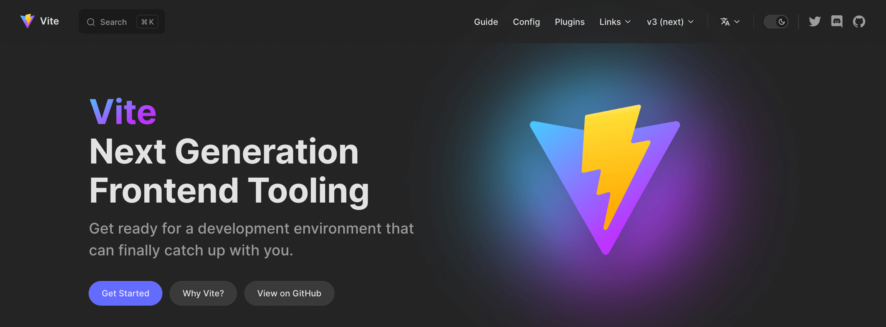
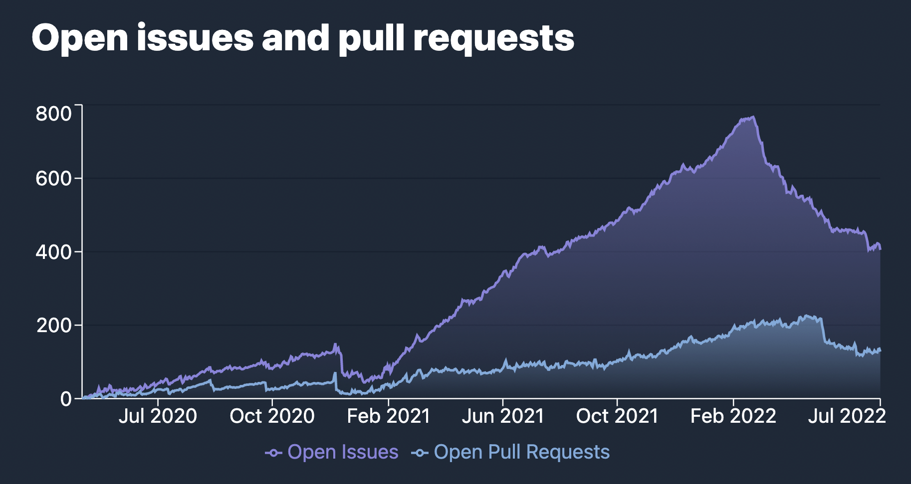

# Vite 3.0 正式发布！

_2022 年 7 月 23 日_ - 查看 [Vite 4.0 发布公告](./announcing-vite4.md)

去年 2 月，[Evan You](https://twitter.com/youyuxi) 发布了 Vite 2。此后，Vite 的采用量持续增长，npm 周下载量超过了 100 万。围绕它迅速形成了庞大的生态系统，Vite 也推动着 Web 框架领域新一轮的创新竞赛。[Nuxt 3](https://v3.nuxtjs.org/) 默认使用 Vite；[SvelteKit](https://kit.svelte.dev/)、[Astro](https://astro.build/)、[Hydrogen](https://hydrogen.shopify.dev/) 和 [SolidStart](https://docs.solidjs.com/quick-start) 都构建在 Vite 之上；[Laravel 也决定默认使用 Vite](https://laravel.com/docs/9.x/vite)；[Vite Ruby](https://vite-ruby.netlify.app/) 展示了 Vite 如何改善 Rails 的开发体验；[Vitest](https://vitest.dev) 作为基于 Vite 的 Jest 替代方案也在快速发展。Vite 为 [Cypress](https://docs.cypress.io/guides/component-testing/writing-your-first-component-test) 和 [Playwright](https://playwright.dev/docs/test-components) 的新组件测试功能提供支持，Storybook 则把 [Vite 作为官方构建器](https://github.com/storybookjs/builder-vite)。而且，[这份名单还在继续增长](https://patak.dev/vite/ecosystem.html)。这些项目的许多维护者也开始参与 Vite Core 的改进，与 Vite [团队](/team)及其他贡献者紧密协作。


今天，距离 Vite 2 发布 16 个月后，我们很高兴宣布 Vite 3 正式发布。我们决定至少每年发布一个 Vite 主版本，以配合 [Node.js 的生命周期结束时间](https://nodejs.org/en/about/releases/)，同时定期审视 Vite API，并为生态项目提供简短的迁移路径。

快速链接：

- [文档](/)
- [迁移指南](https://v3.vite.dev/guide/migration.html)
- [变更日志](https://github.com/vitejs/vite/blob/v6/packages/vite/CHANGELOG.md#300-2022-07-13)

如果你刚开始使用 Vite，建议先阅读[为什么选择 Vite](/guide/why)，再查看[开始](/guide/)和[功能](/guide/features)指南，了解 Vite 的开箱即用能力。我们一如既往地欢迎大家在 [GitHub](https://github.com/vitejs/vite) 上参与贡献。已有超过 [600 位贡献者](https://github.com/vitejs/vite/graphs/contributors)帮助改进 Vite。你可以在 [Twitter](https://twitter.com/vite_js) 上关注动态，或加入 [Discord 社区](https://chat.vite.dev/)与其他 Vite 用户交流。

## 新文档

前往 [v3.vite.dev](https://v3.vite.dev) 体验新版 Vite 3 英文文档。Vite 现在采用新的 [VitePress](https://vitepress.vuejs.org) 默认主题，除了其他功能外，还提供了精美的深色模式。

[](https://v3.vite.dev)

生态中的多个项目已经迁移到该主题，例如 [Vitest](https://vitest.dev)、[vite-plugin-pwa](https://vite-plugin-pwa.netlify.app/) 和 [VitePress](https://vitepress.vuejs.org/) 本身。

如果需要访问 Vite 2 文档，它们仍会保留在 [v2.vite.dev](https://v2.vite.dev)。此外还新增了 [main.vite.dev](https://main.vite.dev) 子域名，Vite `main` 分支的每个提交都会自动部署到这里，方便测试 beta 版本或参与核心开发。

继中文和日文翻译之后，我们还新增了官方西班牙语翻译：

- [简体中文](/)
- [日本語](https://ja.vite.dev/)
- [Español](https://es.vite.dev/)

## Create Vite 入门模板

[create-vite](/guide/#trying-vite-online) 模板一直是使用偏好框架快速测试 Vite 的好工具。在 Vite 3 中，所有模板都换用了与新文档一致的主题。现在就在线打开并体验 Vite 3：

<div class="stackblitz-links">
<a target="_blank" href="https://vite.new"></a>
<a target="_blank" href="https://vite.new/vue"></a>
<a target="_blank" href="https://vite.new/svelte"></a>
<a target="_blank" href="https://vite.new/react"></a>
<a target="_blank" href="https://vite.new/preact"></a>
<a target="_blank" href="https://vite.new/lit"></a>
</div>

<style>
.stackblitz-links {
  display: flex;
  width: 100%;
  justify-content: space-around;
  align-items: center;
}
@media screen and (max-width: 550px) {
  .stackblitz-links {
    display: grid;
    grid-template-columns: 1fr 1fr 1fr;
    width: 100%;
    gap: 2rem;
    padding-left: 3rem;
    padding-right: 3rem;
  }
}
.stackblitz-links > a {
  width: 70px;
  height: 70px;
  display: grid;
  align-items: center;
  justify-items: center;
}
.stackblitz-links > a:hover {
  filter: drop-shadow(0 0 0.5em #646cffaa);
}
</style>

所有模板现在共用同一主题，这有助于更准确地表达它们的定位：用于快速开始使用 Vite 的最小化模板。对于包含 lint、测试配置和其他功能的完整方案，部分框架提供了官方的 Vite 驱动模板，例如 [create-vue](https://github.com/vuejs/create-vue) 和 [create-svelte](https://github.com/sveltejs/kit)。社区维护的模板列表可在 [Awesome Vite](https://github.com/vitejs/awesome-vite#templates) 中找到。

## 开发体验改进

### Vite CLI

<pre style="background-color: var(--vp-code-block-bg);padding:2em;border-radius:8px;max-width:100%;overflow-x:auto;">
  <span style="color:lightgreen"><b>VITE</b></span> <span style="color:lightgreen">v3.0.0</span>  <span style="color:gray">ready in <b>320</b> ms</span>

  <span style="color:lightgreen"><b>➜</b></span>  <span style="color:white"><b>Local</b>:</span>   <span style="color:cyan">http://127.0.0.1:5173/</span>
  <span style="color:green"><b>➜</b></span>  <span style="color:gray"><b>Network</b>: use --host to expose</span>
</pre>

除了 CLI 外观上的改进，你还会注意到开发服务器的默认端口现在是 5173，预览服务器则监听 4173。这样可以减少 Vite 与其他工具发生端口冲突的机会。

### 改进 WebSocket 连接策略

Vite 2 的痛点之一，是在代理后运行时需要额外配置服务器。Vite 3 修改了默认连接方案，使其在大多数场景中开箱即用。通过 [`vite-setup-catalogue`](https://github.com/sapphi-red/vite-setup-catalogue)，这些配置现在都会作为 Vite Ecosystem CI 的一部分接受测试。

### 改进冷启动

在抓取最初的静态导入模块时，如果插件注入了新的导入，Vite 现在可以避免冷启动期间的完整重载（[#8869](https://github.com/vitejs/vite/issues/8869)）。

<details>
  <summary><b>点击了解详情</b></summary>

在 Vite 2.9 中，扫描器和优化器都会在后台运行。理想情况下，扫描器找到所有依赖，冷启动就不需要重载。但如果扫描器漏掉某个依赖，就需要执行新的优化阶段，然后重新加载页面。Vite 2.9 已能避免部分重载：如果新的优化 chunk 与浏览器已有的 chunk 兼容，就不必重载。不过，一旦存在公共依赖，子 chunk 仍可能变化，为避免重复状态仍需重新加载。Vite 3 会等到静态导入抓取完成后，才把优化后的依赖交给浏览器。如果发现缺失依赖，例如由插件注入的依赖，会先快速执行一次优化，再发送打包后的依赖。因此，这些场景不再需要页面重载。

</details>


### import.meta.glob

我们重写了 `import.meta.glob` 支持。新功能详见 [Glob 导入指南](/guide/features.html#glob-import)：

可以用数组传入[多个模式](/guide/features.html#multiple-patterns)：

```js
import.meta.glob(['./dir/*.js', './another/*.js'])
```

现在支持使用以 `!` 开头的[否定模式](/guide/features.html#negative-patterns)，忽略特定文件：

```js
import.meta.glob(['./dir/*.js', '!**/bar.js'])
```

可以指定[具名导入](/guide/features.html#named-imports)，以改善 tree-shaking：

```js
import.meta.glob('./dir/*.js', { import: 'setup' })
```

可以传入[自定义查询](/guide/features.html#custom-queries)来附加元数据：

```js
import.meta.glob('./dir/*.js', { query: { custom: 'data' } })
```

[立即导入](/guide/features.html#glob-import)现在通过标志传入：

```js
import.meta.glob('./dir/*.js', { eager: true })
```

### 让 WASM 导入与未来标准保持一致

WebAssembly 导入 API 已经过调整，以避免与未来标准冲突并提高灵活性：

```js
import init from './example.wasm?init'

init().then((instance) => {
  instance.exports.test()
})
```

更多信息请参阅 [WebAssembly 指南](/guide/features.html#webassembly)。

## 构建改进

### SSR 构建默认使用 ESM

生态系统中的大多数 SSR 框架已经在使用 ESM 构建。因此，Vite 3 将 ESM 设为 SSR 构建的默认格式。这让我们可以简化以往的 [SSR 外部化启发式规则](/guide/ssr.html#ssr-externals)，默认将依赖外部化。

### 改进相对 base 支持

Vite 3 现在正确支持相对 base，即使用 `base: ''`，让构建资源无需重新构建就能部署到不同的 base。这在构建时无法确定 base 的场景中很有用，例如部署到 [IPFS](https://ipfs.io/) 这类内容寻址网络。

## 实验性功能

### 细粒度控制构建资源路径（实验性）

在某些部署场景中，仅支持相对 base 仍然不够。例如，生成的带哈希资源需要部署到与公共文件不同的 CDN 时，就需要在构建阶段更细粒度地控制路径生成。Vite 3 提供了一个实验性 API 来修改构建文件路径。更多信息请参阅[构建高级 base 选项](/guide/build.html#advanced-base-options)。

### 构建阶段使用 esbuild 优化依赖（实验性）

开发和构建阶段的主要区别之一，是 Vite 处理依赖的方式。构建阶段使用 [`@rollup/plugin-commonjs`](https://github.com/rollup/plugins/tree/master/packages/commonjs)，以便导入仅提供 CJS 的依赖，例如 React；开发服务器则使用 esbuild 进行预打包和依赖优化，并在转换导入 CJS 依赖的用户代码时应用内联互操作方案。开发 Vite 3 期间，我们引入了相应改动，使构建阶段也可以[使用 esbuild 优化依赖](https://v3.vite.dev/guide/migration.html#using-esbuild-deps-optimization-at-build-time)。这样就能避免使用 `@rollup/plugin-commonjs`，让开发与构建阶段采用相同方式工作。

考虑到 Rollup 3 将在未来几个月发布，而我们随后也会推出另一个 Vite 主版本，因此决定把这一模式保留为可选项，控制 Vite 3 的范围，并让 Vite 和生态系统有更多时间解决新 CJS 互操作方式在构建阶段可能出现的问题。在 Vite 4 发布前，各框架可以按自己的节奏切换到构建阶段默认使用 esbuild 依赖优化。

### HMR 部分接受（实验性）

现在可以选择启用 [HMR 部分接受](https://github.com/vitejs/vite/pull/7324)。对于在同一模块中导出多个绑定的框架组件，此功能有望实现更细粒度的 HMR。更多信息请参阅[提案讨论](https://github.com/vitejs/vite/discussions/7309)。

## 缩小包体积

Vite 很重视发布和安装体积，快速安装新应用本身就是一项功能。Vite 会打包大多数依赖，并尽可能采用现代、轻量的替代方案。延续这一目标，Vite 3 的发布体积比 Vite 2 小 30%。

|             | 发布体积 | 安装体积 |
| ----------- | :------: | :------: |
| Vite 2.9.14 |  4.38MB  |  19.1MB  |
| Vite 3.0.0  |  3.05MB  |  17.8MB  |
| 减少        |   -30%   |   -7%    |

这部分体积下降来自将多数用户不需要的依赖改为可选依赖。首先，[Terser](https://github.com/terser/terser) 不再默认安装，因为从 Vite 2 开始，esbuild 已经是 JS 和 CSS 的默认压缩器。如果使用 `build.minify: 'terser'`，需要自行安装它，即运行 `npm add -D terser`。我们还把 [node-forge](https://github.com/digitalbazaar/forge) 移出了 monorepo，将自动生成 HTTPS 证书的支持实现为新插件 [`@vitejs/plugin-basic-ssl`](https://v3.vite.dev/guide/migration.html#automatic-https-certificate-generation)。该功能生成的只是不受信任、不会加入本地证书存储的证书，不值得为此增加核心体积。

## Bug 修复

最近加入 Vite 团队的 [@bluwyoo](https://twitter.com/bluwyoo) 和 [@sapphi_red](https://twitter.com/sapphi_red) 推动了一轮集中 issue 梳理。在过去三个月中，Vite 的开放 issue 从 770 个减少到 400 个，而且与此同时，新提交的 PR 数量创下历史新高。[@haoqunjiang](https://twitter.com/haoqunjiang) 也整理了一份全面的 [Vite issue 概览](https://github.com/vitejs/vite/discussions/8232)。

[](https://www.repotrends.com/vitejs/vite)

[](https://www.repotrends.com/vitejs/vite)

## 兼容性说明

- Vite 不再支持已经结束生命周期的 Node.js 12、13 和 15，现在要求 Node.js 14.18+ 或 16+。
- Vite 现在以 ESM 形式发布，同时提供指向 ESM 入口的 CJS 代理以保持兼容性。
- 现代浏览器基线现在面向支持[原生 ES 模块](https://caniuse.com/es6-module)、[原生 ESM 动态导入](https://caniuse.com/es6-module-dynamic-import)和 [`import.meta`](https://caniuse.com/mdn-javascript_operators_import_meta) 的浏览器。
- SSR 和库模式中的 JS 文件扩展名，会根据格式和包类型为输出的 JS 入口及 chunk 使用有效的扩展名，即 `js`、`mjs` 或 `cjs`。

更多信息请参阅[迁移指南](https://v3.vite.dev/guide/migration.html)。

## Vite Core 的改进

在推进 Vite 3 的同时，我们也改善了贡献者参与 [Vite Core](https://github.com/vitejs/vite) 的体验。

- 单元测试和 E2E 测试已迁移到 [Vitest](https://vitest.dev)，带来更快、更稳定的开发体验。这也让生态中的重要基础设施项目得到实际检验。
- VitePress 构建现在作为 CI 的一部分接受测试。
- Vite 跟随生态系统升级到了 [pnpm 7](https://pnpm.io/)。
- 演练项目已从 packages 目录移到 [`/playgrounds`](https://github.com/vitejs/vite/tree/v6/playground)。
- packages 和 playgrounds 现在都设置了 `"type": "module"`。
- 插件现在使用 [unbuild](https://github.com/unjs/unbuild) 打包，[plugin-vue-jsx](https://github.com/vitejs/vite-plugin-vue/tree/bfc52115519ca7021441c72a8f0af5333e8293d9/packages/plugin-vue-jsx) 和 [plugin-legacy](https://github.com/vitejs/vite/tree/v6/packages/plugin-legacy) 也已迁移到 TypeScript。

## 生态系统已经为 Vite 3 做好准备

我们一直与生态项目密切合作，确保由 Vite 驱动的框架已准备好使用 Vite 3。[vite-ecosystem-ci](https://github.com/vitejs/vite-ecosystem-ci) 可以用 Vite 的 `main` 分支运行生态中主要项目的 CI，让我们在引入回归之前及时收到报告。今天发布的版本很快就会兼容大多数使用 Vite 的项目。

## 致谢

Vite 3 是 [Vite 团队](/team)成员、生态项目维护者和 Vite Core 贡献者共同努力的成果。

我们感谢所有实现功能、修复问题、提供反馈并参与 Vite 3 的人：

- Vite 团队成员 [@youyuxi](https://twitter.com/youyuxi)、[@patak_dev](https://twitter.com/patak_dev)、[@antfu7](https://twitter.com/antfu7)、[@bluwyoo](https://twitter.com/bluwyoo)、[@sapphi_red](https://twitter.com/sapphi_red)、[@haoqunjiang](https://twitter.com/haoqunjiang)、[@poyoho](https://github.com/poyoho)、[@Shini_92](https://twitter.com/Shini_92) 和 [@retropragma](https://twitter.com/retropragma)。
- [@benmccann](https://github.com/benmccann)、[@danielcroe](https://twitter.com/danielcroe)、[@brillout](https://twitter.com/brillout)、[@sheremet_va](https://twitter.com/sheremet_va)、[@userquin](https://twitter.com/userquin)、[@enzoinnocenzi](https://twitter.com/enzoinnocenzi)、[@maximomussini](https://twitter.com/maximomussini)、[@IanVanSchooten](https://twitter.com/IanVanSchooten)、[Astro 团队](https://astro.build/)以及其他帮助塑造 Vite 3 的框架和插件维护者。
- [@dominikg](https://github.com/dominikg)，感谢他在 vite-ecosystem-ci 上的工作。
- [@ZoltanKochan](https://twitter.com/ZoltanKochan)，感谢他在 [pnpm](https://pnpm.io/) 上的工作，以及在我们需要支持时的快速响应。
- [@rixo](https://github.com/rixo)，感谢他实现 HMR 部分接受支持。
- [@KiaKing85](https://twitter.com/KiaKing85)，感谢他为 Vite 3 发布准备主题；也感谢 [@\_brc_dd](https://twitter.com/_brc_dd) 改进 VitePress 内部实现。
- [@CodingWithCego](https://twitter.com/CodingWithCego)，感谢他完成新的西班牙语翻译；也感谢 [@ShenQingchuan](https://twitter.com/ShenQingchuan)、[@hiro-lapis](https://github.com/hiro-lapis)以及中文和日文翻译团队的其他成员持续更新翻译文档。

我们也感谢赞助 Vite 团队的个人与公司，以及投资 Vite 开发的企业：[@antfu7](https://twitter.com/antfu7) 在 Vite 及其生态中的部分工作由 [Nuxt Labs](https://nuxtlabs.com/) 支持；[StackBlitz](https://stackblitz.com/) 聘请 [@patak_dev](https://twitter.com/patak_dev) 全职参与 Vite。

## 后续计划

接下来几个月，我们会确保所有构建在 Vite 之上的项目能够顺利过渡。因此，最初几个次要版本会继续专注于 issue 梳理，尤其关注新提交的问题。

Rollup 团队正在[开发下一个主版本](https://twitter.com/lukastaegert/status/1544186847399743488)，预计会在未来几个月发布。等 Rollup 插件生态有时间完成更新后，我们会继续推出新的 Vite 主版本，再次获得引入重要变更的机会，也可能借此稳定本次发布中的部分实验性功能。

如果你有兴趣帮助改进 Vite，最好的参与方式是协助整理 issue。加入[我们的 Discord](https://chat.vite.dev)，找到 `#contributing` 频道；也可以参与 `#docs`、在 `#help` 中帮助其他人，或创建插件。我们才刚刚开始，还有很多想法等待实现，以继续改善 Vite 的开发体验。
