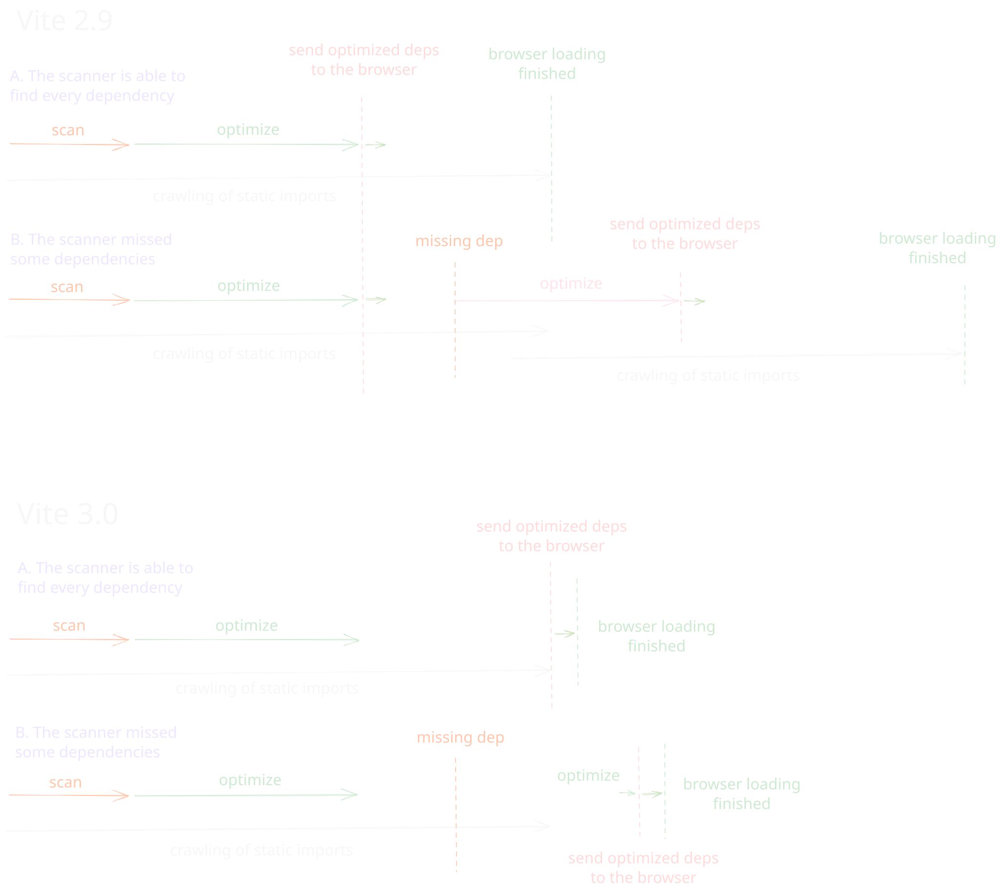
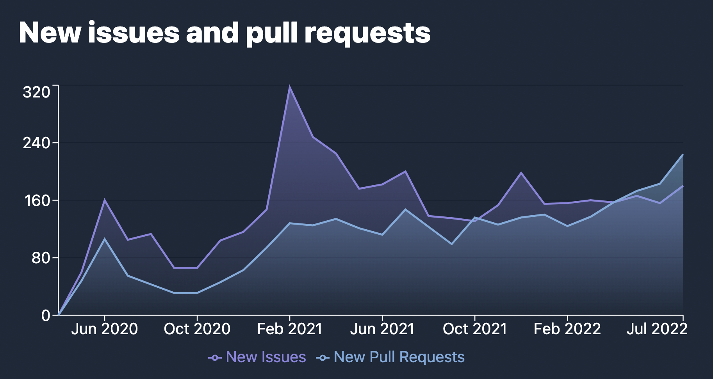

# Vite 3.0 发布了！{#vite-3-0-is-out}

_2022年7月23日_ - 查看 [Vite 4.0 发布公告](./announcing-vite4.md)

去年 2 月，[尤雨溪](https://twitter.com/youyuxi) 发布了 Vite 2。此后，Vite 的使用量持续增长，npm 周下载量突破 100 万，并迅速形成了庞大的生态系统。Vite 正在推动 Web 框架的新一轮创新竞赛。[Nuxt 3](https://v3.nuxtjs.org/) 默认使用 Vite；[SvelteKit](https://kit.svelte.dev/)、[Astro](https://astro.build/)、[Hydrogen](https://hydrogen.shopify.dev/) 和 [SolidStart](https://docs.solidjs.com/quick-start) 都基于 Vite 构建；[Laravel 也决定默认使用 Vite](https://laravel.com/docs/9.x/vite)；[Vite Ruby](https://vite-ruby.netlify.app/) 展示了 Vite 如何改善 Rails 的开发体验；[Vitest](https://vitest.dev) 正成为 Vite 原生的 Jest 替代方案。Vite 还为 [Cypress](https://docs.cypress.io/guides/component-testing/writing-your-first-component-test) 和 [Playwright](https://playwright.dev/docs/test-components) 的新组件测试功能提供支持，Storybook 也将 [Vite 作为官方构建器](https://github.com/storybookjs/builder-vite)。[这样的项目还有很多](https://patak.cat/vite/ecosystem.html)。这些项目中的许多维护者都参与了 Vite 核心改进，与 Vite [团队](/team) 及其他贡献者紧密合作。


在 Vite 2 发布 16 个月后，我们很高兴宣布 Vite 3 正式发布。我们决定至少每年发布一个 Vite 主版本，与 [Node.js 的生命周期终止时间](https://nodejs.org/en/about/releases/) 保持一致，同时定期审视 Vite API，并为生态系统项目提供较短的迁移路径。

快速链接：

- [英文文档](https://vite.dev/)
- [迁移指南](https://v3.vite.dev/guide/migration.html)
- [更新日志](https://github.com/vitejs/vite/blob/main/packages/vite/CHANGELOG.md#300-2022-07-13)

如果你刚接触 Vite，建议先阅读 [为什么选 Vite](/guide/why)，再查看 [开始](/guide/) 和 [功能](/guide/features) 指南，了解 Vite 的开箱即用能力。我们一如既往地欢迎在 [GitHub](https://github.com/vitejs/vite) 上贡献。已有超过 [600 位协作者](https://github.com/vitejs/vite/graphs/contributors) 帮助改进 Vite。你可以在 [Twitter](https://twitter.com/vite_js) 上关注动态，或加入 [Discord 社区](https://chat.vite.dev) 与其他 Vite 用户交流。

## 新文档 {#new-documentation}

前往 [vite.dev](https://vite.dev) 体验全新的 Vite 3 文档。Vite 现在启用了新的 [VitePress](https://vitepress.dev) 默认主题，带来了出色的深色模式等功能。

[](https://vite.dev)

生态系统中的多个项目已经迁移到这个主题，例如 [Vitest](https://vitest.dev)、[vite-plugin-pwa](https://vite-plugin-pwa.netlify.app/) 和 VitePress 本身。

如需访问 Vite 2 文档，它会继续托管在 [v2.vite.dev](https://v2.vite.dev)。当时还新增了 [main.vite.dev](https://main.vite.dev) 子域名，用于自动部署 Vite 主分支的每次提交，方便测试 Beta 版本或参与核心开发。

除已有的中文和日文翻译外，现在还新增了官方西班牙语翻译：

- [简体中文](/)
- [日本語](https://ja.vite.dev/)
- [Español](https://es.vite.dev/)

## 创建 Vite 入门模板 {#create-vite-starter-templates}

[create-vite](/guide/#trying-vite-online) 模板一直是使用你喜欢的框架快速测试 Vite 的好工具。在 Vite 3 中，所有模板都换用了与新文档一致的主题。你可以在线打开它们，立即体验 Vite 3：

<div class="stackblitz-links">
<a target="_blank" href="https://vite.new"></a>
<a target="_blank" href="https://vite.new/vue"></a>
<a target="_blank" href="https://vite.new/svelte"></a>
<a target="_blank" href="https://vite.new/react"></a>
<a target="_blank" href="https://vite.new/preact"></a>
<a target="_blank" href="https://vite.new/lit"></a>
</div>

<style>
.stackblitz-links {
  display: flex;
  width: 100%;
  justify-content: space-around;
  align-items: center;
}
@media screen and (max-width: 550px) {
  .stackblitz-links {
    display: grid;
    grid-template-columns: 1fr 1fr 1fr;
    width: 100%;
    gap: 2rem;
    padding-left: 3rem;
    padding-right: 3rem;
  }
}
.stackblitz-links > a {
  width: 70px;
  height: 70px;
  display: grid;
  align-items: center;
  justify-items: center;
}
.stackblitz-links > a:hover {
  filter: drop-shadow(0 0 0.5em #646cffaa);
}
</style>

所有模板现在共享同一主题，更能体现这些入门项目是用于开始使用 Vite 的最小模板。如需包含代码检查、测试配置等功能的完整方案，一些框架提供了由 Vite 驱动的官方模板，例如 [create-vue](https://github.com/vuejs/create-vue) 和 [create-svelte](https://github.com/sveltejs/kit)。[Awesome Vite](https://github.com/vitejs/awesome-vite#templates) 还维护了一份社区模板列表。

## 开发体验改进 {#dev-improvements}

### Vite CLI {#vite-cli}

<pre style="background-color: var(--vp-code-block-bg);padding:2em;border-radius:8px;max-width:100%;overflow-x:auto;">
  <span style="color:lightgreen"><b>VITE</b></span> <span style="color:lightgreen">v3.0.0</span>  <span style="color:gray">ready in <b>320</b> ms</span>

  <span style="color:lightgreen"><b>➜</b></span>  <span style="color:white"><b>Local</b>:</span>   <span style="color:cyan">http://127.0.0.1:5173/</span>
  <span style="color:green"><b>➜</b></span>  <span style="color:gray"><b>Network</b>: use --host to expose</span>
</pre>

除了 CLI 外观改进，你还会注意到默认开发服务器端口现在为 5173，预览服务器监听 4173 端口。这一变化确保 Vite 避免与其他工具发生冲突。

### 改进 WebSocket 连接策略 {#improved-websocket-connection-strategy}

Vite 2 的一个痛点是在代理后运行时配置服务器。Vite 3 更改了默认连接方案，使其在大多数场景下开箱即用。所有这些配置现在都会通过 [`vite-setup-catalogue`](https://github.com/sapphi-red/vite-setup-catalogue) 作为 Vite 生态 CI 的一部分接受测试。

### 冷启动改进 {#cold-start-improvements}

当插件在遍历初始静态导入模块期间注入新的导入时，Vite 现在会避免冷启动期间的整页重载（[#8869](https://github.com/vitejs/vite/issues/8869)）。

<details>
  <summary><b>展开了解详情</b></summary>

在 Vite 2.9 中，扫描器和优化器都在后台运行。理想情况下，扫描器找到全部依赖项，冷启动就不需要重载；但如果遗漏依赖项，则需要开启新的优化阶段并重载页面。Vite 2.9 能在新优化产物与浏览器已有产物兼容时避免部分重载，但存在公共依赖项时，子产物可能发生变化，为避免状态重复仍需重载。Vite 3 在完成静态导入遍历前不会把优化后的依赖项交给浏览器。如果发现缺失依赖项（例如由插件注入），会先快速完成一次优化，然后才发送打包后的依赖项，因此这些场景不再需要页面重载。

</details>



### import.meta.glob {#import-meta-glob}

`import.meta.glob` 支持已被重写。新功能详见 [Glob 导入指南](/guide/features.html#glob-import)：

可以通过数组传入 [多个模式](/guide/features.html#multiple-patterns)：

```js
import.meta.glob(['./dir/*.js', './another/*.js'])
```

现在支持以 `!` 开头的 [否定模式](/guide/features.html#negative-patterns)，可用于忽略特定文件：

```js
import.meta.glob(['./dir/*.js', '!**/bar.js'])
```

可以指定 [具名导入](/guide/features.html#named-imports) 来改进 `tree-shaking`：

```js
import.meta.glob('./dir/*.js', { import: 'setup' })
```

可以传入 [自定义查询](/guide/features.html#custom-queries) 来附加元数据：

```js
import.meta.glob('./dir/*.js', { query: { custom: 'data' } })
```

现在可以通过标志指定 [立即导入](/guide/features.html#glob-import)：

```js
import.meta.glob('./dir/*.js', { eager: true })
```

### 使 WASM 导入与未来标准保持一致 {#aligning-wasm-import-with-future-standards}

WebAssembly 导入 API 已经过修订，以免与未来标准冲突，并提供更高灵活性：

```js
import init from './example.wasm?init'

init().then((instance) => {
  instance.exports.test()
})
```

更多信息请参阅 [WebAssembly 指南](/guide/features.html#webassembly)。

## 构建改进 {#build-improvements}

### 默认使用 ESM SSR 构建 {#esm-ssr-build-by-default}

生态系统中的大多数 SSR 框架已经在使用 ESM 构建。因此 Vite 3 将 ESM 设为 SSR 构建的默认格式，从而简化此前的 [SSR 外部化启发式方法](/guide/ssr.html#ssr-externals)，并默认将依赖项外部化。

### 改进相对基础路径支持 {#improved-relative-base-support}

Vite 3 现在能正确支持相对基础路径（使用 `base: ''`），让构建资源无需重新构建即可部署到不同的基础路径。这在构建时无法确定基础路径时很有用，例如部署到 [IPFS](https://ipfs.io/) 等内容寻址网络。

## 实验性功能 {#experimental-features}

### 精细控制构建资源路径（实验性） {#built-asset-paths-fine-grained-control-experimental}

在某些部署场景中，相对基础路径仍不够用。例如，带哈希的资源需要部署到与 `public` 文件不同的 CDN 时，就需要更精细地控制构建路径。Vite 3 提供了用于修改构建文件路径的实验性 API。更多信息请参阅 [高级基础路径选项](/guide/build.html#advanced-base-options)。

### 构建时使用 esbuild 优化依赖项（实验性） {#esbuild-deps-optimization-at-build-time-experimental}

开发和构建阶段的一个主要区别是 Vite 如何处理依赖项。构建时使用 [`@rollup/plugin-commonjs`](https://github.com/rollup/plugins/tree/master/packages/commonjs)，以允许导入只提供 CJS 的依赖项（例如 React）；开发服务器则使用 esbuild 预打包并优化依赖项，同时在转换导入 CJS 依赖项的用户代码时应用内联互操作方案。开发 Vite 3 时，我们加入了在构建期间使用 [esbuild 优化依赖项](https://v3.vite.dev/guide/migration.html#using-esbuild-deps-optimization-at-build-time) 所需的改动。这样便可以不再使用 `@rollup/plugin-commonjs`，使开发和构建阶段的行为保持一致。

考虑到 Rollup 3 将在接下来几个月发布，而 Vite 会随后推出新的主版本，我们决定将此模式设为可选，以缩小 Vite 3 的范围，并给 Vite 和生态系统更多时间解决构建阶段新 CJS 互操作方案可能存在的问题。各框架可以在 Vite 4 发布前，按照自己的节奏改为默认使用构建时的 esbuild 依赖优化。

### HMR Partial Accept（实验性） {#hmr-partial-accept-experimental}

Vite 提供了可选的 [HMR Partial Accept](https://github.com/vitejs/vite/pull/7324) 支持。该功能可以为同一模块中导出多个绑定的框架组件带来更精细的 HMR。详情请参阅 [提案讨论](https://github.com/vitejs/vite/discussions/7309)。

## 缩小打包体积 {#bundle-size-reduction}

Vite 很重视发布和安装体积；快速安装一个新应用本身就是一项功能。Vite 会打包大多数依赖项，并尽可能使用现代、轻量的替代方案。延续这一目标，Vite 3 的发布体积比 Vite 2 小 30%。

|             | 发布体积 | 安装体积 |
| ----------- | :------: | :------: |
| Vite 2.9.14 | 4.38 MB  | 19.1 MB  |
| Vite 3.0.0  | 3.05 MB  | 17.8 MB  |
| 减少        | -30%     | -7%      |

体积缩小部分得益于将大多数用户不需要的依赖项改为可选。首先，[Terser](https://github.com/terser/terser) 不再默认安装，因为 Vite 2 已经将 esbuild 设为 JS 和 CSS 的默认压缩器。如果使用 `build.minify: 'terser'`，需要自行安装它（`npm add -D terser`）。我们还将 [node-forge](https://github.com/digitalbazaar/forge) 移出 monorepo，把自动生成 HTTPS 证书的支持实现为新插件 [`@vitejs/plugin-basic-ssl`](https://v3.vite.dev/guide/migration.html#automatic-https-certificate-generation)。这一功能只会创建未加入本地信任存储的不受信任证书，因此额外体积并不值得。

## 修复问题 {#bug-fixing}

新加入 Vite 团队的 [@bluwyoo](https://twitter.com/bluwyoo) 和 [@sapphi_red](https://twitter.com/sapphi_red) 发起了 issue 分类马拉松。过去三个月中，Vite 的未解决 issue 从 770 个减少到 400 个，而同期新 PR 数量达到历史高点。与此同时，[@haoqunjiang](https://twitter.com/haoqunjiang) 还整理了一份全面的 [Vite issue 概览](https://github.com/vitejs/vite/discussions/8232)。

[](https://www.repotrends.com/vitejs/vite)

[](https://www.repotrends.com/vitejs/vite)

## 兼容性说明 {#compatibility-notes}

- Vite 不再支持已结束生命周期的 Node.js 12、13 和 15，现在要求 Node.js 14.18+ 或 16+。
- Vite 现在以 ESM 形式发布，并提供指向 ESM 入口的 CJS 代理以保持兼容。
- 现代浏览器基线现在面向支持 [原生 ES Modules](https://caniuse.com/es6-module)、[原生 ESM 动态导入](https://caniuse.com/es6-module-dynamic-import) 和 [`import.meta`](https://caniuse.com/mdn-javascript_operators_import_meta) 的浏览器。
- SSR 和库模式中的 JS 文件扩展名会根据格式和软件包类型，为输出入口及 chunk 使用有效扩展名（`js`、`mjs` 或 `cjs`）。

更多信息请参阅 [迁移指南](https://v3.vite.dev/guide/migration.html)。

## Vite 核心升级 {#upgrades-to-vite-core}

在开发 Vite 3 的同时，我们也改善了 [Vite 核心](https://github.com/vitejs/vite) 协作者的贡献体验。

- 单元测试和 E2E 测试迁移到了 [Vitest](https://vitest.dev)，带来更快、更稳定的开发体验，同时也让这个重要的生态基础设施项目接受实际检验。
- VitePress 构建现在会作为 CI 的一部分进行测试。
- Vite 跟随生态系统的步伐升级到了 [pnpm 7](https://pnpm.io/)。
- 演练场从 packages 目录移到了 [`/playground`](https://github.com/vitejs/vite/tree/main/playground)。
- 软件包和演练场现在都设置了 `"type": "module"`。
- 插件现在使用 [unbuild](https://github.com/unjs/unbuild) 打包，[plugin-vue-jsx](https://github.com/vitejs/vite-plugin-vue/tree/main/packages/plugin-vue-jsx) 和 [plugin-legacy](https://github.com/vitejs/vite/tree/main/packages/plugin-legacy) 也迁移到了 TypeScript。

## 生态系统已为 Vite 3 做好准备 {#the-ecosystem-is-ready-for-v3}

我们与生态系统项目紧密合作，确保由 Vite 驱动的框架为 Vite 3 做好准备。[vite-ecosystem-ci](https://github.com/vitejs/vite-ecosystem-ci) 让我们能针对 Vite 主分支运行主要生态项目的 CI，并在引入回归前及时收到报告。Vite 3 发布后，大多数使用 Vite 的项目应该很快就能兼容。

## 致谢 {#acknowledgments}

Vite 3 是 [Vite 团队](/team) 成员、生态项目维护者及其他 Vite 核心协作者共同努力的成果。

我们感谢所有实现功能、修复问题、提供反馈并参与 Vite 3 的贡献者：

- Vite 团队成员 [@youyuxi](https://twitter.com/youyuxi)、[@patak_dev](https://twitter.com/patak_dev)、[@antfu7](https://twitter.com/antfu7)、[@bluwyoo](https://twitter.com/bluwyoo)、[@sapphi_red](https://twitter.com/sapphi_red)、[@haoqunjiang](https://twitter.com/haoqunjiang)、[@poyoho](https://github.com/poyoho)、[@Shini_92](https://twitter.com/Shini_92) 和 [@retropragma](https://twitter.com/retropragma)。
- [@benmccann](https://github.com/benmccann)、[@danielcroe](https://twitter.com/danielcroe)、[@brillout](https://twitter.com/brillout)、[@sheremet_va](https://twitter.com/sheremet_va)、[@userquin](https://twitter.com/userquin)、[@enzoinnocenzi](https://twitter.com/enzoinnocenzi)、[@maximomussini](https://twitter.com/maximomussini)、[@IanVanSchooten](https://twitter.com/IanVanSchooten)、[Astro 团队](https://astro.build/) 以及所有帮助塑造 Vite 3 的框架和插件维护者。
- [@dominikg](https://github.com/dominikg) 对 vite-ecosystem-ci 的贡献。
- [@ZoltanKochan](https://twitter.com/ZoltanKochan) 对 [pnpm](https://pnpm.io/) 的贡献，以及在我们需要支持时的及时响应。
- [@rixo](https://github.com/rixo) 对 HMR Partial Accept 的贡献。
- [@KiaKing85](https://twitter.com/KiaKing85) 为 Vite 3 发布准备主题，以及 [@\_brc_dd](https://twitter.com/_brc_dd) 对 VitePress 内部实现的贡献。
- [@CodingWithCego](https://twitter.com/CodingWithCego) 创建新的西班牙语翻译，以及 [@ShenQingchuan](https://twitter.com/ShenQingchuan)、[@hiro-lapis](https://github.com/hiro-lapis) 和其他中日文翻译团队成员持续维护翻译文档。

我们也感谢赞助 Vite 团队的个人和公司，以及直接投入 Vite 开发的公司：[@antfu7](https://twitter.com/antfu7) 在 Vite 和生态系统中的部分工作属于他在 [Nuxt Labs](https://nuxtlabs.com/) 的职责，[StackBlitz](https://stackblitz.com/) 则聘请 [@patak_dev](https://twitter.com/patak_dev) 全职参与 Vite。

## 后续计划 {#whats-next}

接下来的几个月，我们会确保所有基于 Vite 构建的项目平滑过渡，因此最初几个次版本会继续聚焦于 issue 分类，尤其关注新提交的问题。

Rollup 团队正在 [开发下一个主版本](https://twitter.com/lukastaegert/status/1544186847399743488)，并计划在随后几个月发布。Rollup 插件生态获得足够时间完成更新后，我们会推出新的 Vite 主版本。这将提供另一次引入重大变更的机会，并可用于稳定本次发布中的部分实验性功能。

如果你有兴趣帮助改进 Vite，最好的切入点是参与 issue 分类。加入我们的 [Discord 社区](https://chat.vite.dev)，找到 `#contributing` 频道；也可以参与 `#docs`、在 `#help` 中帮助他人或创建插件。Vite 仍处于起步阶段，还有许多改善开发体验的想法等待实现。
