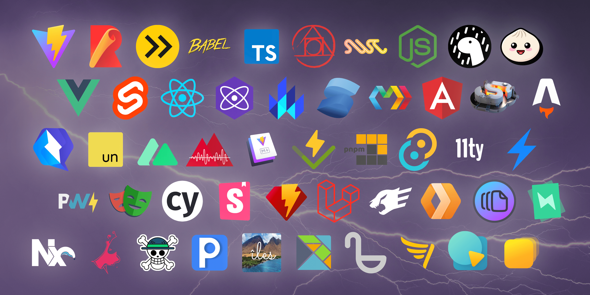

# Vite 4.0 发布了！{#vite-4-0-is-out}

_2022年12月9日_ - 查看 [Vite 5.0 发布公告](./announcing-vite5.md)

Vite 3 [发布](./announcing-vite3.md) 后的五个月里，npm 周下载量从 100 万增长到了 250 万。生态系统也更加成熟，并在持续增长。在今年的 [Jamstack Conf 调查](https://twitter.com/vite_js/status/1589665610119585793) 中，社区使用率从 14% 跃升至 32%，满意度仍高达 9.7。我们见证了 [Astro 1.0](https://astro.build/)、[Nuxt 3](https://v3.nuxtjs.org/) 以及其他由 Vite 驱动并不断创新协作的框架发布稳定版，包括 [SvelteKit](https://kit.svelte.dev/)、[Solid Start](https://www.solidjs.com/blog/introducing-solidstart) 和 [Qwik City](https://qwik.builder.io/qwikcity/overview/)。Storybook 宣布将 Vite 的一等支持作为 [Storybook 7.0](https://storybook.js.org/blog/first-class-vite-support-in-storybook/) 的主要功能之一。Deno 现在也 [支持 Vite](https://www.youtube.com/watch?v=Zjojo9wdvmY)。[Vitest](https://vitest.dev) 的使用量快速增长，很快就会达到 Vite npm 下载量的一半。Nx 也在投入 Vite 生态，并 [正式支持 Vite](https://nx.dev/packages/vite)。

[](https://viteconf.org/2022/replay)

为了展示 Vite 及相关项目的成长，Vite 生态系统于 10 月 11 日齐聚 [ViteConf 2022](https://viteconf.org/2022/replay)。各主要 Web 框架和工具的代表分享了创新与协作的故事。颇具象征意义的是，Rollup 团队也选择在同一天发布 [Rollup 3](https://cn.rollupjs.org)。

今天，在生态伙伴的帮助下，Vite [团队](/team) 很高兴宣布 Vite 4 正式发布，其构建阶段由 Rollup 3 驱动。我们与生态系统共同努力，确保这个新主版本拥有平滑的升级路径。Vite 现在使用 [Rollup 3](https://github.com/vitejs/vite/issues/9870)，它让我们得以简化 Vite 内部的资源处理，并带来许多改进。详情请参阅 [Rollup 3 发布说明](https://github.com/rollup/rollup/releases/tag/v3.0.0)。


快速链接：

- [英文文档](https://vite.dev/)
- [迁移指南](https://v4.vite.dev/guide/migration.html)
- [更新日志](https://github.com/vitejs/vite/blob/main/packages/vite/CHANGELOG.md#400-2022-12-09)

翻译版本：[简体中文](/)、[日本語](https://ja.vite.dev/)、[Español](https://es.vite.dev/)

如果你最近才开始使用 Vite，建议阅读 [为什么选 Vite](/guide/why)，并查看 [开始](/guide/) 和 [功能](/guide/features) 指南，了解 Vite 的开箱即用能力。如果你想参与，欢迎在 [GitHub](https://github.com/vitejs/vite) 上贡献。已有近 [700 位协作者](https://github.com/vitejs/vite/graphs/contributors) 为 Vite 做出贡献。你可以在 [Twitter](https://twitter.com/vite_js) 和 [Mastodon](https://webtoo.ls/@vite) 上关注动态，也可以加入 [Discord 社区](https://chat.vite.dev) 与大家协作。

## 开始体验 Vite 4 {#start-playing-with-vite-4}

运行 `pnpm create vite`，使用你偏好的框架搭建 Vite 项目；也可以通过 [vite.new](https://vite.new) 在线打开入门模板，立即体验 Vite 4。

你还可以运行 `pnpm create vite-extra`，获取其他框架和运行时的模板，包括 Solid、Deno、SSR 和库项目模板。运行 `create vite` 时，也可以在 `Others` 选项中找到 `create vite-extra` 模板。

请注意，Vite 入门模板旨在作为使用不同框架测试 Vite 的演练场。构建正式项目时，我们建议选用各框架推荐的脚手架。部分框架现在也会在 `create vite` 中将用户引导到各自的脚手架，例如 Vue 的 `create-vue` 和 `Nuxt 3`，以及 Svelte 的 `SvelteKit`。

## 开发阶段使用 SWC 的新 React 插件 {#new-react-plugin-using-swc-during-development}

[SWC](https://swc.rs/) 已经成为 [Babel](https://babeljs.io/) 的成熟替代方案，尤其适用于 React 项目。SWC 的 React Fast Refresh 实现比 Babel 快得多，对某些项目而言已是更好的选择。从 Vite 4 开始，React 项目可使用两个取舍不同的插件。我们认为现阶段两种方案都值得支持，并会继续探索两者的改进空间。

### @vitejs/plugin-react {#vitejs-plugin-react}

[@vitejs/plugin-react](https://github.com/vitejs/vite-plugin-react) 使用 esbuild 和 Babel，以较小的软件包体积实现快速 HMR，同时保留使用 Babel 转换管道的灵活性。

### @vitejs/plugin-react-swc（新增） {#vitejs-plugin-react-swc-new}

[@vitejs/plugin-react-swc](https://github.com/vitejs/vite-plugin-react-swc) 是一个新插件：构建时使用 esbuild，开发时则以 SWC 替代 Babel。对于不需要非标准 React 扩展的大型项目，它能显著加快冷启动和热模块替换（HMR）。

## 浏览器兼容性 {#browser-compatibility}

现代浏览器构建现在默认以 `safari14` 为目标，以获得更广泛的 ES2020 兼容性。这意味着现代构建可以使用 [`BigInt`](https://developer.mozilla.org/en-US/docs/Web/JavaScript/Reference/Global_Objects/BigInt)，并且 [空值合并运算符](https://developer.mozilla.org/en-US/docs/Web/JavaScript/Reference/Operators/Nullish_coalescing) 不再被转译。如果需要支持更旧的浏览器，可以照常添加 [`@vitejs/plugin-legacy`](https://github.com/vitejs/vite/tree/main/packages/plugin-legacy)。

## 将 CSS 作为字符串导入 {#importing-css-as-a-string}

在 Vite 3 中，导入 `.css` 文件的默认导出可能导致 CSS 被加载两次。

```ts
import cssString from './global.css'
```

出现重复加载，是因为 `.css` 文件会被输出，而应用代码也很可能使用对应的 CSS 字符串，例如由框架运行时注入。从 Vite 4 开始，`.css` 的默认导出 [已被弃用](https://github.com/vitejs/vite/issues/11094)。这种场景需要使用 `?inline` 查询后缀，因为它不会输出导入的 `.css` 样式。

```ts
import stuff from './global.css?inline'
```

更多信息请参阅 [迁移指南](https://v4.vite.dev/guide/migration.html)。

## 环境变量 {#environment-variables}

Vite 现在使用 `dotenv` 16 和 `dotenv-expand` 9，此前使用的是 `dotenv` 14 和 `dotenv-expand` 5。如果变量值包含 `#` 或 `` ` ``，需要用引号将其包裹起来。

```diff
-VITE_APP=ab#cd`ef
+VITE_APP="ab#cd`ef"
```

详情请参阅 [`dotenv`](https://github.com/motdotla/dotenv/blob/master/CHANGELOG.md) 和 [`dotenv-expand` 更新日志](https://github.com/motdotla/dotenv-expand/blob/master/CHANGELOG.md)。

## 其他功能 {#other-features}

- CLI 快捷键：在开发时按 `h` 查看全部快捷键（[#11228](https://github.com/vitejs/vite/pull/11228)）
- 预构建依赖项时支持 patch-package（[#10286](https://github.com/vitejs/vite/issues/10286)）
- 更清晰的构建日志输出（[#10895](https://github.com/vitejs/vite/issues/10895)），并改用 `kB` 以与浏览器开发者工具保持一致（[#10982](https://github.com/vitejs/vite/issues/10982)）
- 改进 SSR 期间的错误信息（[#11156](https://github.com/vitejs/vite/issues/11156)）

## 缩小软件包体积 {#reduced-package-size}

Vite 重视自身占用空间，尤其希望加快文档演练场和问题复现项目的安装速度。这个主版本再次缩小了 Vite 软件包：Vite 4 的安装体积比 Vite 3.2.5 小 23%（14.1 MB 对 18.3 MB）。

## Vite 核心升级 {#upgrades-to-vite-core}

[Vite 核心](https://github.com/vitejs/vite) 和 [vite-ecosystem-ci](https://github.com/vitejs/vite-ecosystem-ci) 持续演进，为维护者和协作者提供更好的体验，并确保 Vite 开发能够适应生态系统的增长。

### 将框架插件移出核心仓库 {#framework-plugins-out-of-core}

从 Vite 最早的版本起，[`@vitejs/plugin-vue`](https://github.com/vitejs/vite-plugin-vue) 和 [`@vitejs/plugin-react`](https://github.com/vitejs/vite-plugin-react) 就一直位于 Vite 核心 monorepo 中。这让核心和插件能够一起测试、发布，从而形成紧密的反馈循环。借助 [vite-ecosystem-ci](https://github.com/vitejs/vite-ecosystem-ci)，即使插件在独立仓库中开发，我们也能获得同样的反馈。因此从 Vite 4 开始，[它们已被移出 Vite 核心 monorepo](https://github.com/vitejs/vite/pull/11158)。这对 Vite 的框架无关定位意义重大，也让我们能够组建独立团队维护各个插件。今后如需报告问题或提出功能请求，请在新仓库中创建 issue：[`vitejs/vite-plugin-vue`](https://github.com/vitejs/vite-plugin-vue) 和 [`vitejs/vite-plugin-react`](https://github.com/vitejs/vite-plugin-react)。

### vite-ecosystem-ci 改进 {#vite-ecosystem-ci-improvements}

[vite-ecosystem-ci](https://github.com/vitejs/vite-ecosystem-ci) 扩展了 Vite 的 CI，可按需报告 [大多数主要下游项目](https://github.com/vitejs/vite-ecosystem-ci/tree/main/tests) 的 CI 状态。我们每周三次针对 Vite 主分支运行它，以便在引入回归前及时获得报告。大多数使用 Vite 的项目已经准备了包含必要改动的分支，并将在接下来几天发布，因此很快就能兼容 Vite 4。我们也可以在 PR 评论中使用 `/ecosystem-ci run` 按需运行它，从而在改动进入主分支前了解其 [影响](https://github.com/vitejs/vite/pull/11269#issuecomment-1343365064)。

## 致谢 {#acknowledgments}

没有 Vite 贡献者投入的无数小时工作，Vite 4 不可能发布。其中许多人也是下游项目和插件的维护者。我们与 [Vite 团队](/team) 共同努力，再次改善了所有使用 Vite 的框架和应用的开发体验。能够为如此活跃的生态系统改进共同基础，我们深感荣幸。

我们也感谢赞助 Vite 团队的个人和公司，以及直接投资 Vite 未来的公司：[@antfu7](https://twitter.com/antfu7) 在 Vite 和生态系统中的部分工作属于他在 [Nuxt Labs](https://nuxtlabs.com/) 的职责；[Astro](https://astro.build) 资助 [@bluwyoo](https://twitter.com/bluwyoo) 的 Vite 核心工作；[StackBlitz](https://stackblitz.com/) 聘请 [@patak_dev](https://twitter.com/patak_dev) 全职参与 Vite。

## 后续计划 {#next-steps}

我们近期会专注于梳理新提交的 issue，避免潜在回归带来干扰。如果你愿意参与并帮助改进 Vite，建议从 issue 分类开始。加入我们的 [Discord 社区](https://chat.vite.dev)，在 `#contributing` 频道联系我们；也欢迎完善 `#docs`，并在 `#help` 中帮助其他人。随着 Vite 持续普及，我们需要为下一批用户继续建设一个友善、乐于助人的社区。

为了持续改善所有选择 Vite 来驱动框架和开发应用的用户体验，还有许多方向值得探索。继续前进！
