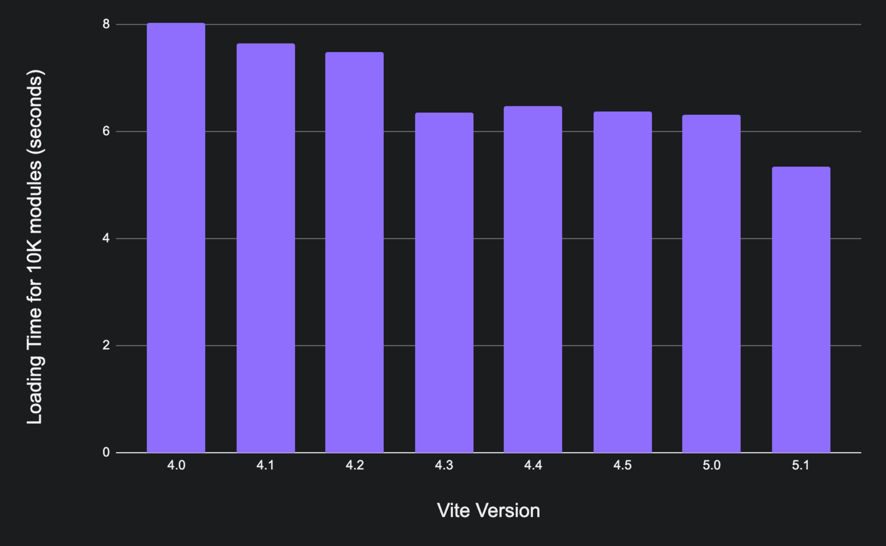

# Vite 5.1 发布了！{#vite-5-1-is-out}

_2024年2月8日_

Vite 5 于去年 11 月 [发布](./announcing-vite5.md)，这代表着 Vite 及其生态系统又一次重大飞跃。几周前，我们庆祝了 npm 每周下载量达到 1000 万次，以及 Vite 仓库贡献者达到 900 位。今天，我们很高兴地宣布 Vite 5.1 正式发布。

快速链接：

- [英文文档](https://vite.dev/)
- [更新日志](https://github.com/vitejs/vite/blob/main/packages/vite/CHANGELOG.md#510-2024-02-08)

翻译版本：[简体中文](/)、[日本語](https://ja.vite.dev/)、[Español](https://es.vite.dev/)、[Português](https://pt.vite.dev/)、[한국어](https://ko.vite.dev/)、[Deutsch](https://de.vite.dev/)

可以在 StackBlitz 中在线体验 Vite 5.1：[vanilla](https://vite.new/vanilla-ts)、[vue](https://vite.new/vue-ts)、[react](https://vite.new/react-ts)、[preact](https://vite.new/preact-ts)、[lit](https://vite.new/lit-ts)、[svelte](https://vite.new/svelte-ts)、[solid](https://vite.new/solid-ts)、[qwik](https://vite.new/qwik-ts)。

如果你刚开始使用 Vite，我们建议先阅读 [入门指南](/guide/) 和 [功能指南](/guide/features)。

要及时了解最新动态，请关注我们在 [X](https://x.com/vite_js) 或 [Mastodon](https://webtoo.ls/@vite) 上的账号。

## Vite Runtime API {#vite-runtime-api}

Vite 5.1 新增了对全新 Vite Runtime API 的实验性支持。该 API 会先使用 Vite 插件处理代码，再运行任意代码。它与 `server.ssrLoadModule` 不同，因为运行时实现与服务器解耦。这使库和框架作者能够在服务器与运行时之间实现自己的通信层。该 API 稳定后，计划用于替代 Vite 当前的 SSR 底层 API。

这个新 API 带来了许多好处：

- 支持 SSR 期间的 HMR。
- 与服务器解耦，因此单个服务器可以被任意数量的客户端使用，每个客户端都有自己的模块缓存（你甚至可以按照自己的方式与它通信，例如使用消息通道、`fetch` 调用、直接函数调用或 WebSocket）。
- 不依赖 Node、Bun、Deno 的任何内置 API，因此可以在任意环境中运行。
- 易于与拥有自定义代码运行机制的工具集成（例如，你可以提供一个 runner，使用 `eval` 而不是 `new AsyncFunction`）。

最初的想法由 [Pooya Parsa](https://github.com/nuxt/vite/pull/201) 提出，随后 [Anthony Fu](https://github.com/antfu) 将其实现为 [vite-node](https://www.npmjs.com/package/vite-node) 包，用于 [支持 Nuxt 3 Dev SSR](https://antfu.me/posts/dev-ssr-on-nuxt)，后来还被用作 [Vitest](https://vitest.dev) 的基础。因此，vite-node 的整体思路已经经过了相当长时间的实践检验。这是 [Vladimir Sheremet](https://github.com/sheremet-va) 对该 API 的新一轮实现。他此前已在 Vitest 中重新实现 vite-node，并在将其加入 Vite Core 时吸取相关经验，使 API 更加强大、灵活。这个 PR 历时一年完成，你可以在 [这里](https://github.com/vitejs/vite/issues/12165) 查看它的演进过程以及与生态系统维护者的讨论。

::: info
Vite Runtime API 后来演变为 Module Runner API，并作为 [Environment API](/guide/api-environment) 的一部分在 Vite 6 中发布。
:::

## 功能 {#features}

### 改进 `.css?url` 支持 {#improved-support-for-cssurl}

现在，将 CSS 文件作为 URL 导入可以稳定、正确地工作。这是 Remix 迁移到 Vite 的最后一个障碍。详见 [#15259](https://github.com/vitejs/vite/issues/15259)。

### `build.assetsInlineLimit` 现在支持回调 {#build-assetsinlinelimit-now-supports-a-callback}

现在，用户可以 [提供一个回调](/config/build-options.html#build-assetsinlinelimit)，返回布尔值，以选择针对特定资源启用或禁用内联。如果返回 `undefined`，则使用默认逻辑。详见 [#15366](https://github.com/vitejs/vite/issues/15366)。

### 改进循环导入的 HMR {#improved-hmr-for-circular-import}

在 Vite 5.0 中，循环导入中的已接受模块即使可以在客户端正常处理，也总会触发整页重新加载。现在已经放宽了这一行为，允许 HMR 在不整页重新加载的情况下生效；但如果 HMR 期间发生任何错误，页面仍会重新加载。详见 [#15118](https://github.com/vitejs/vite/issues/15118)。

### 支持使用 `ssr.external: true` 外部化所有 SSR 包 {#support-ssr-external-true-to-externalize-all-ssr-packages}

过去，Vite 会将除链接包之外的所有包外部化。现在可以使用这个新选项，强制将包括链接包在内的所有包外部化。在 monorepo 的测试中，如果希望模拟通常的“所有包都已外部化”的情况，这个选项会很有用；或者在使用 `ssrLoadModule` 加载任意文件时，如果我们不关心 HMR，也可以始终将包外部化。详见 [#10939](https://github.com/vitejs/vite/issues/10939)。

### 在预览服务器中暴露 `close` 方法 {#expose-close-method-in-the-preview-server}

现在，预览服务器暴露了 `close` 方法，可以正确拆除服务器，包括所有已打开的 `socket` 连接。详见 [#15630](https://github.com/vitejs/vite/issues/15630)。

## 性能改进 {#performance-improvements}

Vite 在每个版本中都变得更快，Vite 5.1 也包含了大量性能改进。我们使用 [vite-dev-server-perf](https://github.com/yyx990803/vite-dev-server-perf)，测量了从 Vite 4.0 开始所有次要版本加载 1 万个模块（25 层深的树）所需的时间。这是衡量 Vite 无打包开发模式效果的一个很好的基准测试。每个模块都是一个包含计数器并导入树中其他文件的小型 TypeScript 文件，因此这个测试主要测量为各个模块分别发起请求所需的时间。Vite 4.0 加载 1 万个模块需要 8 秒（在 M1 MAX 上）。在 [Vite 4.3 专注于性能并取得突破](./announcing-vite4-3.md) 之后，我们将加载时间缩短到了 6.35 秒。在 Vite 5.1 中，我们再次实现了性能飞跃，现在 Vite 只需 5.35 秒即可提供这 1 万个模块。

这次基准测试在无头 Puppeteer 上运行，非常适合用于比较不同版本。不过，它并不能代表用户实际感受到的时间。在 Chrome 隐身窗口中运行同样的 1 万个模块时，结果如下：

| 1 万个模块             | Vite 5.0 | Vite 5.1 |
| ---------------------- | :------: | :------: |
| 加载时间               |  2892ms  |  2765ms  |
| 加载时间（缓存）       |  2778ms  |  2477ms  |
| 整页重新加载           |  2003ms  |  1878ms  |
| 整页重新加载（缓存）   |  1682ms  |  1604ms  |

### 在线程中运行 CSS 预处理器 {#run-css-preprocessors-in-threads}

Vite 现在支持选择性地在线程中运行 CSS 预处理器。你可以使用 [`css.preprocessorMaxWorkers: true`](/config/shared-options.html#css-preprocessormaxworkers) 启用此功能。对于 Vuetify 2 项目，启用该功能后开发启动时间缩短了 40%。PR 中提供了 [其他设置的性能对比](https://github.com/vitejs/vite/pull/13584#issuecomment-1678827918)。详见 [#13584](https://github.com/vitejs/vite/issues/13584)。欢迎 [提供反馈](https://github.com/vitejs/vite/discussions/15835)。

### 改进服务器冷启动的新选项 {#new-options-to-improve-server-cold-starts}

你可以设置 `optimizeDeps.holdUntilCrawlEnd: false`，切换到一种新的依赖优化策略，该策略可能有助于大型项目。我们正在考虑未来将此策略设为默认值。欢迎 [提供反馈](https://github.com/vitejs/vite/discussions/15834)。详见 [#15244](https://github.com/vitejs/vite/issues/15244)。

### 使用缓存检查加快解析 {#faster-resolving-with-cached-checks}

现在默认启用了 `fs.cachedChecks` 优化。在 Windows 中，启用该优化后 `tryFsResolve` 的速度提升了约 14 倍；在 `triangle` 基准测试中，整体解析 ID 的速度提升了约 5 倍。详见 [#15704](https://github.com/vitejs/vite/issues/15704)。

### 内部性能改进 {#internal-performance-improvements}

开发服务器通过多项渐进式改进提升了性能。新增了一个可以在 304 响应时提前短路的中间件（[#15586](https://github.com/vitejs/vite/issues/15586)）。我们避免在高频路径中调用 `parseRequest`（[#15617](https://github.com/vitejs/vite/issues/15617)）。现在，Rollup 也会正确地延迟加载（[#15621](https://github.com/vitejs/vite/issues/15621)）。

## 弃用 {#deprecations}

我们会继续在可能的情况下缩减 Vite 的 API 范围，以便长期维护项目。

### 弃用 `import.meta.glob` 中的 `as` 选项 {#deprecated-as-option-in-importmetaglob}

标准已经转向 [Import Attributes](https://github.com/tc39/proposal-import-attributes)，但目前我们不打算用新选项替代 `as`。相反，建议用户改用 `query`。详见 [#14420](https://github.com/vitejs/vite/issues/14420)。

### 移除实验性的构建时预构建 {#removed-experimental-build-time-pre-bundling}

Vite 3 中加入的实验性功能“构建时预构建”现已移除。随着 Rollup 4 将解析器切换为原生实现，以及 Rolldown 的持续开发，这一功能带来的性能优势和开发与构建不一致的问题都已不再成立。我们希望继续改善开发与构建的一致性，并最终认为，使用 Rolldown 完成“开发期间的预构建”和“生产构建”是未来更好的方向。与依赖预构建相比，Rolldown 还可能以更高效的方式在构建期间实现缓存。详见 [#15184](https://github.com/vitejs/vite/issues/15184)。

## 参与贡献 {#get-involved}

我们感谢 [Vite Core 的 900 位贡献者](https://github.com/vitejs/vite/graphs/contributors)，以及插件、集成、工具和翻译的维护者。他们持续推动生态系统向前发展。如果你喜欢 Vite，我们诚邀你参与进来，帮助我们改进项目。请查看我们的 [贡献指南](https://github.com/vitejs/vite/blob/main/CONTRIBUTING.md)，并参与 [分类 issue](https://github.com/vitejs/vite/issues)、[审阅 PR](https://github.com/vitejs/vite/pulls)、回答 [GitHub Discussions](https://github.com/vitejs/vite/discussions) 中的问题，以及在 Vite Land 的 [帮助论坛](https://chat.vite.dev) 中帮助其他社区成员。

## 致谢 {#acknowledgments}

Vite 5.1 的发布离不开社区贡献者、生态系统维护者和 [Vite 团队](/team) 的共同努力。特别感谢为 Vite 开发提供赞助的个人和公司，尤其感谢 [StackBlitz](https://stackblitz.com/)、[Nuxt Labs](https://nuxtlabs.com/) 和 [Astro](https://astro.build) 通过雇佣 Vite 团队成员来支持 Vite。我们还要感谢在 [Vite 的 GitHub Sponsors](https://github.com/sponsors/vitejs)、[Vite 的 Open Collective](https://opencollective.com/vite) 和 [Evan You 的 GitHub Sponsors](https://github.com/sponsors/yyx990803) 上支持我们的赞助者。
