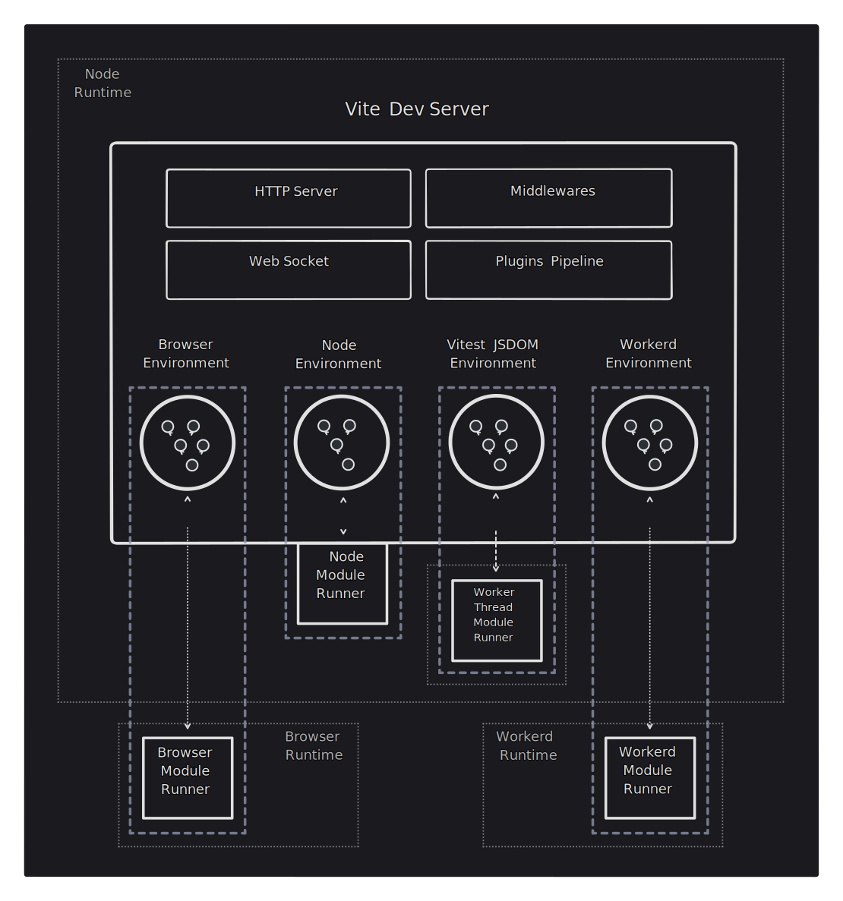

# 环境 API {#environment-api}

:::warning 实验性
这个 API 的初始版本在 Vite 5.1 中以 "Vite Runtime API" 的名字被引入。这份指南介绍了经过修订后的 API，被重新命名为环境 API（Environment API）。这个 API 将在 Vite 6 中作为实验性功能发布。你现在已经可以在最新的 `vite@6.0.0-beta.x` 版本中进行测试。

资料：

- [反馈讨论](https://github.com/vitejs/vite/discussions/16358) 我们在此处收集新 API 的反馈。
- [环境 API PR](https://github.com/vitejs/vite/pull/16471) 新 API 在此处被实现并进行了审查。

在参与测试这个提议的过程中，请与我们分享您的反馈。
:::

## 引入环境概念 {#formalizing-environments} 

Vite 6 正式引入了环境（Environments）的概念。在 Vite 5 之前，有两个隐式环境（`client`，以及可选的 `ssr`）。新的环境 API 允许用户和框架作者根据他们的应用在生产环境中的工作方式创建尽可能多的环境。这些新的功能需要大规模的内部重构，而我们也已经在保持向后兼容性上做出了很大的努力。Vite 6 的初始目标是尽可能平滑地将整个生态系统迁移到新的主要版本，直到有足够的用户已经迁移，并且框架和插件作者已经验证了新的设计后，再采用这些新的实验性 API。

## 缩小构建和开发模式间的差距 {#closing-the-gap-between-build-and-dev}

对于简单的 SPA/MPA，配置中不会暴露任何与环境有关的新 API。在内部，Vite 会将选项应用于 `client` 环境，但在配置 Vite 时无需了解这一概念。Vite 5 中的配置和行为应能在此无缝运行。

当我们移动到一个典型的服务器端渲染（SSR）应用程序时，我们将有两个环境：

- `client`: 在浏览器中运行应用程序。
- `server`: 在 node（或其他服务器运行时）中运行应用程序，渲染页面后再发送到浏览器。

在开发过程中，Vite 会在与 Vite 开发服务器相同的 Node 进程中执行服务器代码，从而接近生产环境。不过，服务器也有可能在其他 JS 运行时中运行，如[Cloudflare 的 workerd](https://github.com/cloudflare/workerd)，它们有不同的限制。现代应用程序也可能在两个以上的环境中运行，例如浏览器、节点服务器和边缘服务器。Vite 5 无法正确表示这些环境。

Vite 6 允许用户在构建和开发过程中配置应用程序，以映射其所有环境。在开发期间，一个 Vite 开发服务器现在可用于在多个不同环境中同时运行代码。应用程序源代码仍由 Vite 开发服务器进行转换。在共享 HTTP 服务器、中间件、解析配置和插件管道的基础上，Vite 开发服务器现在拥有一组独立的开发环境。每个开发环境的配置都尽可能与生产环境相匹配，并连接到执行代码的开发运行时（对于 Workerd，服务器代码现在可以在本地 miniflare 中运行）。在客户端，浏览器导入并执行代码。在其他环境中，模块运行程序会获取并评估转换后的代码。



## 环境配置 {#environments-configuration}

对于 SPA/MPA，配置与 Vite 5 类似。在内部，这些选项用于配置 `client` 环境。

```js
export default defineConfig({
  build: {
    sourcemap: false,
  },
  optimizeDeps: {
    include: ['lib'],
  },
})
```

这一点很重要，因为我们希望 Vite 保持平易近人，避免在需要时才公开新概念。

如果应用程序由多个环境组成，则可以使用 `environments` 配置选项显式配置这些环境。

```js
export default {
  build: {
    sourcemap: false,
  },
  optimizeDeps: {
    include: ['lib'],
  },
  environments: {
    server: {},
    edge: {
      resolve: {
        noExternal: true,
      },
    },
  },
}
```

如果没有明确说明，环境将继承已配置的顶级配置选项（例如，新的 `server` 和 `edge` 环境将继承 `build.sourcemap: false` 选项）。少数顶级选项（如 `optimizeDeps`）仅适用于 `client` 环境，因为它们在默认应用于服务器环境时效果不佳。也可以通过 `environments.client` 明确配置 `client` 环境，但我们建议使用顶级选项进行配置，以便在添加新环境时客户端配置保持不变。

`EnvironmentOptions` 接口公开所有每个环境选项。有些环境选项适用于 `build` 和 `dev`，如 `resolve`。还有 `DevEnvironmentOptions` 和 `BuildEnvironmentOptions` 用于开发和构建特定选项（如 `dev.warmup` 或 `build.outDir`）。一些选项（例如`optimizeDeps`）仅适用于 dev，但为了向后兼容，它保留为顶层而不是嵌套在`dev`中。

```ts
interface EnvironmentOptions {
  define?: Record<string, any>
  resolve?: EnvironmentResolveOptions
  optimizeDeps: DepOptimizationOptions
  consumer?: 'client' | 'server'
  dev: DevOptions
  build: BuildOptions
}
```

`UserConfig` 接口从 `EnvironmentOptions` 接口扩展而来，允许通过 `environments` 选项配置客户端和其他环境的默认值。在开发过程中，名为 `ssr` 的 `client` 和服务器环境始终存在。这允许与 `server.ssrLoadModule(url)` 和 `server.moduleGraph` 向后兼容。在构建期间，`client` 环境始终存在，而 `ssr` 环境仅在明确配置时才存在（使用 `environments.ssr` 或为了向后兼容而使用 `build.ssr`）。应用程序不需要为其 SSR 环境使用 `ssr` 名称，例如，它可以将其命名为 `server`。

```ts
interface UserConfig extends EnvironmentOptions {
  environments: Record<string, EnvironmentOptions>
  // 其他选项
}
```

请注意，一旦环境 API 稳定， `ssr` 顶级属性将被废弃。该选项的作用与 `environments` 相同，但针对的是默认的 `ssr` 环境，而且只允许配置一小部分选项。

## 自定义环境实例 {#custom-environment-instances}

底层 API 配置已可用，因此可以支持为运行时提供环境。这些环境还可以生成其他进程或线程，以便在更接近生产环境的运行时间内运行开发模块。

```js
import { customEnvironment } from 'vite-environment-provider'

export default {
  build: {
    outDir: '/dist/client',
  },
  environments: {
    ssr: customEnvironment({
      build: {
        outDir: '/dist/ssr',
      },
    }),
  },
}
```

## 向后兼容性 {#backward-compatibility}

当前的 Vite 服务器 API 尚未被弃用，并且与 Vite 5 向后兼容。新的环境 API 是实验性的。

`server.moduleGraph` 返回客户端和服务器端渲染（ssr）模块图的混合视图。所有其方法都将返回向后兼容的混合模块节点。对于传递给 `handleHotUpdate` 的模块节点，也使用相同的方案。

我们不建议现在就切换到环境 API。我们的目标是在插件不需要维护两个版本之前，让大部分用户基础采用 Vite 6。查看未来破坏性更改部分以获取未来弃用和升级路径的信息：

- [钩子函数中的 `this.environment`](/changes/this-environment-in-hooks)
- [HMR `hotUpdate` 插件钩子](/changes/hotupdate-hook)
- [迁移到按环境划分的 API](/changes/per-environment-apis)
- [使用 `ModuleRunner` API 进行服务端渲染](/changes/ssr-using-modulerunner)
- [构建过程中的共享插件](/changes/shared-plugins-during-build)

## 目标用户 {#target-users}

本指南为终端用户提供了关于环境的基本概念。

插件作者可以使用更一致的 API 与当前环境配置进行交互。如果你正在基于 Vite 进行开发，[环境 API 插件指南](./api-environment-plugins.md) 描述了扩展插件 API 如何支持多个自定义环境。

框架可以自行决定在不同层次上暴露环境。如果你是框架作者，请继续阅读 [环境 API 框架指南](./api-environment-frameworks.md)，以了解环境 API 编程方面的内容。

对于运行时提供者，[环境 API 运行时指南](./api-environment-runtimes.md) 解释了如何提供自定义环境供框架和用户使用。
