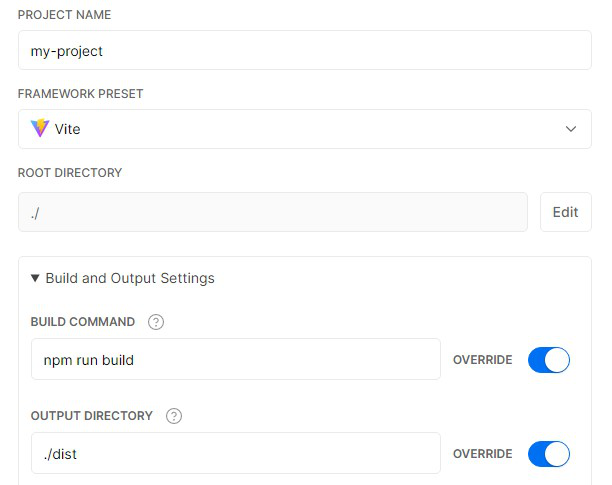

# 部署静态站点

下面的指引都基于以下几个假设：

- 你正在使用的是默认的构建输出路径（`dist`）。这个路径 [可以使用 `build.outDir` 更改](https://vitejs.dev/config/#build-outdir)，在这种情况下，你可以从这篇指南中推断出所需的指令。
- Vite 已经被安装为了一个你项目的本地开发依赖（dev dependency），并且你已经配置好了如下的 npm script：
- 你正在使用 npm，或者使用了 Yarn 或其他的包管理工具，可以运行下面的脚本指令：

```json
{
  "scripts": {
    "build": "vite build",
    "preview": "vite preview"
  }
}
```

值得注意的是 `vite preview` 旨在提供一个生产版本的本地预览，但不应直接作为一个生产服务器。

::: tip 注意
本篇指引提供的指令旨在
本篇指南提供了如何执行 Vite 站点的静态部署的说明。Vite 也对服务端渲染有了实验性的支持。SSR 是指支持在 Node 中运行相应应用程序的前端框架，预渲染成 HTML，最后在客户端进行 hydrate 处理。查看 [SSR 指南](./ssr) 可以了解更多细节。另一方面，如果你正在寻找与传统服务端渲染集成的方式，那么请查看 [后端集成](./backend-integration) 章节。
:::

## 构建应用

你可能会运行 `npm run build` 命令来执行应用的构建。

```bash
$ npm run build
```

默认情况下，构建会输出到 `dist` 文件夹中。你可以部署这个 `dist` 文件夹到任何你喜欢的平台。

### 本地测试应用

当你构建完成应用后，你可能想要通过运行 `npm run preview` 命令，在本地测试该应用。

```bash
$ npm run build
$ npm run preview
```

`preview` 命令会启动一个本地静态 Web 服务器，将 `dist` 文件夹服务于 http://localhost:5000 。这样在本地查看该产物是否正常可用就十分容易了。

你可以使用 `--port` 标志传入一个参数来配置服务器的运行端口。

```json
{
  "scripts": {
    "preview": "vite preview --port 8080"
  }
}
```

这样 `preview` 命令会改将服务器运行在 http://localhost:8080 上。

## GitHub Pages

1. 在 `vite.config.js` 中设置正确的 `base`。

   如果你要部署在 `https://<USERNAME>.github.io/`，你可以省略 `base` 因为其默认为 `'/'`。

   如果你要部署在 `https://<USERNAME>.github.io/<REPO>/`，例如你的仓库地址为 `https://github.com/<USERNAME>/<REPO>`，那么请设置 `base` 为 `'/<REPO>/'`。

2. 在你的项目中，创建一个 `deploy.sh` 脚本，包含以下内容（注意高亮的未注释的行)，运行它来部署站点：

```bash{13,20,23}
#!/usr/bin/env sh

# 发生任何错误时终止
set -e

# 构建
npm run build

# 进入输出产物文件夹
cd dist

# 如果你要部署到自定义域名
# echo 'www.example.com' > CNAME

git init
git add -A
git commit -m 'deploy'

# 如果你要部署在 https://<USERNAME>.github.io
# git push -f git@github.com:<USERNAME>/<USERNAME>.github.io.git master

# 如果你要部署在 https://<USERNAME>.github.io/<REPO>
# git push -f git@github.com:<USERNAME>/<REPO>.git master:gh-pages

cd -
```

::: tip
你也可以在你的 CI 启动时运行该脚本，使得在每次推送代码时自动部署。
:::

### GitHub Pages 配合 Travis CI

1. 在 `vite.config.js` 中设置正确的 `base`。

   如果你要部署在 `https://<USERNAME or GROUP>.github.io/`，你可以省略 `base` 因为其默认为 `'/'`。

   如果你要部署在 `https://<USERNAME or GROUP>.github.io/<REPO>/`，例如你的仓库地址为 `https://github.com/<USERNAME>/<REPO>`，那么请设置 `base` 为 `'/<REPO>/'`。

2. 在项目根目录创建一个 `.travis.yml` 文件

3. 在本地运行 `npm install` 确认正常生成一个 lockfile (`package-lock.json`)。

4. 使用 GitHub Pages 提供的部署模板，并跟随 [Travis CI 文档](https://docs.travis-ci.com/user/deployment/pages/) 进行配置：

```yaml
language: node_js
node_js:
  - lts/*
install:
  - npm ci
script:
  - npm run build
deploy:
  provider: pages
  skip_cleanup: true
  local_dir: dist
  # 在 GitHub 上生成的令牌，允许 Travis 推送代码到你的存储库。
  # 在仓库对应的 Travis 设置页面中配置，用于安全控制。
  github_token: $GITHUB_TOKEN
  keep_history: true
  on:
    branch: master
```

## GitLab Pages 配合 GitLab CI

1. 在 `vite.config.js` 中设置正确的 `base`。

   如果你要部署在 `https://<USERNAME or GROUP>.gitlab.io/`，你可以省略 `base` 因为其默认为 `'/'`。

   如果你要部署在 `https://<USERNAME or GROUP>.gitlab.io/<REPO>/`，例如你的仓库地址为 `https://github.com/<USERNAME>/<REPO>`，那么请设置 `base` 为 `'/<REPO>/'`。

2. 在 `vite.config.js` 中设置 `build.outDir` 为 `public`。

3. 在项目根目录创建一个 `.gitlab-ci.yml` 文件，包含以下内容。它将使得每次你更改内容时都重新构建与部署站点：

```yaml
image: node:10.22.0
pages:
  cache:
    paths:
      - node_modules/
  script:
    - npm install
    - npm run build
  artifacts:
    paths:
      - public
  only:
    - master
```

## Netlify

1. 在 [Netlify](https://netlify.com) 上，按下列设置配合 Github 设置好一个一个新的项目：

- **构建命令：** `vite build` 或者 `npm run build`
- **发布目录：** `dist`

2. 点击部署按钮。

## Google Firebase

1. 确保已经安装 [firebase-tools](https://www.npmjs.com/package/firebase-tools)。

2. 在项目根目录创建 `firebase.json` 和 `.firebaserc` 两个文件，应包含以下内容：

 `firebase.json`:

  ```json
  {
    "hosting": {
      "public": "dist",
      "ignore": []
    }
  }
  ```

  `.firebaserc`:

  ```js
  {
   "projects": {
     "default": "<YOUR_FIREBASE_ID>"
   }
  }
  ```

3. 运行 `npm run build` 后，通过 `firebase deploy` 命令部署。

## Surge

1. 请确保您已经安装了 [surge](https://www.npmjs.com/package/surge)。

2. 运行 `npm run build`。

3. 通过运行 `surge dist` 命令部署到 surge。


你也可以通过添加 `surge dist yourdomain.com` 部署到一个 [自定义域名](http://surge.sh/help/adding-a-custom-domain)。

## Heroku

1. 安装 [Heroku CLI](https://devcenter.heroku.com/articles/heroku-cli)。

2. [注册一个 Heroku 账号](https://signup.heroku.com)。

3. 运行 `heroku login` 并填入你的你的 Heroku 凭证：

```bash
$ heroku login
```

4. 在项目根目录创建一个 `static.json` ，应含以下内容：

`static.json`:

```json
{
  "root": "./dist"
}
```

这是你站点的配置信息，阅读 [heroku-buildpack-static](https://github.com/heroku/heroku-buildpack-static) 文档了解更多。

5. 配置好你的 Heroku git 远程地址：

```bash
# 更新版本
$ git init
$ git add .
$ git commit -m "My site ready for deployment."

# 创建一个具有指定名称的新应用程序
$ heroku apps:create example

# 为静态站点设置 buildpack 
$ heroku buildpacks:set https://github.com/heroku/heroku-buildpack-static.git
```

6. 部署站点：

```bash
# 发布站点
$ git push heroku master

# 在浏览器中打开 Heroku CI 的仪表板
$ heroku open
```

## Vercel

要通过 [Vercel for Git](https://vercel.com/docs/git) 部署你的 Vite 应用，请确保它已经被推送为了一个 Git 仓库。

去往 https://vercel.com/import/git 并导入该项目到 Vercel，使用你相应地 Git 服务（GitHub，GitLab 或者 BitBucket）。根据指引，选择带有 `package.json` 的项目根目录。并使用 `npm run build` 来覆盖构建步骤，并将输出目录设置为 `./dist`。



在项目被导入之后，所有后续的推送将生成预览部署，但只有对生产分支（通常是“main”）所做的所有更改才将触发生产部署。

一旦部署，你会得到一个 URL 来查看应用的实时预览，如 https://vite.vercel.app 。
